# Getting Started

## .NET MAUI Project Template Types

When you create a new .NET MAUI app in Visual Studio, you can either use XAML or Blazor as the User Interface technology. 

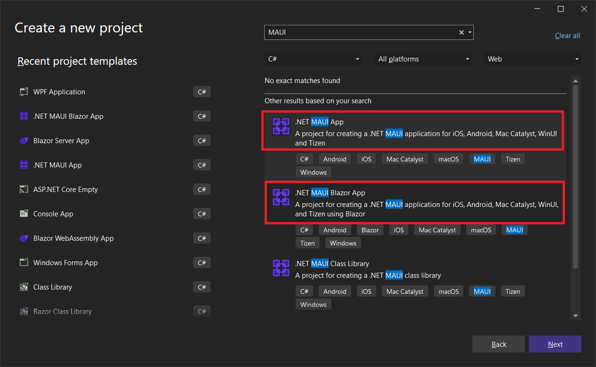

The **.NET MAUI App** template uses XAML, and the **.NET MAUI Blazor App** template uses the `BlazorWebView` component to host Blazor pages. Blazor is a UI platform that uses HTML, CSS, and C# to build UI. It is essentially a web technology, but can be used in Hybrid apps such as .NET MAUI, and even Windows Forms and WPF.

In this class we will focus on XAML projects. If you want to know more about .NET MAUI Blazor, check out [The .NET Show](https://www.thedotnetshow.com/). For more general Blazor videos, check out [BlazorTrain](https://blazortrain.com/).

## Installing

In the past, installing Microsoft developer technologies has been fragmented. Now you go to one website: https://visualstudio.microsoft.com/vs/ and download the Visual Studio Installer. This single app will let you install any tech and tools that Visual Studio supports. 

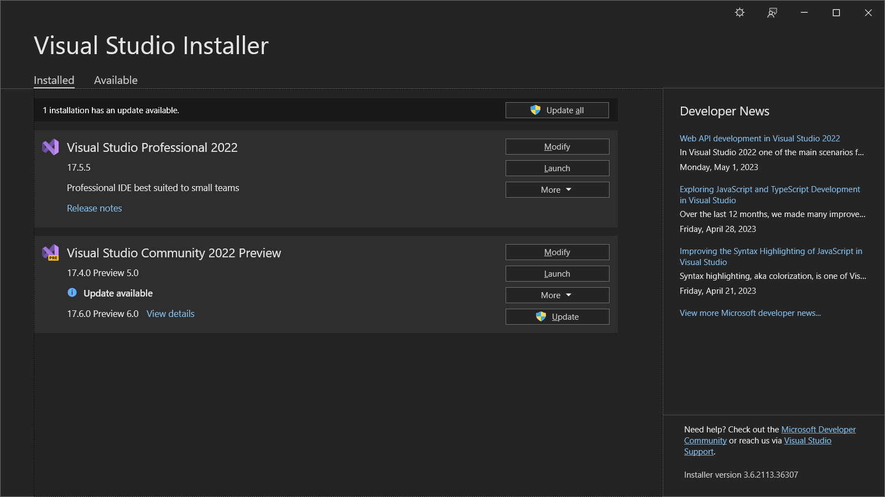

The installer will let you know when an update is available. It will not only update Visual Studio, but any of the dev tools and frameworks required for the groups that you've selected.

The tech is split into groups called **Workloads**. When you install for the first time or modify an existing installation, you can select the workloads to install. 

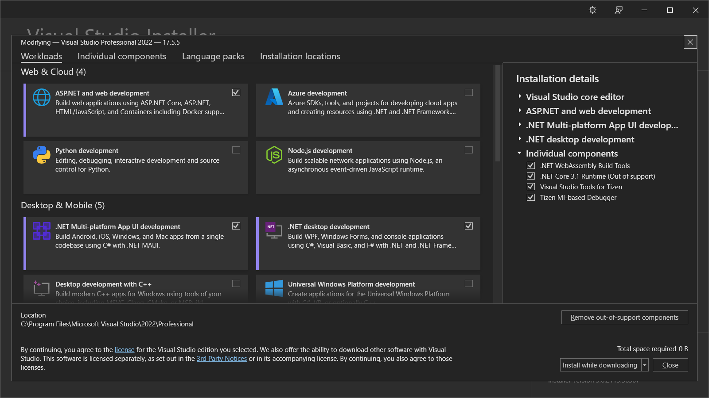

As you can see, **.NET MAUI** is a workload that you can select. That is all you need to get started building MAUI apps. Just make sure your installation is always up to date.

> :point_up: When you install the MAUI workload, you do not need to install the latest Android SDK or any other subsystems that in older times you had to manage yourself.

## Create Your First MAUI App

First things first. You should create a folder somewhere on your computer where you can keep all of the code and projects. I usually put the materials folder on my desktop and make a sub-folder called *My Projects* where I save the projects I actually write in class.

Launch Visual Studio 2022 and create a new **.NET MAUI App** project.

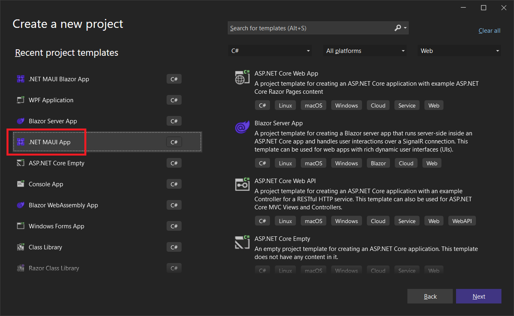

Name it **MyMauiApp**

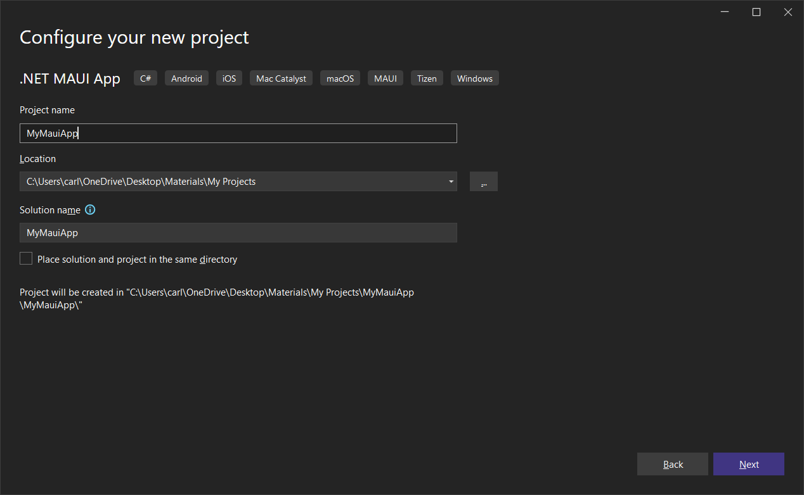

Select the default framework version, which should be at least 7.0:

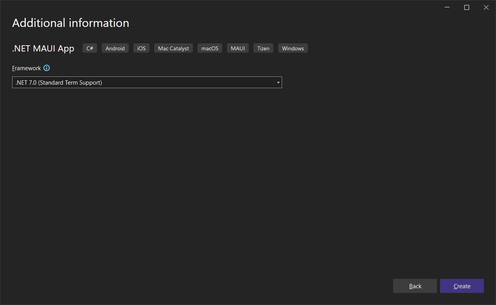

Visual Studio should look something like this:

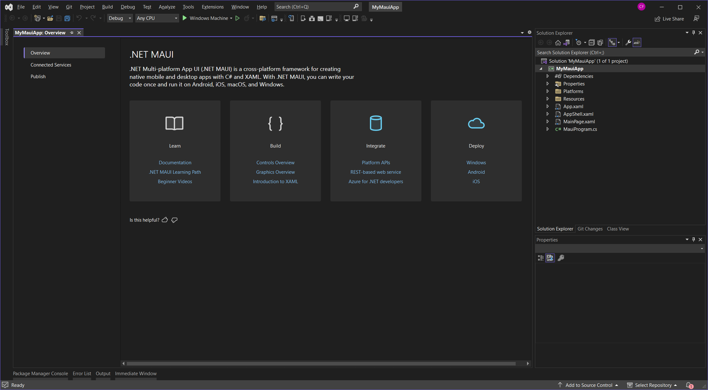

## Project Template Overview

Expand the *Platforms* and *Resources* folders.

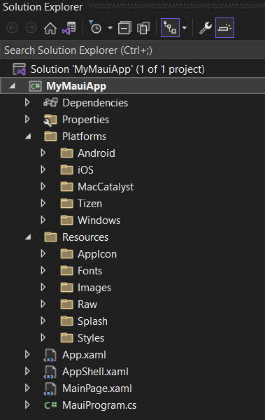

Whereas a Xamarin Forms solution would contain a different project for each platform, MAUI solutions have one project, a *Platforms* folder, and a subfolder for code and resources specific to that platform. That's a huge improvement.

Expand the *Android* and *iOS* folders:

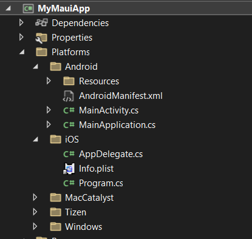

### Common Files:

Files created in the project outside of the *Platform* are shared among all platforms, including XAML files.

***MauiProgram.cs***:

This is analogous to *Program.cs* in a non-MAUI .NET Core app. This is where you can add services and code for general configuration. 

***App.xaml and App.xaml.cs***

*App.xaml* is where you define resources and styles in your app. 

*App.xaml.cs* is a good place to configure platform-specific code and override Window virtual methods.

***AppShell.xaml and AppShell.xaml.cs***:

These are used to configure the Shell, a UI feature that's implemented by default. We will talk about Shell later.

### Resources Folder:

These subfolders are where you can embed resources into your app of the following types:

- AppIcon
- Fonts (font files)
- Images
- Raw (audio, video, or any other files)
- Splash (Splash Screen)
- Styles (XAML styles and color definitions)

### Android Files:

[***AndroidManifest.xml***](https://learn.microsoft.com/en-us/dotnet/maui/android/manifest?view=net-maui-7.0)

This file describes essential information about your app to build tools, the Android operating system, and Google Play.

The manifest file is generated as part of the .NET MAUI build process on Android. This build process takes the XML in the *Platforms\Android\AndroidManifest.xml* file, and merges it with any XML that's generated from specific attributes on your classes. The resulting manifest file can be found in the *obj* folder. For example, it can be found at *obj\Debug\net7.0-android\AndroidManifest.xml* for debug builds on .NET 7.

This is what it looks like right now:

```xml
<?xml version="1.0" encoding="utf-8"?>
<manifest xmlns:android="http://schemas.android.com/apk/res/android">
	<application android:allowBackup="true" android:icon="@mipmap/appicon" 
				 android:roundIcon="@mipmap/appicon_round" 
				 android:supportsRtl="true"></application>
	<uses-permission android:name="android.permission.ACCESS_NETWORK_STATE" />
	<uses-permission android:name="android.permission.INTERNET" />
</manifest>
```

The `<application>` element contains properties for the entire app including the icon.

Permission requests must be declared here with one or more `<uses-permission/>` attributes. By default, the app needs to access the network state (whether or not it has an Internet connection), and it also needs to access the Internet. If these are not declared it won't work online. 

You may be required to declare additional permissions in the future. This is where they go.

***MainApplication.cs***

`MainApplication` serves as the top class and the entry point for an Android app. It derives from `MauiApplication`. This is the first code that runs in a MAUI Android app.

***MainActivity.cs***:

`MainActivity` is a class that defines the Android-specific code. It derives from `MauiAppCompatActivity`. It is created just before `MainPage` in the lifecycle.

```c#
using Android.App;
using Android.Content.PM;
using Android.OS;

namespace MyMauiApp;

[Activity(Theme = "@style/Maui.SplashTheme", MainLauncher = true, 
    ConfigurationChanges = ConfigChanges.ScreenSize | 
    ConfigChanges.Orientation | ConfigChanges.UiMode | 
    ConfigChanges.ScreenLayout | ConfigChanges.SmallestScreenSize | 
    ConfigChanges.Density)]
public class MainActivity : MauiAppCompatActivity
{
}
```

You can modify `MainActivity` with both attributes and code. By default there's not much there, but you may be required to augment this.

#### Startup Sequence of a MAUI Android app:

1. *MainApplication.cs*
2. *MauiProgram.cs*
3. *App.xaml.cs*
4. *MainActivity.cs*
5. *MainPage.xaml.cs*

### iOS Files:

> :point_up: The MacCatalyst folder contains these same three files.

[***Info.plist***](https://learn.microsoft.com/en-us/dotnet/maui/macios/info-plist?view=net-maui-7.0&tabs=vs):

An information property list file is an XML file encoded using Unicode UTF-8 that contains configuration information for your .NET Multi-platform App UI (.NET MAUI) app on iOS and Mac Catalyst. The root node of the file is a dictionary, which contains a set of keys and values that define your app configuration. The name of the information property list file is *Info.plist*, and is case sensitive. All .NET MAUI iOS and Mac Catalyst apps must contain an *Info.plist* file that describes the app.

.NET MAUI creates *Info.plist* files for iOS and Mac Catalyst when you create a .NET MAUI app from a project template. These files are located in the *Platforms/iOS* and *Platforms/Mac Catalyst* folders, and are populated with an initial list of property list keys.

When you build your app, .NET MAUI copies your *Info.plist* file into the compiled bundle, before code signing the bundle. During the copy operation, .NET MAUI uses build properties to perform some variable substitution. It can also insert additional keys representing configuration that's specified in other ways. Due to this, the information property list file that ships in your app bundle isn't identical to the source file in your project.

***Program.cs***:

This is the entry point into your iOS app. Here you define the AppDelegate that you'll use to create the MAUI app.

***AppDelegate.cs***

This is analogous to the Android `MainApplication` in that it's where the MAUI app is created. 

#### Startup Sequence of a MAUI iOS app:

1. *Program.cs*
2. *AppDelegate.cs*
3. *MauiProgram.cs*
4. *App.xaml.cs*
5. *MainPage.xaml.cs*

## Windows Files:

The technology used for [MAUI Windows](https://learn.microsoft.com/en-us/windows/apps/windows-dotnet-maui/) apps is called [WinUI](https://learn.microsoft.com/en-us/windows/apps/winui/). There are two versions, v2 for UWP (Universal Windows Platform) and v3, which is used by MAUI ([Windows App SDK](https://learn.microsoft.com/en-us/windows/apps/winui/winui3/)). Version 3 takes advantage of features in Windows 10 (1809 or later) and Windows 11.

***app.mainifest***:

This file, like *Info.plist* and *AndroidManifest.xml*, configure the Windows app, but only for general settings.

***Package.appxmanifest***:

This is where the app is configured in detail, such as publisher information, logos, processor architectures, etc. This is an easily configurable, temporary version of the app package manifest used during app development. 

A file called *AppxManifest.xml* is generated by the Visual Studio build process and is based on the information in the *Package.appxmanifest* file. This is the final version of the app package manifest used with published and sideloaded apps. If any updates are made to the *Package.appxmanifest* file, you must rebuild the project to see the updates in the *AppxManifest.xml* file.

Visual Studio brings up a designer for this file when you double-click on it:

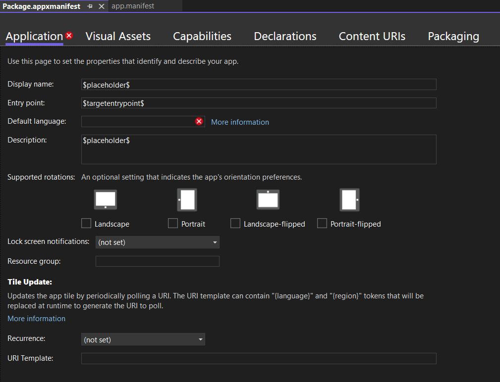

In Visual Studio, you can edit the raw XML of any XML file that has a default designer by right-clicking on the file in the Solution Explorer and selecting **XML (Text) Editor** from the list:

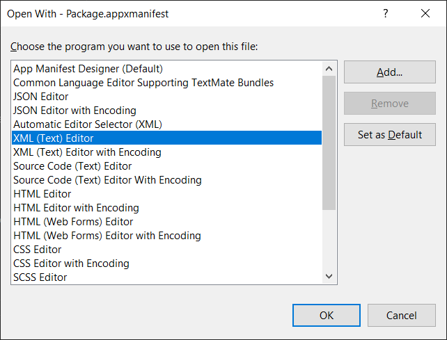

Then you get a standard text editor:

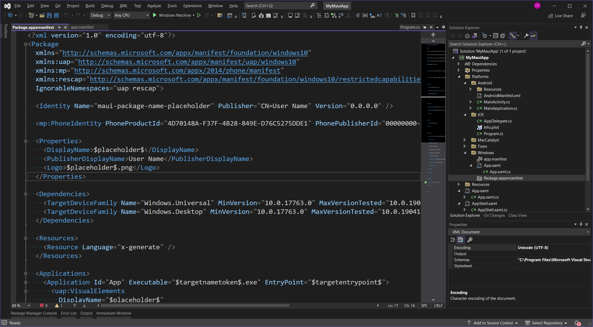

Visual Studio will (currently) not let you deploy a Windows MAUI app to the Windows store, but you can create an MSIX file, a self-extracting installer.

## Selecting a Debugging Platform

At the top of the Visual Studio window where it says **Windows Machine** you can drop down a list of target devices where you can run and debug the project. On my machine I have both an iPhone and an Android device connected, so you'll see those options in my list:

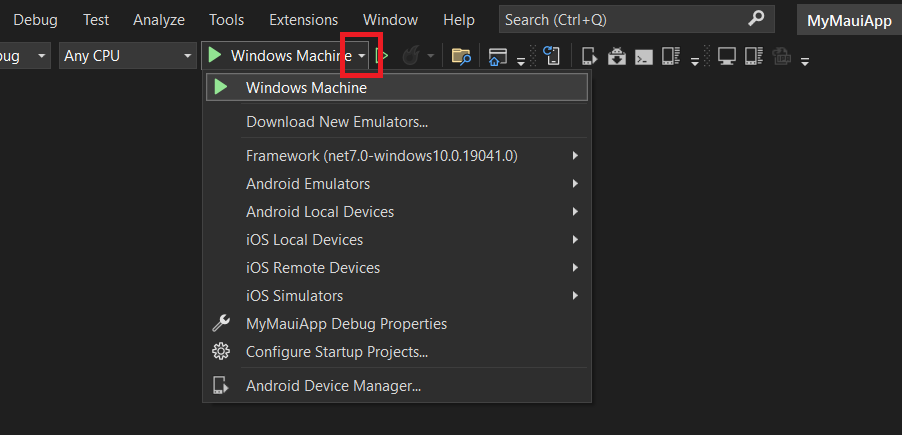


> :point_up: You must enable Windows Developer Mode in order to debug on Windows. Follow the links if you get an error.

Run the app by pressing the Play button or the F5 key, and then we'll talk about how to configure a few things for the Windows platform. It should look something like this:


As you click the button, the text of the button will reflect the number of times it has been clicked:

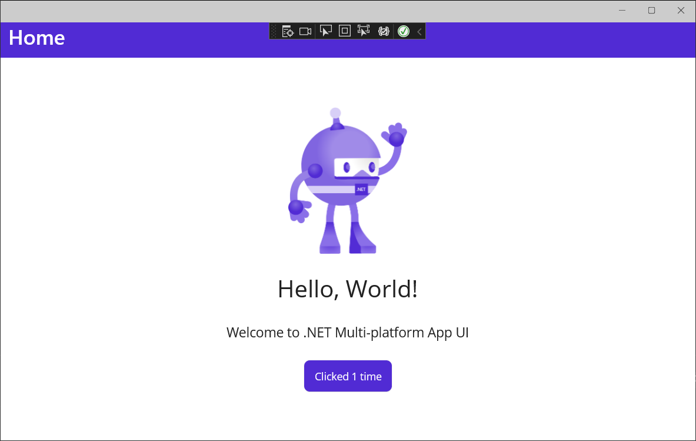

### Set Windows Size and Position

Unlike MAUI Mac Desktop apps, Windows apps do not remember their position or size in between executions. This may seem like a silly thing, but when you have a 49" monitor like me, it takes up nearly the entire screen, and the position is always somewhere on the left. 

This is a screenshot I just took as I'm writing this document. 

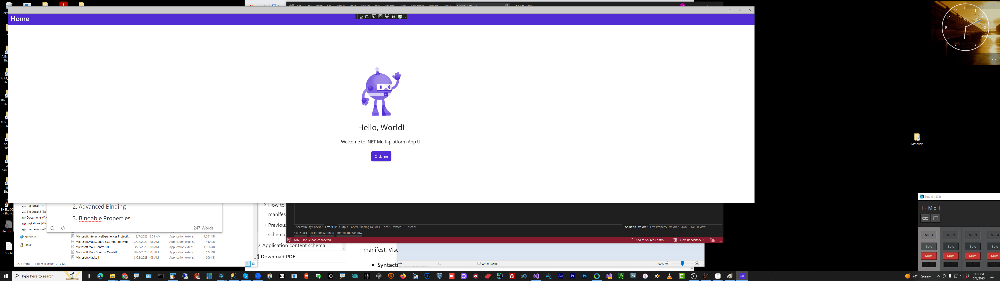

This is clearly a barrier to productivity for me.

Unlike WPF, the MainPage.xaml file doesn't let you specify the window position or the size. But there is a workaround.

Replace *App.xaml.cs* with this:

```c#
namespace MyMauiApp;

public partial class App : Application
{
	public App()
	{
		InitializeComponent();
		MainPage = new AppShell();
	}

    protected override Window CreateWindow
        (IActivationState activationState)
    {
        var window = base.CreateWindow(activationState);
#if WINDOWS
        window.Created += Window_Created;
#endif
        return window;
    }

    private async void Window_Created(object sender, EventArgs e)
    {
#if WINDOWS
        const int defaultWidth = 1280;
        const int defaultHeight = 720;

        var window = (Window)sender;
        window.Width = defaultWidth;
        window.Height = defaultHeight;
        window.X = -defaultWidth;
        window.Y = -defaultHeight;

        await window.Dispatcher.DispatchAsync(() => { });

        var displayInfo = DeviceDisplay.Current.MainDisplayInfo;
        window.X = (displayInfo.Width / 
            displayInfo.Density - window.Width) / 2;
        window.Y = (displayInfo.Height / 
            displayInfo.Density - window.Height) / 2;
#endif
    }
}
```

If we're running on Windows, the size and position is calculated and set before the window even appears.

Run the app. Now it's centered and sized nicely:

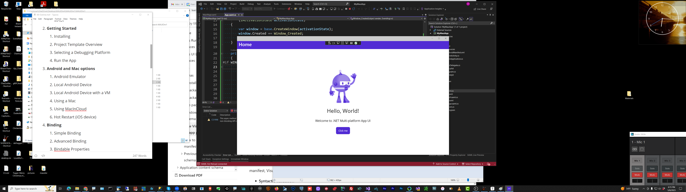

## Analyzing the XAML and code

Check out *MainPage.xaml.cs*:

```c#
namespace MyMauiApp;

public partial class MainPage : ContentPage
{
	int count = 0;

	public MainPage()
	{
		InitializeComponent();
	}

	private void OnCounterClicked(object sender, EventArgs e)
	{
		count++;

		if (count == 1)
			CounterBtn.Text = $"Clicked {count} time";
		else
			CounterBtn.Text = $"Clicked {count} times";

		SemanticScreenReader.Announce(CounterBtn.Text);
	}
}
```

This is the code-behind class for *MainPage.xaml*, and tells us that it is a [`ContentPage`](https://learn.microsoft.com/en-us/dotnet/maui/user-interface/pages/contentpage?view=net-maui-7.0). 

`ContentPage` displays a single view, which is often a layout such as as [Grid](https://learn.microsoft.com/en-us/dotnet/api/microsoft.maui.controls.grid) or [StackLayout](https://learn.microsoft.com/en-us/dotnet/api/microsoft.maui.controls.stacklayout), and is the most common page type.

You can also see that our button click handler is here, and that it increments an `int` property when the button is clicked.

Now let's look at *MainPage.xaml* in detail:

```xaml
<?xml version="1.0" encoding="utf-8" ?>
<ContentPage xmlns="http://schemas.microsoft.com/dotnet/2021/maui"
             xmlns:x="http://schemas.microsoft.com/winfx/2009/xaml"
             x:Class="MyMauiApp.MainPage">

    <ScrollView>
        <VerticalStackLayout
            Spacing="25"
            Padding="30,0"
            VerticalOptions="Center">

            <Image
                Source="dotnet_bot.png"
                SemanticProperties.Description="Cute dot net bot waving hi to you!"
                HeightRequest="200"
                HorizontalOptions="Center" />

            <Label
                Text="Hello, World!"
                SemanticProperties.HeadingLevel="Level1"
                FontSize="32"
                HorizontalOptions="Center" />

            <Label
                Text="Welcome to .NET Multi-platform App UI"
                SemanticProperties.HeadingLevel="Level2"
                SemanticProperties.Description="Welcome to dot net Multi platform App U I"
                FontSize="18"
                HorizontalOptions="Center" />

            <Button
                x:Name="CounterBtn"
                Text="Click me"
                SemanticProperties.Hint="Counts the number of times you click"
                Clicked="OnCounterClicked"
                HorizontalOptions="Center" />

        </VerticalStackLayout>
    </ScrollView>

</ContentPage>
```

Notice that everything is wrapped in a `<ContentPage/>` control. That's because the class itself is derived from `ContentPage`.

[`<ScrollView>`](https://learn.microsoft.com/en-us/dotnet/maui/user-interface/controls/scrollview?view=net-maui-7.0) is a view that's capable of scrolling its content. By default, `ScrollView` scrolls its content vertically. A `ScrollView` can only have a single child, although this can be other layouts.

If you are at all familiar with XAML, the rest of this should be easy to figure out, except for [SemanticProperties](https://learn.microsoft.com/en-us/dotnet/maui/fundamentals/accessibility). This is an object that defines metadata for accessibility tools such as screen readers. 

For example, line 14 describes the robot image:

```c#
SemanticProperties.Description="Cute dot net bot waving hi to you!"
```

None of the controls have a name (expressed by the `x:Name` property) except for the Button. Take a look at the `OnCounterClicked` handler in *MainPage.xaml.cs*:

```c#
private void OnCounterClicked(object sender, EventArgs e)
{
    count++;

    if (count == 1)
        CounterBtn.Text = $"Clicked {count} time";
    else
        CounterBtn.Text = $"Clicked {count} times";

    SemanticScreenReader.Announce(CounterBtn.Text);
}
```

Notice that lines 17 and 18 directly change the `Text` property of the button. There's no `NotifyPropertyChanged`, there's no viewmodel. It just works. Why?

Because `Text` is a `BindableProperty` of the `Button` class. Bindable Properties take care of UI property changes automatically. For a video demo and explanation of Bindable Properties, check out [Episode 39](https://youtu.be/U5_c81A0Fgs) and [Episode 40](https://youtube.com/live/eflepPQxNIw) of The .NET Show on YouTube.

The bottom line is that most MAUI controls have Bindable Properties when called for, namely when changing them results in a User Interface update. Nice!

## A Quick Intro to Colors and Styles

Colors and styles are defined in the *Resources\Styles* folder.

Check out *Colors.xaml*:

```xaml
<?xml version="1.0" encoding="UTF-8" ?>
<?xaml-comp compile="true" ?>
<ResourceDictionary 
    xmlns="http://schemas.microsoft.com/dotnet/2021/maui"
    xmlns:x="http://schemas.microsoft.com/winfx/2009/xaml">

    <Color x:Key="Primary">#512BD4</Color>
    <Color x:Key="Secondary">#DFD8F7</Color>
    <Color x:Key="Tertiary">#2B0B98</Color>
    <Color x:Key="White">White</Color>
    <Color x:Key="Black">Black</Color>
    <Color x:Key="Gray100">#E1E1E1</Color>
    <Color x:Key="Gray200">#C8C8C8</Color>
    <Color x:Key="Gray300">#ACACAC</Color>
    <Color x:Key="Gray400">#919191</Color>
    <Color x:Key="Gray500">#6E6E6E</Color>
    <Color x:Key="Gray600">#404040</Color>
    <Color x:Key="Gray900">#212121</Color>
    <Color x:Key="Gray950">#141414</Color>
    <SolidColorBrush x:Key="PrimaryBrush" Color="{StaticResource Primary}"/>
    <SolidColorBrush x:Key="SecondaryBrush" Color="{StaticResource Secondary}"/>
    <SolidColorBrush x:Key="TertiaryBrush" Color="{StaticResource Tertiary}"/>
    <SolidColorBrush x:Key="WhiteBrush" Color="{StaticResource White}"/>
    <SolidColorBrush x:Key="BlackBrush" Color="{StaticResource Black}"/>
    <SolidColorBrush x:Key="Gray100Brush" Color="{StaticResource Gray100}"/>
    <SolidColorBrush x:Key="Gray200Brush" Color="{StaticResource Gray200}"/>
    <SolidColorBrush x:Key="Gray300Brush" Color="{StaticResource Gray300}"/>
    <SolidColorBrush x:Key="Gray400Brush" Color="{StaticResource Gray400}"/>
    <SolidColorBrush x:Key="Gray500Brush" Color="{StaticResource Gray500}"/>
    <SolidColorBrush x:Key="Gray600Brush" Color="{StaticResource Gray600}"/>
    <SolidColorBrush x:Key="Gray900Brush" Color="{StaticResource Gray900}"/>
    <SolidColorBrush x:Key="Gray950Brush" Color="{StaticResource Gray950}"/>

    <Color x:Key="Yellow100Accent">#F7B548</Color>
    <Color x:Key="Yellow200Accent">#FFD590</Color>
    <Color x:Key="Yellow300Accent">#FFE5B9</Color>
    <Color x:Key="Cyan100Accent">#28C2D1</Color>
    <Color x:Key="Cyan200Accent">#7BDDEF</Color>
    <Color x:Key="Cyan300Accent">#C3F2F4</Color>
    <Color x:Key="Blue100Accent">#3E8EED</Color>
    <Color x:Key="Blue200Accent">#72ACF1</Color>
    <Color x:Key="Blue300Accent">#A7CBF6</Color>

</ResourceDictionary>
```

The Primary color is defined as purple (#512BD4). Change it to Blue (#0000FF) and run the app again.

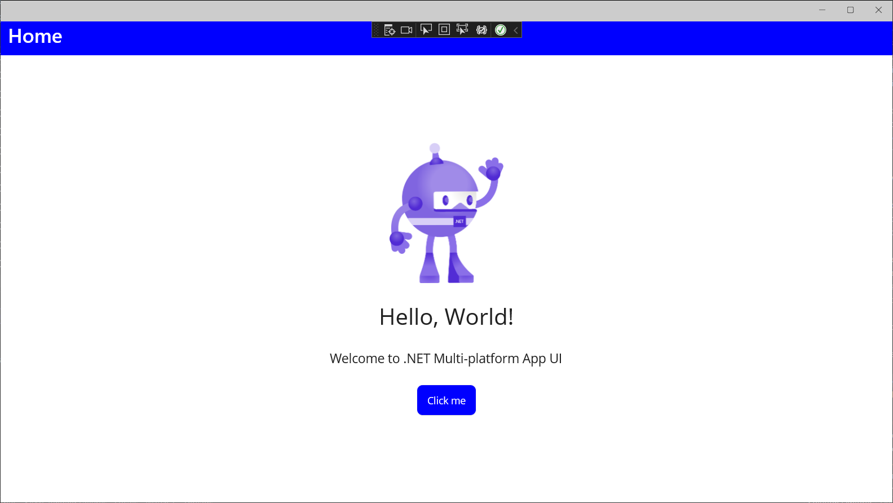

That's how easy it is to set colors in a MAUI app.

**Styles** are just collections of UI settings: Colors, fonts, borders, etc. 

Check out *Styles.xaml* (truncated):

```xaml
<?xml version="1.0" encoding="UTF-8" ?>
<?xaml-comp compile="true" ?>
<ResourceDictionary 
    xmlns="http://schemas.microsoft.com/dotnet/2021/maui"
    xmlns:x="http://schemas.microsoft.com/winfx/2009/xaml">

    <Style TargetType="ActivityIndicator">
        <Setter Property="Color" Value="{AppThemeBinding Light={StaticResource Primary}, Dark={StaticResource White}}" />
    </Style>

    <Style TargetType="IndicatorView">
        <Setter Property="IndicatorColor" Value="{AppThemeBinding Light={StaticResource Gray200}, Dark={StaticResource Gray500}}"/>
        <Setter Property="SelectedIndicatorColor" Value="{AppThemeBinding Light={StaticResource Gray950}, Dark={StaticResource Gray100}}"/>
    </Style>

    <Style TargetType="Border">
        <Setter Property="Stroke" Value="{AppThemeBinding Light={StaticResource Gray200}, Dark={StaticResource Gray500}}" />
        <Setter Property="StrokeShape" Value="Rectangle"/>
        <Setter Property="StrokeThickness" Value="1"/>
    </Style>

    <Style TargetType="BoxView">
        <Setter Property="Color" Value="{AppThemeBinding Light={StaticResource Gray950}, Dark={StaticResource Gray200}}" />
    </Style>
```

These are the default styles that will apply to your UI, but they can be changed.

For example, look at the Button Style, starting on line 26:

```xaml
<Style TargetType="Button">
    <Setter Property="TextColor" Value="{AppThemeBinding Light={StaticResource White}, Dark={StaticResource Primary}}" />
    <Setter Property="BackgroundColor" Value="{AppThemeBinding Light={StaticResource Primary}, Dark={StaticResource White}}" />
    <Setter Property="FontFamily" Value="OpenSansRegular"/>
    <Setter Property="FontSize" Value="14"/>
    <Setter Property="CornerRadius" Value="8"/>
    <Setter Property="Padding" Value="14,10"/>
    <Setter Property="MinimumHeightRequest" Value="44"/>
    <Setter Property="MinimumWidthRequest" Value="44"/>
    <Setter Property="VisualStateManager.VisualStateGroups">
        <VisualStateGroupList>
            <VisualStateGroup x:Name="CommonStates">
                <VisualState x:Name="Normal" />
                <VisualState x:Name="Disabled">
                    <VisualState.Setters>
                        <Setter Property="TextColor" Value="{AppThemeBinding Light={StaticResource Gray950}, Dark={StaticResource Gray200}}" />
                        <Setter Property="BackgroundColor" Value="{AppThemeBinding Light={StaticResource Gray200}, Dark={StaticResource Gray600}}" />
                    </VisualState.Setters>
                </VisualState>
            </VisualStateGroup>
        </VisualStateGroupList>
    </Setter>
</Style>
```

It's all there: BorderRadius, Font, Padding, BackgroundColor, TextColor, etc.

Try changing the TextColor. Change line 28 from this:

```xaml
<Setter Property="BackgroundColor" Value="{AppThemeBinding Light={StaticResource Primary}, Dark={StaticResource White}}" />
```

to this:

```xaml
<Setter Property="BackgroundColor" Value="{AppThemeBinding Light={StaticResource Tertiary}, Dark={StaticResource White}}" />
```

Run the app again. The button background color is now the Tertiary color, defined as dark purple. 


Now, while the app is running, reset the colors and styles back to their original state. Did you notice that the running app automatically updated it's colors? This is the Hot Reload feature, available in most Visual Studio project types.

### Play with Hot Reload

Change the label text, remove the robot image, then put it back. Add a new label. Is the lightbulb going on?

Undo whatever changes you made and Save All. Let's move on.

## Inside MauiProgram.cs

In order to explain the MauiProgram.cs I added comments to the code below.

```c#
global using System.ServiceModel.Syndication;
global using System.Xml;
global using MyMauiApp.Models;
global using MyMauiApp.Services;

using Microsoft.Extensions.Logging;

namespace MyMauiApp;

public static class MauiProgram
{
    // This method returns the entry point (a MauiApp) and is called
    // from each platform's entry point.
	public static MauiApp CreateMauiApp()
	{
        // MauiApp.CreateBuilder returns a MauiAppBuilder, which
        // is used to configure fonts, resources, and services.
		var builder = MauiApp.CreateBuilder();
		builder
            // We give it our main App class, 
            // which derives from Application.
            // App is defined in App.xaml.cs.            
			.UseMauiApp<App>()
            // Default font configuration.
			.ConfigureFonts(fonts =>
			{
                // AddFont takes a required filename (first parameter)
                // and an optional alias for each font.
                // When using these fonts in XAML you can use them
                // either by filename (without the extension,) or the alias.
				fonts.AddFont("OpenSans-Regular.ttf", "OpenSansRegular");
				fonts.AddFont("OpenSans-Semibold.ttf", "OpenSansSemibold");
			});

#if DEBUG
		builder.Logging.AddDebug();
#endif
		// The MauiAppBuilder returns a MauiApp application.
		return builder.Build();
	}
}
```

If you look at the references for `CreateMauiApp`, you will see how all 4 platforms entry points are calling this method to get the `MauiApp` returned.

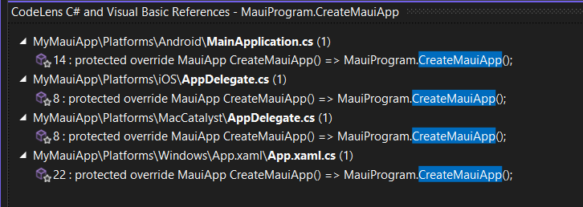

Below is a graphical representation of the dependencies:

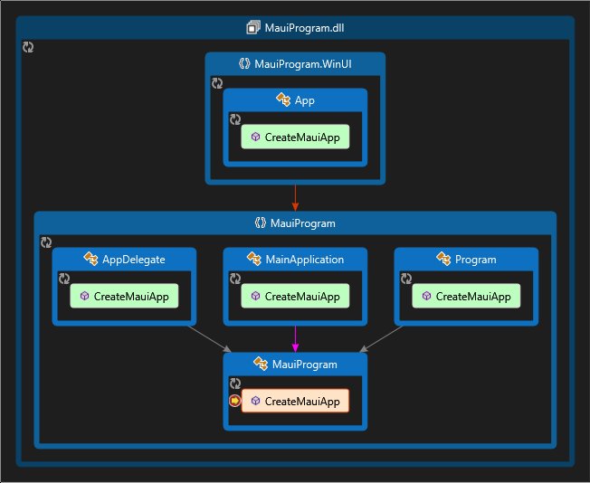

#### So, what else can we do in MauiProgram.cs?

Well, for starters you can configure animations, a container, dispatching, effects, essentials, fonts, image sources, and MAUI handlers, as you can see in the image below.

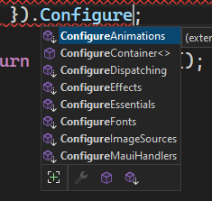

With the exception of `ConfigureContainer`, they are all extension methods provided by the `Microsoft.Maui.Hosting` namespace.

You can also register Services, Logging and Configuration via each of those properties.

##### Services, Logging and Configuration

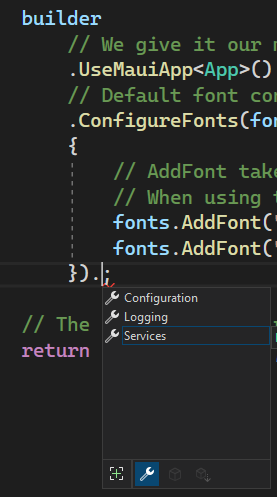
