# Android, iOS, and Mac Options

## Android Emulators

The best option for Android is a local device attached with USB, but sometimes you only have the emulators.

Without hardware acceleration and a fast computer, using the emulators will be disappointing. However, if that's your only option, let's talk about [hardware acceleration](https://learn.microsoft.com/en-us/dotnet/maui/android/emulator/hardware-acceleration?view=net-maui-7.0).

The following virtualization technologies are available for accelerating the Android emulator:

1. **Microsoft's Hyper-V and the Windows Hypervisor Platform (WHPX)**.

   [Hyper-V](https://learn.microsoft.com/en-us/virtualization/hyper-v-on-windows/) is a virtualization feature of Windows that makes it possible to run virtualized computer systems on a physical host computer.

2. **Intel's Hardware Accelerated Execution Manager (HAXM)**.

   HAXM is a virtualization engine for computers running Intel CPUs.

For the best experience on Windows, it's recommended you use WHPX to accelerate the Android emulator. If WHPX isn't available on your computer, then HAXM can be used. The Android emulator automatically uses hardware acceleration if the following criteria are met:

See the documentation for using HAXM. Chances are that your laptop supports Hyper-V, so let's see if we can use that.

### Enable Hyper-V on Windows

From the Windows Menu Search Bar, enter "Turn Windows features on or off" to pull up the **Windows Features** applet and enable **Hyper-V**. You may be required to restart your machine.

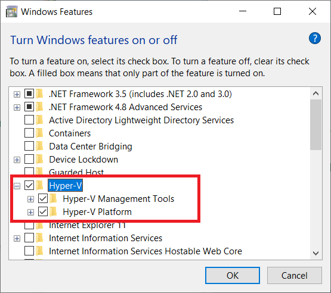

**Pull up the Android Device Manager**

It's under Tools/Android.

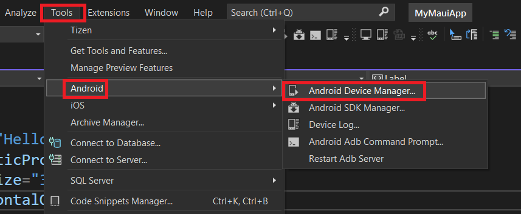

I have four emulators installed:

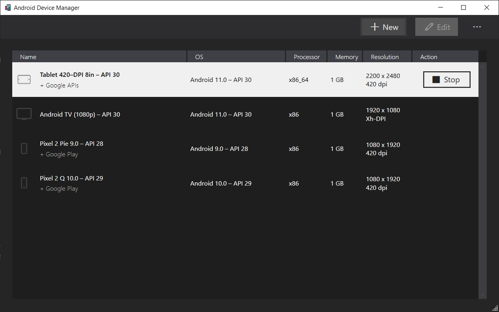

To install a new emulator (recommended), click the **+ New** button at the top.

Select a device from the **Base Device** dropdown. I'm selecting a **Pixel 5**. Then click the **Create** button to download and install the emulator:

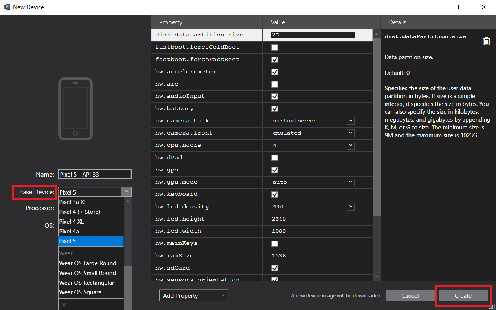

You should see something like this:

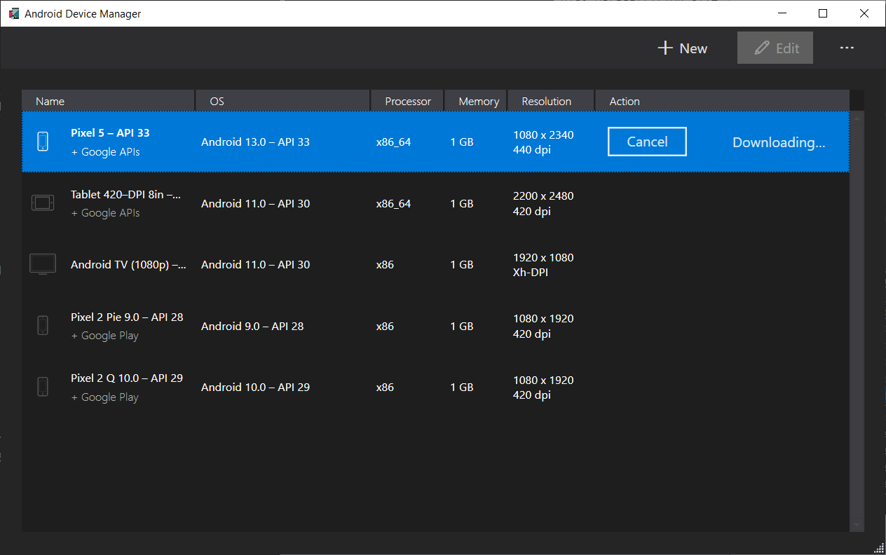

Now, the new emulator should show up in your target device list. Select it and run.

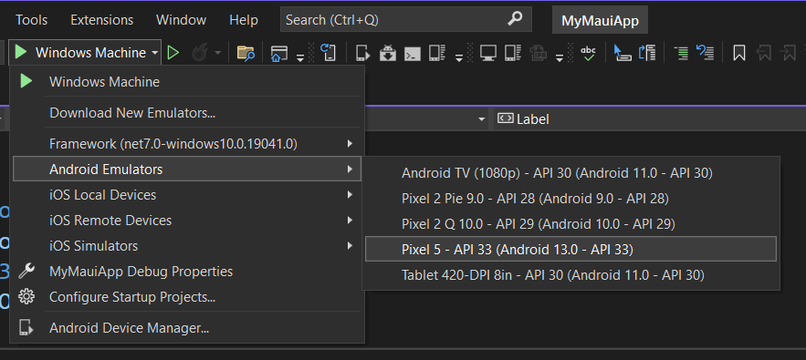

It may take several minutes for it to load up, but it should work.

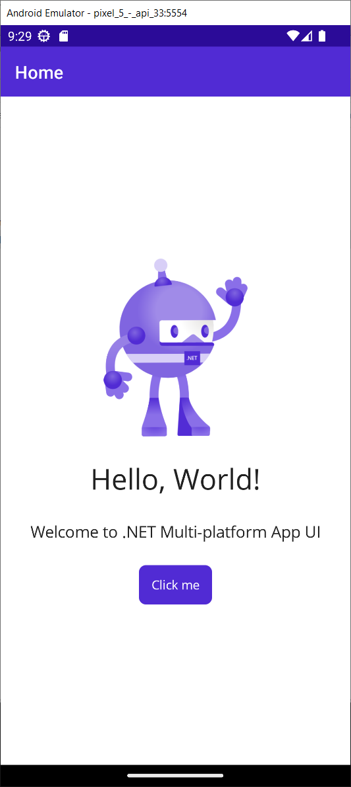

Go ahead and experiment with Hot Reload.

## Local Android Devices

As I said earlier, the best way to debug MAUI Android apps is by plugging in a local device via USB and [setting it up for local debugging](https://learn.microsoft.com/en-us/dotnet/maui/android/device/setup?view=net-maui-7.0).

#### Step 1: Enable Developer Mode

A device must enable Developer mode in order to deploy and test an Android app. Developer mode is enabled by following these steps:

1. Go to the **Settings** screen.
2. Select **About phone**.
3. Tap **Build Number** seven times until **You are now a developer!** is visible.

Depending on the UI your device is running, the **About phone** option may be in a different location. 

#### Step 2: Enable USB Debugging

After enabling developer mode on your device, enable USB debugging by following these steps:

1. Go to the **Settings** screen.
2. Select **Developer options**.
3. Turn on the **USB debugging** option.

Depending on the UI your device is running, the **USB debugging** option may be in a different location. Consult your device documentation if you can't find **USB debugging**.

#### Step 3: Install the USB Driver

For Samsung Devices, download from [https://developer.samsung.com/android-usb-driver](https://developer.samsung.com/android-usb-driver)

For Google Devices, download from [https://developer.android.com/studio/run/win-usb](https://developer.android.com/studio/run/win-usb)

For all other OEMs, check out [https://www.xda-developers.com/download-android-usb-drivers/](https://www.xda-developers.com/download-android-usb-drivers/)

#### Step 4: Connect your Device

Make sure your device is not sleeping, and you are at the main screen. You'll need to confirm USB Debugging permissions.

You should now see your device listed under the target device list.

#### Troubleshooting

I had a situation where my local device disappeared from the target device list. 

To fix it, I ran Visual Studio Installer, and selected **Repair** from the **More** menu option.

Here is a screen shot of the app running on my local Samsung Galaxy S9. I used the Phone Link app on Windows, and the Link to Windows app on the phone.

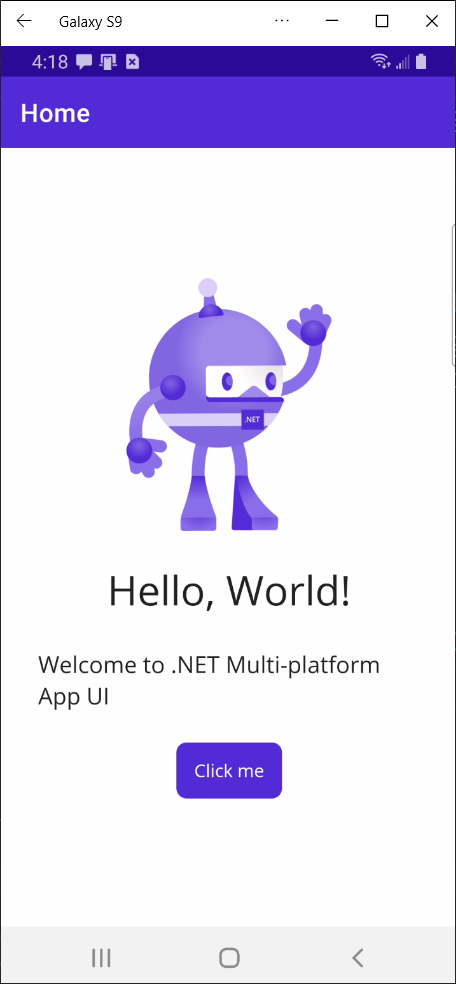

Just to test Hot Reload, I changed the Primary color to Blue, as we did with the Windows app:

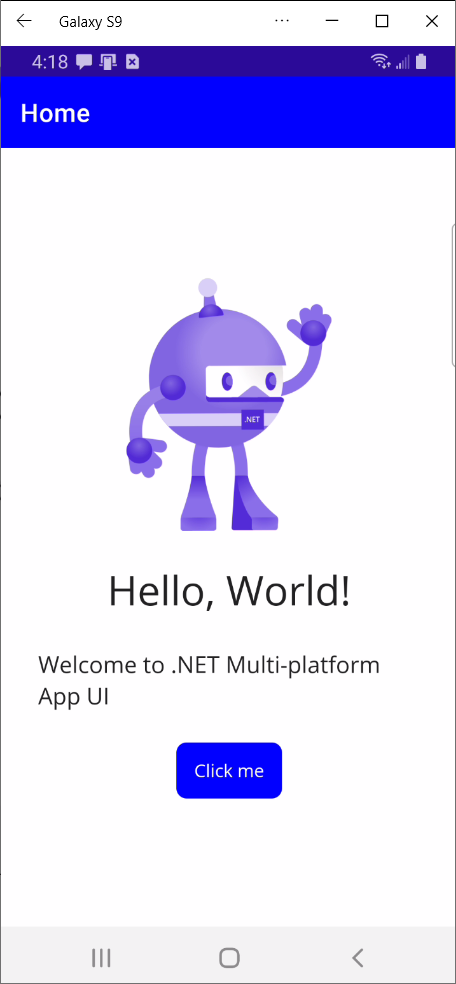

## Using a Mac

You can use a Mac in two different ways:

- Pair the Windows machine to the Mac so you can build and debug iOS apps in an iOS Simulator
- Use a source control repository for your project and run the app on the mac using an iOS Simulator

I have always found pairing to the mac to be flaky. It's much easier if you push your changes to a repo, pull them from the mac, and run the app on the mac with a terminal window.

### Preparing the Mac

[Pairing to a Mac](https://learn.microsoft.com/en-us/dotnet/maui/ios/pair-to-mac?view=net-maui-7.0) requires that you have a Mac machine connected to the same local network as your PC.

Pair to Mac enables the following software development workflow:

- You can write .NET MAUI iOS code in Visual Studio 2022.
- Visual Studio 2022 opens a network connection to a Mac build host and uses the build tools on that machine to compile and sign the iOS app.
- There's no need to run a separate application on the Mac – Visual Studio 2022 invokes Mac builds securely over SSH.
- Visual Studio 2022 is notified of changes as soon as they happen. For example, when an iOS device is plugged into the Mac or becomes available on the network, the iOS Toolbar updates instantly.
- Multiple instances of Visual Studio 2022 can connect to the Mac simultaneously.
- It's possible to use the Windows command-line to build iOS apps.

In order to use a mac, you must have installed

- [The latest MacOS with the latest updates](https://support.apple.com/en-us/HT211683)
- [The latest XCode App](https://developer.apple.com/xcode/resources/)
- [Mono](https://www.mono-project.com/download/stable/#download-mac)

In addition, if you have a Mac computer with Apple silicon please ensure that [Rosetta](https://support.apple.com/guide/security/rosetta-2-on-a-mac-with-apple-silicon-secebb113be1/web) is installed.

### Enable remote login on the Mac

To set up the Mac build host, first enable remote login:

1 - On the Mac, open **System Preferences** and go to the **Sharing** pane.

2 - Check **Remote Login** in the **Service** list.

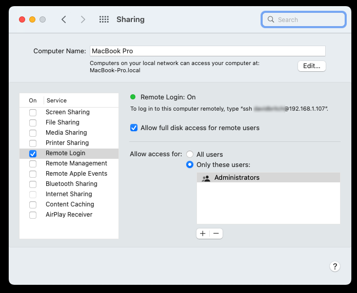

Make sure that it's configured to allow access for **All users**, or that your Mac username or group is included in the list of allowed users.

3 - If prompted, configure the macOS firewall. If you have set the macOS firewall to block incoming connections, you may need to allow mono-sgen to receive incoming connections. An alert appears to prompt you if so.

4 - If it's on the same network as the Windows machine, the Mac should now be discoverable by Visual Studio 2022. If the Mac is still not discoverable, try [manually adding a Mac](https://learn.microsoft.com/en-us/dotnet/maui/ios/pair-to-mac?view=net-maui-7.0#manually-add-a-mac).

### Connect to the Mac from Visual Studio 2022

After enabling remote login on the Mac, connect Visual Studio 2022 to the Mac:

Open the **Pair to Mac** dialog with the **Pair to Mac** button iOS toolbar:

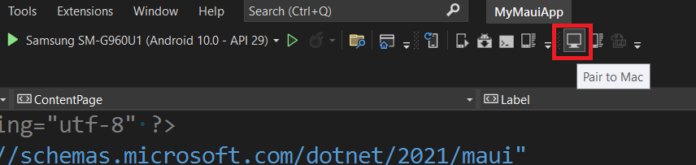

Alternatively, select **Tools > iOS > Pair to Mac**.

The **Pair to Mac** dialog displays a list of all previously connected and currently available Mac build hosts:

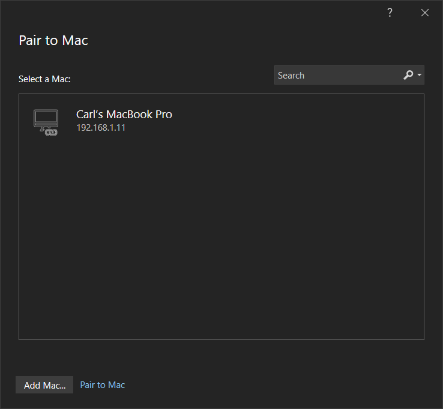

Select a Mac in the list and select **Connect**, or select the **Add Mac...** button, at which point you'll be asked for a host name or IP Address.

Enter your username and password. The first time you connect to any particular Mac, you're prompted to enter your username and password for that machine:

Successfully connecting looks like this:

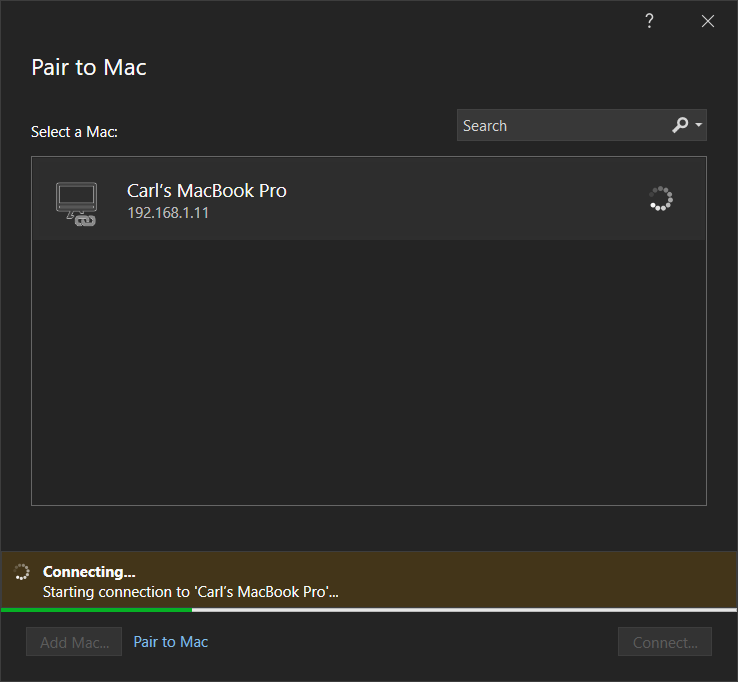

When connected it should look like this:

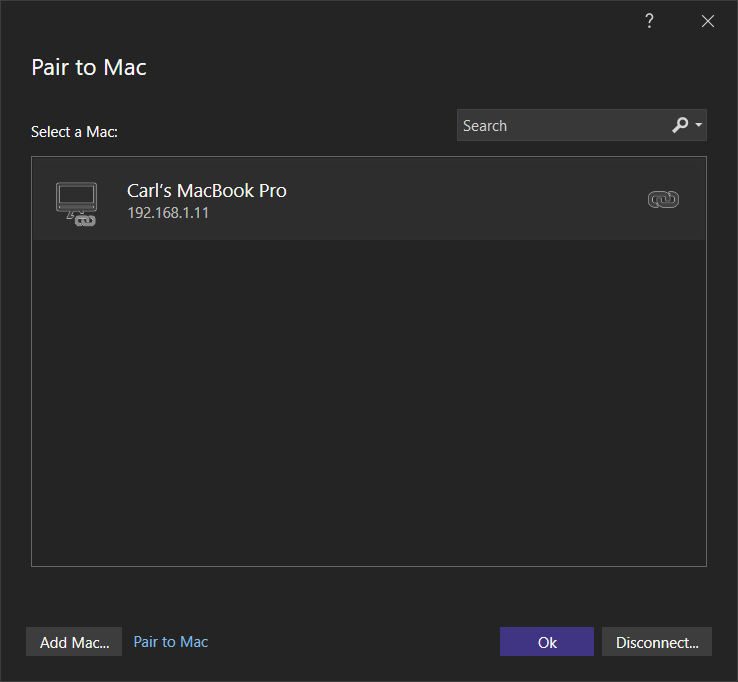

If it hangs, close Visual Studio, reopen it and try again.

> :point_up: If your Mac has pending security updates, Visual Studio will not be able to connect

Once your Mac is paired, you can try selecting an iOS Simulator from the list and running the app.

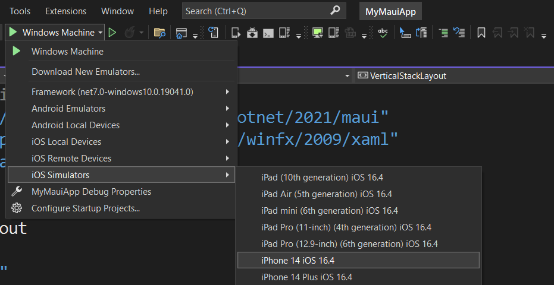

Here's what it looks like in the iOS Simulator on Windows:

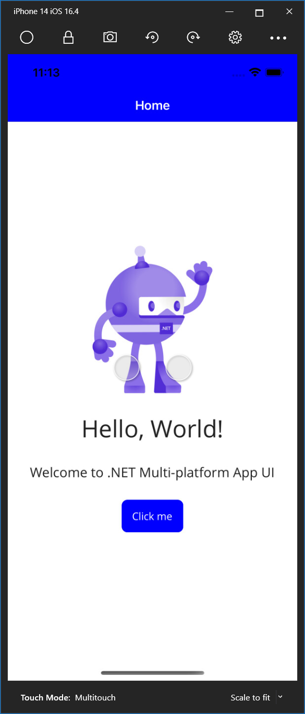

> :point_up: If the latest version of XCode is not installed on the mac, it may fail, as Visual Studio always expects the latest version to be installed. After updating any software on the Mac, you always have to disconnect and re-connect to the Mac from Visual Studio.

Try Hot Reload by changing the Primary color back to Purple (#512BD4).

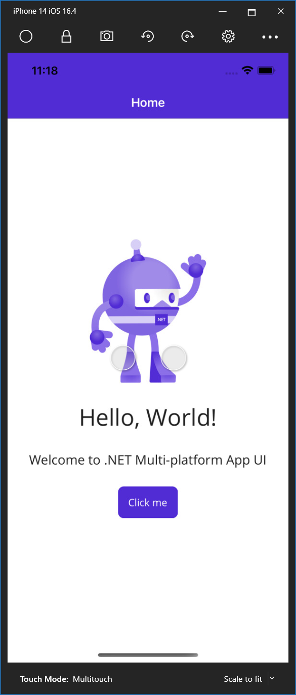

### Using a Mac without Pairing

It's pretty simple to do this. You either need to share your Windows project folder directly on the Mac (good luck with that), or you can create a code repository on GitHub, [Azure Repos](https://azure.microsoft.com/en-us/products/devops/repos/), or another Git repository.

For a detailed video on how to set this up with GitHub, check out [Episode 19](https://www.youtube.com/watch?v=CYoNWt57C5k) of The .NET Show.

On the Mac, open a Terminal Window and navigate to the *projects folder*:

```
cd projects
```

At this point you can clone your repo

```
git clone https://github.com/carlfranklin/MyMauiApp.git
```

This is a public repo, but you should point to your own repo. Here's what happens next:

```
Cloning into 'MyMauiApp'...
remote: Enumerating objects: 56, done.
remote: Counting objects: 100% (56/56), done.
remote: Compressing objects: 100% (48/48), done.
remote: Total 56 (delta 2), reused 56 (delta 2), pack-reused 0
Receiving objects: 100% (56/56), 155.86 KiB | 2.13 MiB/s, done.
Resolving deltas: 100% (2/2), done.
carlfranklin@Carls-MacBook-Pro projects % 
```

Now I can go into the project folder;

```
cd MyMauiApp
```

Build the app with this:

```
dotnet build
```

In order to run the app in an iOS Simulator, open XCode, go to the **Window** menu, select **Devices and Simulators**, select the **Simulators** tab, select a Simulator you'd like to use, and copy the UDID (Device ID) into the clipboard.

Now execute the command with the UDID from the clipboard:

```
dotnet build -t:Run -f net7.0-ios -p:_DeviceName=v2:udid=[YOUR UDID HERE]
```

When I tried building this, I got the error outlined on this page:

[https://stackoverflow.com/questions/75990406/how-to-solve-error-he0004-could-not-load-the-framework-contentdeliveryservices](https://stackoverflow.com/questions/75990406/how-to-solve-error-he0004-could-not-load-the-framework-contentdeliveryservices)

I was not able to come up with the magic blend of SDK/XCode/VS versions, but I have faith that at some point in the future this will be resolved.

As one of the StackOverflow users said, it's very frustrating trying to keep versions on XCode and Visual Studio in sync. They are often out of sync.

As a consolation, you can run the Mac Desktop version by executing this command:

```
dotnet build -t:Run -f net7.0-maccatalyst
```

This came right up:

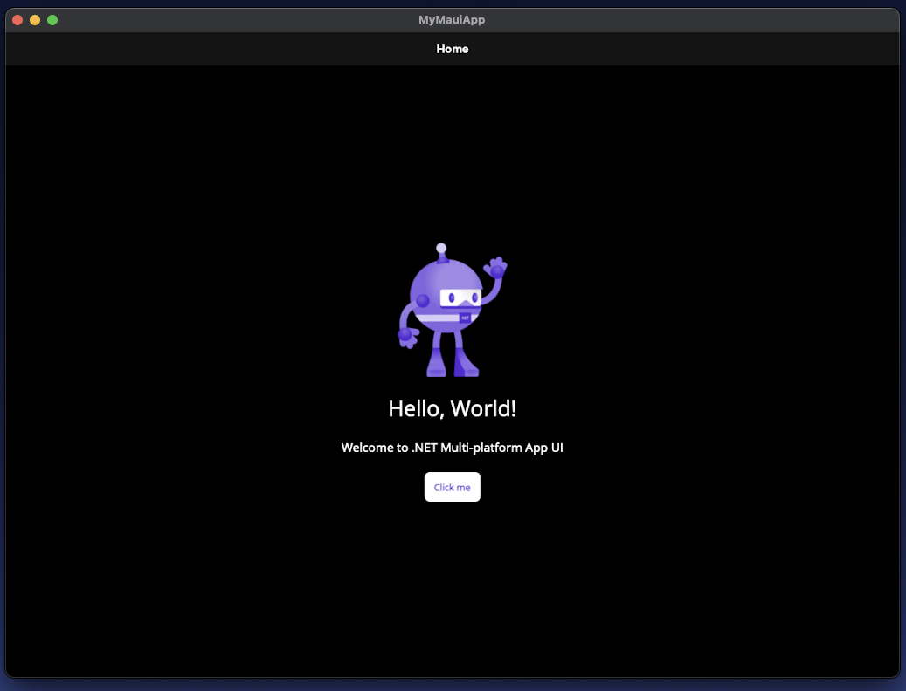

Now, we don't have Hot Reload here, but you can make a change on the PC, push to Github, Pull from the Mac, and rebuild and run.

Let's change the main label text from "Hello, World!" to "Hello, MAUI!" Then, we can push, pull, and build.

After making the change and pushing changes to the repo, we can pull the latest on the Mac with this:

```
git pull -r
```

Once we have the latest build, we can issue the build and run command again:

```
dotnet build -t:Run -f net7.0-maccatalyst
```

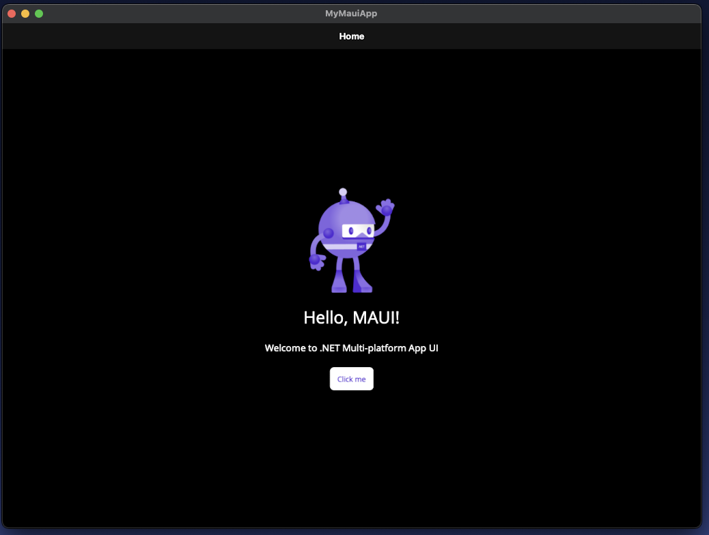

### Using a Local iOS Device

Hot restart isn't a replacement for the full build experience provided by a Mac build host. For example, it can only deploy apps that use the debug build configuration, and it doesn't support static libraries and frameworks, XCFrameworks, or binding resource packages. For more information, see [Limitations](https://learn.microsoft.com/en-us/dotnet/maui/ios/hot-restart?view=net-maui-7.0#limitations).

The [documentation for setting up Hot Restart](https://learn.microsoft.com/en-us/dotnet/maui/ios/hot-restart?view=net-maui-7.0) is pretty good, but I can simplify.

There are a number of requirements that must be met to use hot restart to deploy a .NET MAUI app to a locally connected iOS device:

- You must be using Visual Studio 2022 version 17.3 or greater.
- You must have iTunes (Microsoft Store or 64-bit version) installed on your development machine.
- You must have an [Apple Developer account](https://appleid.apple.com/account) and paid [Apple Developer Program](https://developer.apple.com/programs) enrollment.

Got all that? Great. You now have the privilege of using your own iPhone to debug an app that you wrote on your own machine. 

Let's jump over to the documentation and scroll down to the **Setup** section.

If all goes well, and you run the app against your local device, you'll see this message:


Go to your iOS device and launch the app.

Here's a screenshot I took of it running on my iPhone:

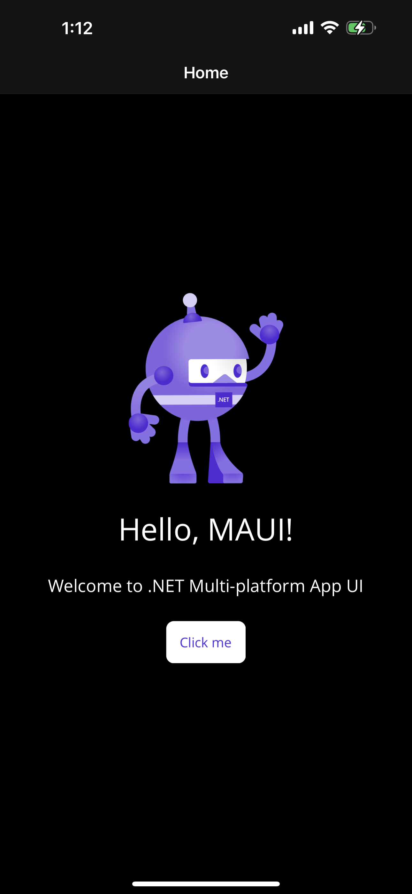

So there you have it. We've run our app on Windows, Mac Desktop, an Android emulator, an Android device, an iOS simulator, and an iOS device. 

Let's move on.

