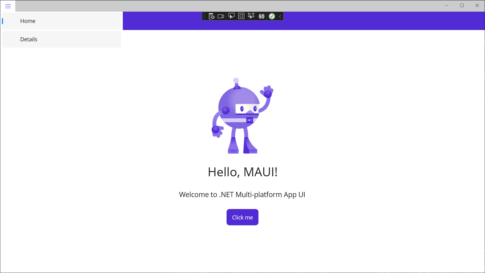

# Shell and Navigation

[.NET Multi-platform App UI (.NET MAUI) Shell](https://learn.microsoft.com/en-us/dotnet/maui/fundamentals/shell/?view=net-maui-7.0) reduces the complexity of app development by providing the fundamental features that most apps require, including:

- A single place to describe the visual hierarchy of an app.
- A common navigation user experience.
- A URI-based navigation scheme that permits navigation to any page in the app.
- An integrated search handler.

## App visual hierarchy

In a .NET MAUI Shell app, the visual hierarchy of the app is described in a class that subclasses the [Shell](https://learn.microsoft.com/en-us/dotnet/api/microsoft.maui.controls.shell) class. 

In the default MAUI template, this is `AppShell`, defined by *AppShell.xaml* and *AppShell.xaml.cs*

Take a look at *AppShell.xaml*:

```xaml
<?xml version="1.0" encoding="UTF-8" ?>
<Shell
    x:Class="MyMauiApp.AppShell"
    xmlns="http://schemas.microsoft.com/dotnet/2021/maui"
    xmlns:x="http://schemas.microsoft.com/winfx/2009/xaml"
    xmlns:local="clr-namespace:MyMauiApp"
    Shell.FlyoutBehavior="Disabled">

    <ShellContent
        Title="Home"
        ContentTemplate="{DataTemplate local:MainPage}"
        Route="MainPage" />

</Shell>
```

The `ShellContent` defines our single page, `MainPage` with the title **Home**, and the Route **MainPage**. This is setting us up to add more pages, and let the Shell manage navigation between them.

The `Shell`-derived class (`AppShell`) can consist of three main hierarchical objects:

1. [FlyoutItem](https://learn.microsoft.com/en-us/dotnet/api/microsoft.maui.controls.flyoutitem) or [TabBar](https://learn.microsoft.com/en-us/dotnet/api/microsoft.maui.controls.tabbar). A [FlyoutItem](https://learn.microsoft.com/en-us/dotnet/api/microsoft.maui.controls.flyoutitem) represents one or more items in the flyout, and should be used when the navigation pattern for the app requires a flyout. A [TabBar](https://learn.microsoft.com/en-us/dotnet/api/microsoft.maui.controls.tabbar) represents the bottom tab bar, and should be used when the navigation pattern for the app begins with bottom tabs and doesn't require a flyout. For more information about flyout items, see [.NET MAUI Shell flyout](https://learn.microsoft.com/en-us/dotnet/maui/fundamentals/shell/flyout). For more information about tab bars, see [.NET MAUI Shell tabs](https://learn.microsoft.com/en-us/dotnet/maui/fundamentals/shell/tabs).
2. [Tab](https://learn.microsoft.com/en-us/dotnet/api/microsoft.maui.controls.tab), which represents grouped content, navigable by bottom tabs. For more information, see [.NET MAUI Shell tabs](https://learn.microsoft.com/en-us/dotnet/maui/fundamentals/shell/tabs).
3. [ShellContent](https://learn.microsoft.com/en-us/dotnet/api/microsoft.maui.controls.shellcontent), which represents the [ContentPage](https://learn.microsoft.com/en-us/dotnet/api/microsoft.maui.controls.contentpage) objects for each tab. For more information, see [.NET MAUI Shell pages](https://learn.microsoft.com/en-us/dotnet/maui/fundamentals/shell/pages).

These objects don't represent any user interface, but rather the organization of the app's visual hierarchy. Shell will take these objects and produce the navigation user interface for the content.

> :point_up: Pages are created on demand in Shell apps, in response to navigation.

### Navigation

.NET Multi-platform App UI (.NET MAUI) Shell includes a URI-based [navigation experience](https://learn.microsoft.com/en-us/dotnet/maui/fundamentals/shell/navigation?view=net-maui-7.0) that uses routes to navigate to any page in the app, without having to follow a set navigation hierarchy. In addition, it also provides the ability to navigate backwards without having to visit all of the pages on the navigation stack.

Let's add a new `ContentPage` to the app:

*DetailPage.xaml*:

```xaml
<?xml version="1.0" encoding="utf-8" ?>
<ContentPage xmlns="http://schemas.microsoft.com/dotnet/2021/maui"
            xmlns:x="http://schemas.microsoft.com/winfx/2009/xaml"
            x:Class="MyMauiApp.DetailPage">
    <ScrollView>
        <VerticalStackLayout
            Spacing="25"
            Padding="30,0"
            VerticalOptions="Center">

            <Label
                Text="Detail Page"
                SemanticProperties.HeadingLevel="Level1"
                FontSize="32"
                HorizontalOptions="Center" />
            
        </VerticalStackLayout>
    </ScrollView>
</ContentPage>
```

*DetailPage.xaml.cs*:

```c#
namespace MyMauiApp;

public partial class DetailPage : ContentPage
{
    public DetailPage()
    {
        InitializeComponent();
    }
}
```

Now, replace *AppShell.xaml* with the following:

```xaml
<?xml version="1.0" encoding="UTF-8" ?>
<Shell
    x:Class="MyMauiApp.AppShell"
    xmlns="http://schemas.microsoft.com/dotnet/2021/maui"
    xmlns:x="http://schemas.microsoft.com/winfx/2009/xaml"
    xmlns:local="clr-namespace:MyMauiApp"
    Shell.FlyoutBehavior="Flyout">

    <ShellContent
        Title="Home"
        ContentTemplate="{DataTemplate local:MainPage}"
        Route="MainPage" />

    <ShellContent
        Title="Details"
        ContentTemplate="{DataTemplate local:DetailPage}"
        Route="DetailPage" />

</Shell>
```

We added a new `ShellContent` for the Details Page.

We also changed `Shell.FlyoutBehavior` from `Disabled` to `Flyout`. That gives us a hamburger menu on the top-left. 

Run the app and click the hamburger menu:



Now you can navigate to the Details page and back.

For more details on navigation see the [MAUI Documentation](https://learn.microsoft.com/en-us/dotnet/maui/fundamentals/shell/navigation?view=net-maui-7.0).