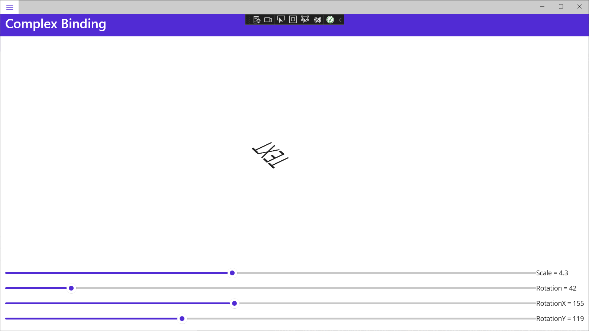
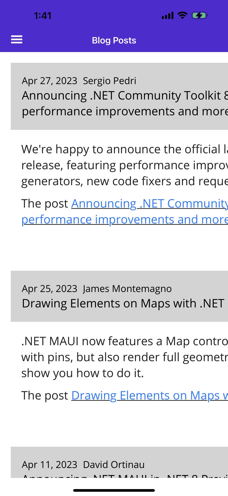

# Data Binding

[.NET Multi-platform App UI (.NET MAUI) data bindings](https://learn.microsoft.com/en-us/dotnet/maui/xaml/fundamentals/data-binding-basics?view=net-maui-7.0) allow properties of two objects to be linked so that a change in one causes a change in the other. This is a very valuable tool, and while data bindings can be defined entirely in code, XAML provides shortcuts and convenience.

Data bindings connect properties of two objects, called the *source* and the *target*. In code, two steps are required:

1. The `BindingContext` property of the target object must be set to the source object,
2. The `SetBinding` method (often used in conjunction with the `Binding` class) must be called on the target object to bind a property of that object to a property of the source object.

The target property must be a bindable property, which means that the target object must derive from [BindableObject](https://learn.microsoft.com/en-us/dotnet/api/microsoft.maui.controls.bindableobject). A property of [Label](https://learn.microsoft.com/en-us/dotnet/api/microsoft.maui.controls.label), such as `Text`, is associated with the bindable property `TextProperty`.

In XAML, you must also perform the same two steps that are required in code, except that the `Binding` markup extension takes the place of the `SetBinding` call and the `Binding` class. However, when you define data bindings in XAML, there are multiple ways to set the `BindingContext` of the target object. Sometimes it’s set from the code-behind file, sometimes using a [`StaticResource`](https://learn.microsoft.com/en-us/dotnet/api/microsoft.maui.controls.xaml.staticresourceextension) or `x:Static` markup extension, and sometimes as the content of `BindingContext` property-element tags.

## View-to-view bindings

You can define data bindings to link properties of two views on the same page. In this case, you set the `BindingContext` of the target object using the `x:Reference` markup extension.

Add a new ContentPage to the app:

*SimpleBinding.xaml*:

```xaml
<?xml version="1.0" encoding="utf-8" ?>
<ContentPage xmlns="http://schemas.microsoft.com/dotnet/2021/maui"
             xmlns:x="http://schemas.microsoft.com/winfx/2009/xaml"
             x:Class="MyMauiApp.SimpleBinding"
             Title="Simple Binding">

    <StackLayout VerticalOptions="Center" Margin="40">
        <Label Text="ROTATION"
               BindingContext="{x:Reference slider}"
               Rotation="{Binding Path=Value}"
               FontAttributes="Bold"
               FontSize="18"
               HorizontalOptions="Center"
               VerticalOptions="Center" />
        <Slider x:Name="slider"
               Maximum="360"
               VerticalOptions="Center" />
        <Label BindingContext="{x:Reference slider}"
               Text="{Binding Value, StringFormat='The angle is {0:F0} degrees'}"
               FontAttributes="Bold"
               FontSize="18"
               HorizontalOptions="Center"
               VerticalOptions="Center" />
    </StackLayout>

</ContentPage>
```

Add the code-behind class:

*SimpleBinding.xaml.cs*:

```c#
namespace MyMauiApp;

public partial class SimpleBinding : ContentPage
{
    public SimpleBinding()
    {
        InitializeComponent();
    }
}
```

Add the following to *AppShell.xaml*:

```xaml
    <ShellContent
        Title="Simple Binding"
        ContentTemplate="{DataTemplate local:SimpleBinding}"
        Route="SimpleBinding" />
```

Run the app, navigate to the Simple Binding page, and move the slider:


Notice that the two label controls update as the slider value changes.

The [Slider](https://learn.microsoft.com/en-us/dotnet/api/microsoft.maui.controls.slider) contains an `x:Name` attribute.

```xaml
    <Slider x:Name="slider"
            Maximum="360"
            VerticalOptions="Center" />
```

The name is referenced by the two [Label](https://learn.microsoft.com/en-us/dotnet/api/microsoft.maui.controls.label) views using the `x:Reference` markup extension. 

```xaml
    <Label Text="ROTATION"
           BindingContext="{x:Reference slider}"
           Rotation="{Binding Path=Value}"
```

```xaml
    <Label BindingContext="{x:Reference slider}"
           Text="{Binding Value, StringFormat='The angle is {0:F0} degrees'}"
```

The `x:Reference` binding extension defines a property named `Name` to set to the name of the referenced element, in this case `slider`.

However, the `ReferenceExtension` class that defines the `x:Reference` markup extension also defines a `ContentProperty` attribute for `Name`, which means that it isn’t explicitly required. So, if you're binding to a view and referencing it by it's name, you don't have to specify the `Name` property.

## Binding modes

A single view can have data bindings on several of its properties. However, each view can have only one `BindingContext`, so multiple data bindings on that view must all reference properties of the same object.

The solution to this and other problems involves the `Mode` property, which is set to a member of the `BindingMode` enumeration:

- `Default`
- `OneWay` — values are transferred from the source to the target
- `OneWayToSource` — values are transferred from the target to the source
- `TwoWay` — values are transferred both ways between source and target
- `OneTime` — data goes from source to target, but only when the `BindingContext` changes

Let's implement one common use of the `OneWayToSource` and `TwoWay` binding modes.

Add a new ContentPage named [ComplexBinding.xaml]():

```xaml
<?xml version="1.0" encoding="utf-8" ?>
<ContentPage xmlns="http://schemas.microsoft.com/dotnet/2021/maui"
             xmlns:x="http://schemas.microsoft.com/winfx/2009/xaml"
             x:Class="MyMauiApp.ComplexBinding"
             Padding ="10"
             Title ="Complex Binding">

    <Grid>
        <Grid.RowDefinitions>
            <RowDefinition Height="*" />
            <RowDefinition Height="Auto" />
            <RowDefinition Height="Auto" />
            <RowDefinition Height="Auto" />
            <RowDefinition Height="Auto" />
        </Grid.RowDefinitions>
        <Grid.ColumnDefinitions>
            <ColumnDefinition Width="*" />
            <ColumnDefinition Width="Auto" />
        </Grid.ColumnDefinitions>

        <!-- Scaled and rotated Label -->
        <Label x:Name="label"
               Text="TEXT"
               HorizontalOptions="Center"
               VerticalOptions="CenterAndExpand" />

        <!-- Slider and identifying Label for Scale -->
        <Slider x:Name="scaleSlider"
                BindingContext="{x:Reference label}"
                Grid.Row="1" Grid.Column="0"
                Maximum="10"
                Value="{Binding Scale, Mode=TwoWay}" />
        <Label BindingContext="{x:Reference scaleSlider}"
               Text="{Binding Value, StringFormat='Scale = {0:F1}'}"
               Grid.Row="1" Grid.Column="1"
               VerticalTextAlignment="Center" />

        <!-- Slider and identifying Label for Rotation -->
        <Slider x:Name="rotationSlider"
                BindingContext="{x:Reference label}"
                Grid.Row="2" Grid.Column="0"
                Maximum="360"
                Value="{Binding Rotation, Mode=OneWayToSource}" />
        <Label BindingContext="{x:Reference rotationSlider}"
               Text="{Binding Value, StringFormat='Rotation = {0:F0}'}"
               Grid.Row="2" Grid.Column="1"
               VerticalTextAlignment="Center" />

        <!-- Slider and identifying Label for RotationX -->
        <Slider x:Name="rotationXSlider"
                BindingContext="{x:Reference label}"
                Grid.Row="3" Grid.Column="0"
                Maximum="360"
                Value="{Binding RotationX, Mode=OneWayToSource}" />
        <Label BindingContext="{x:Reference rotationXSlider}"
               Text="{Binding Value, StringFormat='RotationX = {0:F0}'}"
               Grid.Row="3" Grid.Column="1"
               VerticalTextAlignment="Center" />

        <!-- Slider and identifying Label for RotationY -->
        <Slider x:Name="rotationYSlider"
                BindingContext="{x:Reference label}"
                Grid.Row="4" Grid.Column="0"
                Maximum="360"
                Value="{Binding RotationY, Mode=OneWayToSource}" />
        <Label BindingContext="{x:Reference rotationYSlider}"
               Text="{Binding Value, StringFormat='RotationY = {0:F0}'}"
               Grid.Row="4" Grid.Column="1"
               VerticalTextAlignment="Center" />
    </Grid>

</ContentPage>
```

Add the code-behind file:

*ComplexBinding.xaml.cs*:

```c#
namespace MyMauiApp;

public partial class ComplexBinding : ContentPage
{
    public ComplexBinding()
    {
        InitializeComponent();
    }
}
```

Add a `ShellContent` item for this page to *AppShell.xaml*:

```xaml
    <ShellContent
        Title="Complex Binding"
        ContentTemplate="{DataTemplate local:ComplexBinding}"
        Route="ComplexBinding" />
```

Run the app, navigate to the Complex Binding page, and test out the sliders:

**Scale**:


**Rotation**:


**RotationX**:


**RotationY**:



In this example, four [Slider](https://learn.microsoft.com/en-us/dotnet/api/microsoft.maui.controls.slider) views are intended to control the `Scale`, `Rotate`, `RotateX`, and `RotateY` properties of a [Label](https://learn.microsoft.com/en-us/dotnet/api/microsoft.maui.controls.label). 

At first, it seems as if these four properties of the [Label](https://learn.microsoft.com/en-us/dotnet/api/microsoft.maui.controls.label) should be data-binding targets because each is being set by a [Slider](https://learn.microsoft.com/en-us/dotnet/api/microsoft.maui.controls.slider). However, the `BindingContext` of [Label](https://learn.microsoft.com/en-us/dotnet/api/microsoft.maui.controls.label) can be only one object, and there are four different sliders. 

For that reason, the `BindingContext` of each of the four sliders is set to the [Label](https://learn.microsoft.com/en-us/dotnet/api/microsoft.maui.controls.label), and the bindings are set on the `Value` properties of the sliders. 

By using the `OneWayToSource` and `TwoWay` modes, these `Value` properties can set the source properties, which are the `Scale`, `Rotate`, `RotateX`, and `RotateY` properties of the [Label](https://learn.microsoft.com/en-us/dotnet/api/microsoft.maui.controls.label).

The bindings on three of the [Slider](https://learn.microsoft.com/en-us/dotnet/api/microsoft.maui.controls.slider) views are `OneWayToSource`, meaning that the [Slider](https://learn.microsoft.com/en-us/dotnet/api/microsoft.maui.controls.slider) value causes a change in the property of its `BindingContext`, which is the [Label](https://learn.microsoft.com/en-us/dotnet/api/microsoft.maui.controls.label) named `label`. These three [Slider](https://learn.microsoft.com/en-us/dotnet/api/microsoft.maui.controls.slider) views cause changes to the `Rotate`, `RotateX`, and `RotateY` properties of the [Label](https://learn.microsoft.com/en-us/dotnet/api/microsoft.maui.controls.label)

However, the binding for the `Scale` property is `TwoWay`. This is because the `Scale` property has a default value of 1, and using a `TwoWay` binding causes the [Slider](https://learn.microsoft.com/en-us/dotnet/api/microsoft.maui.controls.slider) initial value to be set at 1 rather than 0. If that binding were `OneWayToSource`, the `Scale` property would initially be set to 0 from the [Slider](https://learn.microsoft.com/en-us/dotnet/api/microsoft.maui.controls.slider) default value. The [Label](https://learn.microsoft.com/en-us/dotnet/api/microsoft.maui.controls.label) would not be visible.

> :point_up: The [VisualElement](https://learn.microsoft.com/en-us/dotnet/api/microsoft.maui.controls.visualelement) class also has `ScaleX` and `ScaleY` properties, which scale the [VisualElement](https://learn.microsoft.com/en-us/dotnet/api/microsoft.maui.controls.visualelement) on the x-axis and y-axis respectively.

## Bindings and Collections

#### ListView

[ListView](https://learn.microsoft.com/en-us/dotnet/api/microsoft.maui.controls.listview) defines an `ItemsSource` property of type `IEnumerable`, and it displays the items in that collection. These items can be objects of any type. By default, [ListView](https://learn.microsoft.com/en-us/dotnet/api/microsoft.maui.controls.listview) uses the `ToString` method of each item to display that item. Sometimes this is just what you want, but in many cases, `ToString` returns only the fully-qualified class name of the object.

However, the items in the [ListView](https://learn.microsoft.com/en-us/dotnet/api/microsoft.maui.controls.listview) collection can be displayed any way you want through the use of a *template*, which involves a class that derives from [Cell](https://learn.microsoft.com/en-us/dotnet/api/microsoft.maui.controls.cell). The template is cloned for every item in the [ListView](https://learn.microsoft.com/en-us/dotnet/api/microsoft.maui.controls.listview), and data bindings that have been set on the template are transferred to the individual clones. Custom cells can be created for items using the [ViewCell](https://learn.microsoft.com/en-us/dotnet/api/microsoft.maui.controls.viewcell) class.

#### CollectionView

The .NET Multi-platform App UI (.NET MAUI) [CollectionView](https://learn.microsoft.com/en-us/dotnet/api/microsoft.maui.controls.collectionview) is a view for presenting lists of data using different layout specifications. It aims to provide a more flexible, and performant alternative to [ListView](https://learn.microsoft.com/en-us/dotnet/api/microsoft.maui.controls.listview). I prefer using CollectionView all the time. It's just better on all platforms.

## CollectionView and ListView differences

While the [CollectionView](https://learn.microsoft.com/en-us/dotnet/api/microsoft.maui.controls.collectionview) and [ListView](https://learn.microsoft.com/en-us/dotnet/api/microsoft.maui.controls.listview) APIs are similar, there are some notable differences:

- [CollectionView](https://learn.microsoft.com/en-us/dotnet/api/microsoft.maui.controls.collectionview) has a flexible layout model, which allows data to be presented vertically or horizontally, in a list or a grid.
- [CollectionView](https://learn.microsoft.com/en-us/dotnet/api/microsoft.maui.controls.collectionview) supports single and multiple selection.
- [CollectionView](https://learn.microsoft.com/en-us/dotnet/api/microsoft.maui.controls.collectionview) has no concept of cells. Instead, a data template is used to define the appearance of each item of data in the list.
- [CollectionView](https://learn.microsoft.com/en-us/dotnet/api/microsoft.maui.controls.collectionview) automatically utilizes the virtualization provided by the underlying native controls.
- [CollectionView](https://learn.microsoft.com/en-us/dotnet/api/microsoft.maui.controls.collectionview) reduces the API surface of [ListView](https://learn.microsoft.com/en-us/dotnet/api/microsoft.maui.controls.listview). Many properties and events from [ListView](https://learn.microsoft.com/en-us/dotnet/api/microsoft.maui.controls.listview) are not present in [CollectionView](https://learn.microsoft.com/en-us/dotnet/api/microsoft.maui.controls.collectionview).
- [CollectionView](https://learn.microsoft.com/en-us/dotnet/api/microsoft.maui.controls.collectionview) does not include built-in separators.
- [CollectionView](https://learn.microsoft.com/en-us/dotnet/api/microsoft.maui.controls.collectionview) will throw an exception if its `ItemsSource` is updated off the UI thread.

## Ingesting an RSS Feed

Data is everywhere and there are many ways to access it. Since it's beyond the scope of this workshop to talk about Authentication, Authorization, and API Architecture, I've opted for code to download the latest blog posts from the .NET MAUI Blog, managed by the Microsoft MAUI Team. We can then display them on a page.

You can find the blog itself on the web at [https://devblogs.microsoft.com/dotnet/category/maui/](https://devblogs.microsoft.com/dotnet/category/maui/)

The RSS Feed URL is [https://devblogs.microsoft.com/dotnet/category/maui/feed/](https://devblogs.microsoft.com/dotnet/category/maui/feed/). We will use this to retrieve blog posts.

Add a new folder called *Models*, and to it add the following class:

*BlogPost.cs*:

```c#
namespace MyMauiApp.Models;

public class BlogPost
{
    public DateTime PublishDate { get; set; }
    public string Author { get; set; } = string.Empty;
    public string Title { get; set; } = string.Empty;
    public string Description { get; set; } = string.Empty;
    public string Content { get; set; } = string.Empty;
}
```

Add the following NuGet Package:

```
System.ServiceModel.Syndication
```

Add the following lines to the top of *MauiProgram.cs*:

```c#
global using System.ServiceModel.Syndication;
global using System.Xml;
global using MyMauiApp.Models;
global using MyMauiApp.Services;
```

> :point_up: Don't worry about the squiggles. We will need all of these.

Add a new folder called *Services*, and to it add the following class:

*BlogDataManager.cs*:

```c#
namespace MyMauiApp.Services;

public static class BlogDataManager
{
    private readonly static string url =
        "https://devblogs.microsoft.com/dotnet/category/maui/feed/";

    public static List<BlogPost> BlogPosts = new List<BlogPost>();

    /// <summary>
    /// Reads posts from the .NET MAUI Blog into the BlogPosts list
    /// </summary>
    /// <returns></returns>
    public static void GetBlogPosts()
    {
        var posts = new List<BlogPost>();
        
        using var reader = XmlReader.Create(url);
    
        var feed = SyndicationFeed.Load(reader);
        
        foreach (var item in feed.Items )
        {
            var post = new BlogPost();

            // Publish Date
            post.PublishDate = item.PublishDate.DateTime;
            
            // Author. Use ElementExtensions to read the dc:creator tag
            var creators = 
                item.ElementExtensions.ReadElementExtensions<string>
                ("creator", "http://purl.org/dc/elements/1.1/");
            if (creators != null && creators.Count > 0)
            {
                post.Author = creators.FirstOrDefault<string>();
            }
            
            // Title
            post.Title = item.Title.Text;
            
            // Description
            post.Description = item.Summary.Text;
            
            // Content. Use ElementExtensions to read encoded content
            var contents = 
                item.ElementExtensions.ReadElementExtensions<string>
                ("encoded", "http://purl.org/rss/1.0/modules/content/");
            if (contents != null && contents.Count > 0)
            {
                post.Content = contents.FirstOrDefault<string>();
            }

            // Done. Add to list
            posts.Add(post);
        }

        // Refresh the list
        BlogPosts.Clear();
        BlogPosts.AddRange(posts);
    }
}
```

I've opted to make this a `static` class so it will be easily accessible without requiring dependency injection.

This class not only reads the posts from the RSS feed, but it exposes the list of posts as a static property. That will make it easy for us to bind from anywhere.

Add a new Content Page called *BlogPage.xaml*:

```xaml
<?xml version="1.0" encoding="utf-8" ?>
<ContentPage xmlns="http://schemas.microsoft.com/dotnet/2021/maui"
             xmlns:x="http://schemas.microsoft.com/winfx/2009/xaml"
             x:Class="MyMauiApp.BlogPage"
             xmlns:local="clr-namespace:MyMauiApp"
             Title="Blog Posts">

    <ScrollView Margin="20">
        <CollectionView ItemsSource="{Binding BlogPosts}">
            <CollectionView.ItemTemplate>
                <DataTemplate>
                    <Label Text="{Binding Author}"
                           FontSize="14" />
                </DataTemplate>
            </CollectionView.ItemTemplate>
        </CollectionView>
    </ScrollView>

</ContentPage>
```

This is a good start. It will show the authors of each blog post in a `CollectionView`. 

Add the following code-behind class:

*BlogPage.xaml.cs*:

```c#
namespace MyMauiApp;

public partial class BlogPage : ContentPage
{
    public BlogPage()
    {
        InitializeComponent();
        BindingContext = this;
        BlogDataManager.GetBlogPosts();
    }

    public List<BlogPost> BlogPosts => BlogDataManager.BlogPosts;
}
```

Add to *AppShell.xaml*:

```c#
    <ShellContent
        Title="Blog Posts"
        ContentTemplate="{DataTemplate local:BlogPage}"
        Route="BlogPage" />
```


Here we are defining a read-only `BlogPosts` property that returns the blog posts from the data manager.

```c#
public List<BlogPost> BlogPosts => BlogDataManager.BlogPosts;
```

In order for the XAML to bind to it without fanfare, we have to make the page itself the data context.

```c#
BindingContext = this;
```

Finally, in the constructor, we load the data from the RSS feed

```c#
BlogDataManager.GetBlogPosts();
```

Run the app and navigate to the Blog Posts page:


OK, now that we know we can show items in a list, let's fill out the data with some real UI.

Replace *BlogPage.xaml* with this:

```xaml
<?xml version="1.0" encoding="utf-8" ?>
<ContentPage xmlns="http://schemas.microsoft.com/dotnet/2021/maui"
             xmlns:x="http://schemas.microsoft.com/winfx/2009/xaml"
             x:Class="MyMauiApp.BlogPage"
             xmlns:local="clr-namespace:MyMauiApp"
             Title="Blog Posts">

    <ScrollView>
        <CollectionView Margin="20" 
                        ItemsSource="{Binding BlogPosts}">
            <CollectionView.ItemTemplate>
                <DataTemplate>
                    <VerticalStackLayout Margin="0,0,0,20">
                        <Border BackgroundColor="LightGray">
                            <VerticalStackLayout Margin="20" >
                                <HorizontalStackLayout>
                                    <Label Margin="0,0,10,0" 
                                        TextColor="Black"
                                        Text="{Binding PublishDate, 
                                        StringFormat='{}{0:MMM dd, yyyy}'}" 
                                        FontSize="18"  />
                                    <Label Text="{Binding Author}" 
                                        TextColor="Black"
                                        FontSize="18" 
                                        FontAttributes="Bold" />
                                </HorizontalStackLayout>
                                <Label Text="{Binding Title}" 
                                       TextColor="Black"
                                       LineBreakMode="WordWrap"
                                       FontSize="22" />
                            </VerticalStackLayout>
                        </Border>
                        <Label Margin="20" 
                               Text="{Binding Description}" 
                               LineBreakMode="WordWrap"
                               TextType="Html" 
                               FontSize="22" />
                    </VerticalStackLayout>
                </DataTemplate>
            </CollectionView.ItemTemplate>
        </CollectionView>
    </ScrollView>

</ContentPage>
```

This is a good example of using a `CollelctionView` inside a `ScrollView` with a nicely-styled `DataTemplate` for each item

Run the app:


Notice how many nested Layout controls we are using. That's XAML for you. Any time you need more than one item on top of another, you need a `VerticalStackLayout`. Any time you need more than one item next to one another you need a `HorizontalStackLayout`.  The `Border` is required when you want to put a styled border around one or more items. In this case, I use it for the blog post header, which shows the publish date, the author, and the title.

Also, notice that I did not put the actual blog post (the Content) on the screen. That would require a `<WebView>` control, which requires an absolute width and height, and also can chew up memory that your mobile users might not want to sacrifice.

This is the app running on my Android phone:


This is it working on my iPhone using Hot Restart:



Uh oh. It doesn't wrap on iOS. I consider this a bug that will be fixed in the future.

## Binding value converters

A value converter is a class that implements the [IValueConverter](https://learn.microsoft.com/en-us/dotnet/api/microsoft.maui.controls.ivalueconverter) interface. Classes that implement [IValueConverter](https://learn.microsoft.com/en-us/dotnet/api/microsoft.maui.controls.ivalueconverter) are also often referred to as *binding converters* or *binding value converters*.

The purpose of a value converter is to return an object of any type given another object of any type. Typically, this is used in place of logic such as "if the value of a boolean is true, return the color green, otherwise return the color red."

We're going to create a value converter that returns a color based on the month of a date. We'll then implement that in our **BlogPage** page.

Add the following class to the project:

*DateToColorValueConverter.cs*:

```c#
using System.Globalization;

namespace MyMauiApp;

public class DateToColorValueConverter : IValueConverter
{
    public object Convert(object value, Type targetType, object parameter, CultureInfo culture)
    {
        var date = (DateTime)value;
        Color color = null;

        switch (date.Month)
        {
            case 0:
                color = Colors.Snow;
                break;
            case 1:
                color = Colors.AliceBlue;
                break;
            case 2:
                color = Colors.LightYellow;
                break;
            case 3:
                color = Colors.GreenYellow;
                break;
            case 4:
                color = Colors.YellowGreen;
                break;
            case 5:
                color = Colors.Green;
                break;
            case 6:
                color = Colors.IndianRed;
                break;
            case 7:
                color = Colors.Red;
                break;
            case 8:
                color = Colors.Orange;
                break;
            case 9:
                color = Colors.DarkOrange;
                break;
            case 10:
                color = Colors.SandyBrown;
                break;
            case 11:
                color = Colors.Tan;
                break;
        }
        return color;
    }

    public object ConvertBack(object value, Type targetType, object parameter, CultureInfo culture)
    {
        throw new NotImplementedException();
    }
}
```

This converter returns a `Microsoft.Maui.Graphics.Color`, which is the data type of `Visual Element.BackgroundColor`, given a date where the month is examined.

Replace *BlogPage.xaml* with the following:

```xaml
<?xml version="1.0" encoding="utf-8" ?>
<ContentPage xmlns="http://schemas.microsoft.com/dotnet/2021/maui"
             xmlns:x="http://schemas.microsoft.com/winfx/2009/xaml"
             x:Class="MyMauiApp.BlogPage"
             xmlns:local="clr-namespace:MyMauiApp"
             Title="Blog Posts">

    <ContentPage.Resources>
        <local:DateToColorValueConverter x:Key="dateToColor" />
    </ContentPage.Resources>
    
    <ScrollView>
        <CollectionView Margin="20" 
                        ItemsSource="{Binding BlogPosts}">
            <CollectionView.ItemTemplate>
                <DataTemplate>
                    <VerticalStackLayout Margin="0,0,0,20">
                        <Border BackgroundColor=
                                "{Binding Converter={StaticResource dateToColor}, 
                                    Path=PublishDate}">
                            <VerticalStackLayout Margin="20" >
                                <HorizontalStackLayout>
                                    <Label Margin="0,0,10,0" 
                                        TextColor="Black"
                                        Text="{Binding PublishDate, 
                                        StringFormat='{}{0:MMM dd, yyyy}'}" 
                                        FontSize="18"  />
                                    <Label Text="{Binding Author}" 
                                        TextColor="Black"
                                        FontSize="18" 
                                        FontAttributes="Bold" />
                                </HorizontalStackLayout>
                                <Label Text="{Binding Title}" 
                                       TextColor="Black"
                                       LineBreakMode="WordWrap"
                                       FontSize="22" />
                            </VerticalStackLayout>
                        </Border>
                        <Label Margin="20" 
                               Text="{Binding Description}" 
                               LineBreakMode="WordWrap"
                               TextType="Html" 
                               FontSize="22" />
                    </VerticalStackLayout>
                </DataTemplate>
            </CollectionView.ItemTemplate>
        </CollectionView>
    </ScrollView>

</ContentPage>
```

Check out lines 8-10:

```xaml
<ContentPage.Resources>
    <local:DateToColorValueConverter x:Key="dateToColor" />
</ContentPage.Resources>
```

Because we have defined the `local` xaml namespace, we can get a reference into our app.

These lines defines a reference to our `DateToColorValueConverter` named `dateToColor`.

Now check out the definition for our `Border` control:

```xaml
    <Border BackgroundColor=
            "{Binding Converter={StaticResource dateToColor}, 
                Path=PublishDate}">
```

The order that any bound properties are defined is important. Before, we had set the `WidthRequest` property binding before the `BackgroundColor`. Because the binding for `WidthRequest` changed the binding source to the code-behind file, the source is now changed for each subsequently defined properties.

The easiest solution is to define the `BackgroundColor` first, because it is already bound to the `DataTemplate` where `PublishDate` lives.

This is one of those quirks of XAML that drives me nuts.

Run the app and navigate to the Blog Posts page. Notice that the Border (header) for each post has a different color.


