# Hardware Sensors

In this topic we'll dive into [accessing device sensors](https://learn.microsoft.com/en-us/dotnet/maui/platform-integration/device/sensors?view=net-maui-7.0&tabs=android) in a MAUI app. 

> :point_up: MAUI has abstracted access to hardware sensors away from the individual platforms, so you don't need to know how to program them individually.

Devices have all sorts of sensors that are available to you. Some sensors can detect movement, others changes in the environment, such as light. Monitoring and reacting to these sensors makes your app dynamic in adapting to how the device is being used. You can also respond to changes in the sensors and alert the user. 

Device sensor-related types are available in the `Microsoft.Maui.Devices.Sensors` namespace.

## Sensor speed

Sensor speed sets the speed in which a sensor will return data to your app. When you start a sensor, you provide the desired sensor speed with the [SensorSpeed](https://learn.microsoft.com/en-us/dotnet/api/microsoft.maui.devices.sensors.sensorspeed) enumeration.

- [Fastest](https://learn.microsoft.com/en-us/dotnet/api/microsoft.maui.devices.sensors.sensorspeed#microsoft-maui-devices-sensors-sensorspeed-fastest)
  Get the sensor data as fast as possible (not guaranteed to return on UI thread).
- [Game](https://learn.microsoft.com/en-us/dotnet/api/microsoft.maui.devices.sensors.sensorspeed#microsoft-maui-devices-sensors-sensorspeed-game)
  Rate suitable for games (not guaranteed to return on UI thread).
- [Default](https://learn.microsoft.com/en-us/dotnet/api/microsoft.maui.devices.sensors.sensorspeed#microsoft-maui-devices-sensors-sensorspeed-default)
  Default rate suitable for screen orientation changes.
- [UI](https://learn.microsoft.com/en-us/dotnet/api/microsoft.maui.devices.sensors.sensorspeed#microsoft-maui-devices-sensors-sensorspeed-ui)
  Rate suitable for general user interface.

> :warning: Monitoring too many sensors at once may affect the rate sensor data is returned to your app.

### Sensor event handlers

Event handlers added to sensors with either the [Game](https://learn.microsoft.com/en-us/dotnet/api/microsoft.maui.devices.sensors.sensorspeed#microsoft-maui-devices-sensors-sensorspeed-game) or [Fastest](https://learn.microsoft.com/en-us/dotnet/api/microsoft.maui.devices.sensors.sensorspeed#microsoft-maui-devices-sensors-sensorspeed-fastest) speeds **aren't** guaranteed to run on the UI thread. If the event handler needs to access user-interface elements, use the [`MainThread.BeginInvokeOnMainThread`](https://learn.microsoft.com/en-us/dotnet/maui/platform-integration/appmodel/main-thread) method to run that code on the UI thread.

## Connectivity

You can use the .NET Multi-platform App UI (.NET MAUI) [IConnectivity](https://learn.microsoft.com/en-us/dotnet/api/microsoft.maui.networking.iconnectivity) interface to inspect the network accessibility of the device. The network connection may have access to the internet. Devices also contain different kinds of network connections, such as Bluetooth, cellular, or WiFi. The `IConnectivity` interface has an event to monitor changes in the devices connection state.

The default implementation of the `IConnectivity` interface is available through the [Connectivity.Current](https://learn.microsoft.com/en-us/dotnet/api/microsoft.maui.networking.connectivity.current#microsoft-maui-networking-connectivity-current) property. Both the `IConnectivity` interface and `Connectivity` class are contained in the `Microsoft.Maui.Networking` namespace.

## Get started

To access the **Connectivity** functionality, the following platform-specific setup is required.

### Android

The `AccessNetworkState` permission is required and must be configured in the Android project. This can be added in the following ways:

- Add the assembly-based permission:

  Open the *Platforms/Android/MainApplication.cs* file and add the following assembly attributes after `using` directives:

```
[assembly: UsesPermission(Android.Manifest.Permission.AccessNetworkState)]
```

\- or -

- Update the Android Manifest:

Open the *Platforms/Android/AndroidManifest.xml* file and add the following in the `manifest` node:

```xml
<uses-permission android:name="android.permission.ACCESS_NETWORK_STATE" />
```

#### ioS/Mac Catalyst and Windows

No setup is required.

### Using Connectivity

You can determine the scope of the current network by checking the [NetworkAccess](https://learn.microsoft.com/en-us/dotnet/api/microsoft.maui.networking.iconnectivity.networkaccess#microsoft-maui-networking-iconnectivity-networkaccess) property.

```c#
NetworkAccess accessType = Connectivity.Current.NetworkAccess;

if (accessType == NetworkAccess.Internet)
{
    // Connection to internet is available
}
```

Network access falls into the following categories:

- [Internet](https://learn.microsoft.com/en-us/dotnet/api/microsoft.maui.networking.networkaccess#microsoft-maui-networking-networkaccess-internet) — Local and internet access.
- [ConstrainedInternet](https://learn.microsoft.com/en-us/dotnet/api/microsoft.maui.networking.networkaccess#microsoft-maui-networking-networkaccess-constrainedinternet) — Limited internet access. This value means that there's a captive portal, where local access to a web portal is provided. Once the portal is used to provide authentication credentials, internet access is granted.
- [Local](https://learn.microsoft.com/en-us/dotnet/api/microsoft.maui.networking.networkaccess#microsoft-maui-networking-networkaccess-local) — Local network access only.
- [None](https://learn.microsoft.com/en-us/dotnet/api/microsoft.maui.networking.networkaccess#microsoft-maui-networking-networkaccess-none) — No connectivity is available.
- [Unknown](https://learn.microsoft.com/en-us/dotnet/api/microsoft.maui.networking.networkaccess#microsoft-maui-networking-networkaccess-unknown) — Unable to determine internet connectivity.

You can check what type of connection profile the device is actively using:

```c#
IEnumerable<ConnectionProfile> profiles = 
    Connectivity.Current.ConnectionProfiles;

if (profiles.Contains(ConnectionProfile.WiFi))
{
    // Active Wi-Fi connection.
}
```

Whenever the connection profile or network access changes, the [ConnectivityChanged](https://learn.microsoft.com/en-us/dotnet/api/microsoft.maui.networking.iconnectivity.connectivitychanged) event is raised:

```c#
public class ConnectivityTest
{
    public ConnectivityTest() =>
        Connectivity.ConnectivityChanged += Connectivity_ConnectivityChanged;

    ~ConnectivityTest() =>
        Connectivity.ConnectivityChanged -= Connectivity_ConnectivityChanged;

    void Connectivity_ConnectivityChanged(object sender, ConnectivityChangedEventArgs e)
    {
        if (e.NetworkAccess == NetworkAccess.ConstrainedInternet)
            Console.WriteLine("Internet access is available but is limited.");

        else if (e.NetworkAccess != NetworkAccess.Internet)
            Console.WriteLine("Internet access has been lost.");

        // Log each active connection
        Console.Write("Connections active: ");

        foreach (var item in e.ConnectionProfiles)
        {
            switch (item)
            {
                case ConnectionProfile.Bluetooth:
                    Console.Write("Bluetooth");
                    break;
                case ConnectionProfile.Cellular:
                    Console.Write("Cell");
                    break;
                case ConnectionProfile.Ethernet:
                    Console.Write("Ethernet");
                    break;
                case ConnectionProfile.WiFi:
                    Console.Write("WiFi");
                    break;
                default:
                    break;
            }
        }

        Console.WriteLine();
    }
}
```

#### Connectivity Limitations

It's important to know that it's possible that [Internet](https://learn.microsoft.com/en-us/dotnet/api/microsoft.maui.networking.networkaccess#microsoft-maui-networking-networkaccess-internet) is reported by [NetworkAccess](https://learn.microsoft.com/en-us/dotnet/api/microsoft.maui.networking.iconnectivity.networkaccess#microsoft-maui-networking-iconnectivity-networkaccess) but full access to the web isn't available. Because of how connectivity works on each platform, it can only guarantee that a connection is available. For instance, the device may be connected to a Wi-Fi network, but the router is disconnected from the internet. In this instance `Internet` may be reported, but an active connection isn't available.

## Accelerometer

The accelerometer sensor measures the acceleration of the device along its three axes. The data reported by the sensor represents how the user is moving the device.

The [IAccelerometer](https://learn.microsoft.com/en-us/dotnet/api/microsoft.maui.devices.sensors.iaccelerometer) interface provides access to the sensor, and is available through the [Accelerometer.Default](https://learn.microsoft.com/en-us/dotnet/api/microsoft.maui.devices.sensors.accelerometer.default#microsoft-maui-devices-sensors-accelerometer-default) property. Both the `IAccelerometer` interface and `Accelerometer` class are contained in the `Microsoft.Maui.Devices.Sensors` namespace.

To start monitoring the accelerometer sensor, call the [IAccelerometer.Start](https://learn.microsoft.com/en-us/dotnet/api/microsoft.maui.devices.sensors.iaccelerometer.start) method. .NET MAUI sends accelerometer data changes to your app by raising the [IAccelerometer.ReadingChanged](https://learn.microsoft.com/en-us/dotnet/api/microsoft.maui.devices.sensors.iaccelerometer.readingchanged) event. Use the [IAccelerometer.Stop](https://learn.microsoft.com/en-us/dotnet/api/microsoft.maui.devices.sensors.iaccelerometer.stop) method to stop monitoring the sensor. You can detect the monitoring state of the accelerometer with the [IAccelerometer.IsMonitoring](https://learn.microsoft.com/en-us/dotnet/api/microsoft.maui.devices.sensors.iaccelerometer.ismonitoring) property, which will be `true` if the accelerometer was started and is currently being monitored.

Let's add a new ContentPage called *AccelerometerPage.xaml*:

```xaml
<?xml version="1.0" encoding="utf-8" ?>
<ContentPage xmlns="http://schemas.microsoft.com/dotnet/2021/maui"
            xmlns:x="http://schemas.microsoft.com/winfx/2009/xaml"
            x:Class="MyMauiApp.AccelerometerPage">
    <VerticalStackLayout
            Spacing="25"
            Padding="30,0"
            VerticalOptions="Center">

        <Button Clicked="ToggleAccelerometer" 
                Text="Toggle Accelerometer"
                HorizontalOptions="Center" />

        <Label x:Name="AccelLabel"
                Text="Accelerometer"
                SemanticProperties.HeadingLevel="Level1"
                FontSize="32"
                HorizontalOptions="Center" />

    </VerticalStackLayout>
</ContentPage>
```

Add a code-behind file.

*AccelerometerPage.xaml.cs*:

```c#
namespace MyMauiApp;

public partial class AccelerometerPage : ContentPage
{
    public AccelerometerPage()
    {
        InitializeComponent();
    }

    private void ToggleAccelerometer(object sender, EventArgs e)
    {
        if (Accelerometer.Default.IsSupported)
        {
            if (!Accelerometer.Default.IsMonitoring)
            {
                // Turn on accelerometer
                Accelerometer.Default.ReadingChanged += Accelerometer_ReadingChanged;
                Accelerometer.Default.Start(SensorSpeed.UI);
            }
            else
            {
                // Turn off accelerometer
                Accelerometer.Default.Stop();
                Accelerometer.Default.ReadingChanged -= Accelerometer_ReadingChanged;
            }
        }
    }

    private void Accelerometer_ReadingChanged(object sender, AccelerometerChangedEventArgs e)
    {
        // Update UI Label with accelerometer state
        AccelLabel.TextColor = Colors.Green;
        AccelLabel.Text = $"Accel: {e.Reading}";
    }
}
```

And, of course, add a `ShellContent` to *AppShell.xaml*:

```xaml
<ShellContent
    Title="Accelerometer"
    ContentTemplate="{DataTemplate local:AccelerometerPage}"
    Route="AccelerometerPage" />
```

Run on a mobile device. These are screencaps from my iPhone:

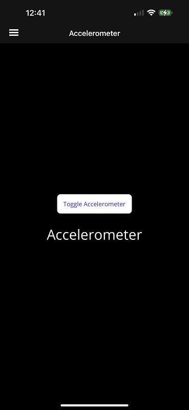


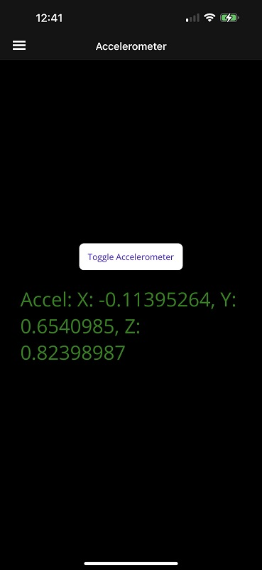

## Compass

The compass sensor monitors the device's magnetic north heading.

The [ICompass](https://learn.microsoft.com/en-us/dotnet/api/microsoft.maui.devices.sensors.icompass) interface provides access to the sensor, and is available through the [Compass.Default](https://learn.microsoft.com/en-us/dotnet/api/microsoft.maui.devices.sensors.compass.default#microsoft-maui-devices-sensors-compass-default) property. Both the `ICompass` interface and `Compass` class are contained in the `Microsoft.Maui.Devices.Sensors` namespace.

To start monitoring the compass sensor, call the [ICompass.Start](https://learn.microsoft.com/en-us/dotnet/api/microsoft.maui.devices.sensors.icompass.start) method. .NET MAUI raises the [ICompass.ReadingChanged](https://learn.microsoft.com/en-us/dotnet/api/microsoft.maui.devices.sensors.icompass.readingchanged) event when the compass heading changes. Use the [ICompass.Stop](https://learn.microsoft.com/en-us/dotnet/api/microsoft.maui.devices.sensors.icompass.stop) method to stop monitoring the sensor. You can detect the monitoring state of the compass with the [ICompass.IsMonitoring](https://learn.microsoft.com/en-us/dotnet/api/microsoft.maui.devices.sensors.icompass.ismonitoring) property, which will be `true` if the compass is currently being monitored.

Add a new ContentPage called *CompassPage.xaml*:

```xaml
<?xml version="1.0" encoding="utf-8" ?>
<ContentPage xmlns="http://schemas.microsoft.com/dotnet/2021/maui"
            xmlns:x="http://schemas.microsoft.com/winfx/2009/xaml"
            x:Class="MyMauiApp.CompassPage">
    <ScrollView>
        <VerticalStackLayout
            Spacing="25"
            Padding="30,0"
            VerticalOptions="Center">

            <Button Clicked="ToggleCompass" 
                Text="Toggle Compass"
                HorizontalOptions="Center" />
            
            <Label x:Name="CompassLabel"
                Text="Compass Data"
                SemanticProperties.HeadingLevel="Level1"
                FontSize="32"
                HorizontalOptions="Center" />

        </VerticalStackLayout>
    </ScrollView>
</ContentPage>
```

Add a code-behind file:

*CompassPage.xaml.cs*:

```c#
namespace MyMauiApp;

public partial class CompassPage : ContentPage
{
    public CompassPage()
    {
        InitializeComponent();
    }

    private void ToggleCompass(object sender, EventArgs e)
    {
        if (Compass.Default.IsSupported)
        {
            if (!Compass.Default.IsMonitoring)
            {
                // Turn on compass
                Compass.Default.ReadingChanged += Compass_ReadingChanged;
                Compass.Default.Start(SensorSpeed.UI);
            }
            else
            {
                // Turn off compass
                Compass.Default.Stop();
                Compass.Default.ReadingChanged -= Compass_ReadingChanged;
            }
        }
    }

    private void Compass_ReadingChanged(object sender, CompassChangedEventArgs e)
    {
        // Update UI Label with compass state
        CompassLabel.TextColor = Colors.Green;
        CompassLabel.Text = $"Compass: {e.Reading}";
    }
}
```

Add a `ShellContent` to *AppShell.xaml*:

```xaml
<ShellContent
    Title="Compass"
    ContentTemplate="{DataTemplate local:CompassPage}"
    Route="CompassPage" />
```

Here is a screenshot if the app running on my Android phone:

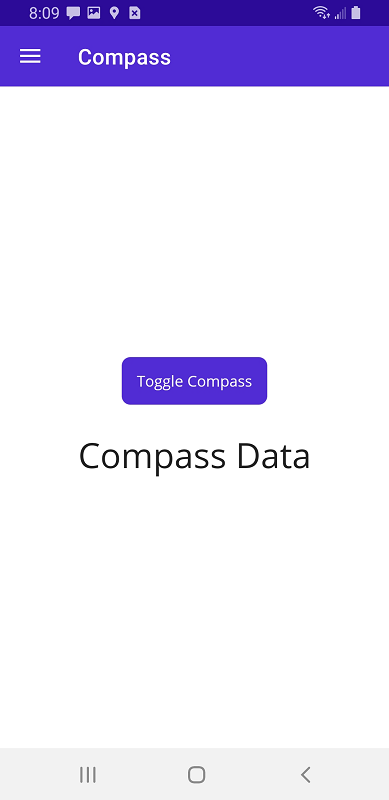


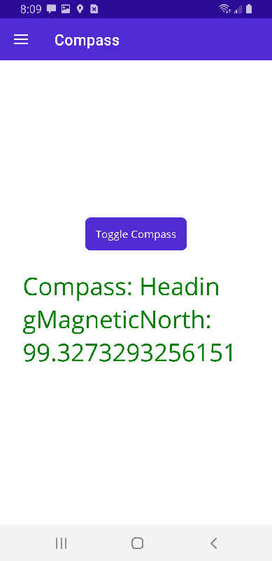

## Shake

Even though I'm listing **shake** as a sensor, it isn't. The [accelerometer](https://learn.microsoft.com/en-us/dotnet/maui/platform-integration/device/sensors?view=net-maui-7.0&tabs=android#accelerometer) is used to detect when the device is shaken.

The [IAccelerometer](https://learn.microsoft.com/en-us/dotnet/api/microsoft.maui.devices.sensors.iaccelerometer) interface provides access to the sensor, and is available through the [Accelerometer.Default](https://learn.microsoft.com/en-us/dotnet/api/microsoft.maui.devices.sensors.accelerometer.default#microsoft-maui-devices-sensors-accelerometer-default) property. Both the `IAccelerometer` interface and `Accelerometer` class are contained in the `Microsoft.Maui.Devices.Sensors` namespace.

The detect shake API uses raw readings from the accelerometer to calculate acceleration. It uses a simple queue mechanism to detect if 3/4ths of the recent accelerometer events occurred in the last half second. Acceleration is calculated by adding the square of the X, Y, and Z (x squared + y squared + Z squared) readings from the accelerometer and comparing it to a specific threshold.

To start monitoring the accelerometer sensor, call the [IAccelerometer.Start](https://learn.microsoft.com/en-us/dotnet/api/microsoft.maui.devices.sensors.iaccelerometer.start) method. When a shake is detected, the [IAccelerometer.ShakeDetected](https://learn.microsoft.com/en-us/dotnet/api/microsoft.maui.devices.sensors.iaccelerometer.shakedetected) event is raised. Use the [IAccelerometer.Stop](https://learn.microsoft.com/en-us/dotnet/api/microsoft.maui.devices.sensors.iaccelerometer.stop) method to stop monitoring the sensor. You can detect the monitoring state of the accelerometer with the `IAccelerometer.IsMonitoring` property, which will be `true` if the accelerometer was started and is currently being monitored.

It's recommended to use [Game](https://learn.microsoft.com/en-us/dotnet/api/microsoft.maui.devices.sensors.sensorspeed#microsoft-maui-devices-sensors-sensorspeed-game) or faster for the [SensorSpeed](https://learn.microsoft.com/en-us/dotnet/api/microsoft.maui.devices.sensors.sensorspeed).

Add a new ContentPage called *ShakePage.xaml*:

```xaml
<?xml version="1.0" encoding="utf-8" ?>
<ContentPage xmlns="http://schemas.microsoft.com/dotnet/2021/maui"
            xmlns:x="http://schemas.microsoft.com/winfx/2009/xaml"
            x:Class="MyMauiApp.ShakePage">
    <VerticalStackLayout
            Spacing="25"
            Padding="30,0"
            VerticalOptions="Center">

        <Button Clicked="ToggleShake" 
                Text="Toggle Shake"
                HorizontalOptions="Center" />

        <Label x:Name="ShakeLabel"
                Text="Shake"
                SemanticProperties.HeadingLevel="Level1"
                FontSize="32"
                HorizontalOptions="Center" />

    </VerticalStackLayout>
</ContentPage>
```

Add a code-behind file.

*ShakePage.xaml.cs*:

```c#
namespace MyMauiApp;

public partial class ShakePage : ContentPage
{
    public ShakePage()
    {
        InitializeComponent();
    }

    private void ToggleShake(object sender, EventArgs e)
    {
        if (Accelerometer.Default.IsSupported)
        {
            if (!Accelerometer.Default.IsMonitoring)
            {
                // Turn on accelerometer
                Accelerometer.Default.ShakeDetected += Accelerometer_ShakeDetected;
                Accelerometer.Default.Start(SensorSpeed.Game);
            }
            else
            {
                // Turn off accelerometer
                Accelerometer.Default.Stop();
                Accelerometer.Default.ShakeDetected -= Accelerometer_ShakeDetected;
                ShakeLabel.TextColor = Colors.Black;
                ShakeLabel.Text = "Shake";
            }
        }
    }

    private void Accelerometer_ShakeDetected(object sender, EventArgs e)
    {
        // Update UI Label with a "shaked detected" notice, in red
        ShakeLabel.TextColor = Colors.Red;
        ShakeLabel.Text = $"Shake detected";
    }
}
```

And add a `ShellContent` to *AppShell.xaml*:

```xaml
<ShellContent
    Title="Shake"
    ContentTemplate="{DataTemplate local:ShakePage}"
    Route="ShakePage" />
```

Here it is running on my Android phone:

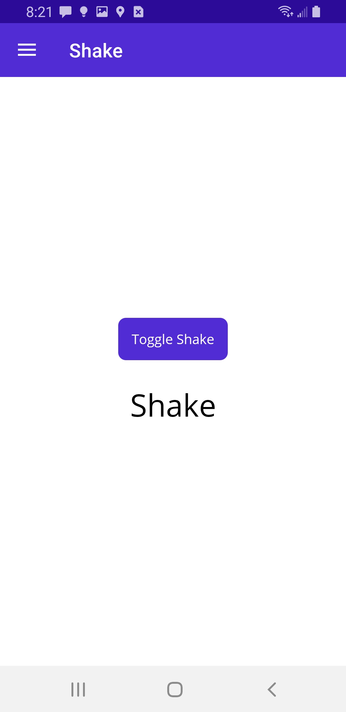

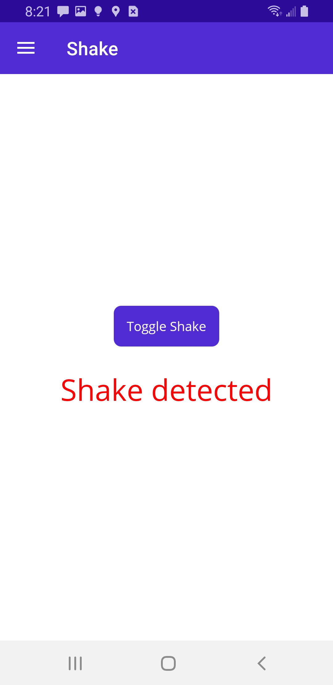


## Gyroscope

The gyroscope sensor measures the angular rotation speed around the device's three primary axes.

The [IGyroscope](https://learn.microsoft.com/en-us/dotnet/api/microsoft.maui.devices.sensors.igyroscope) interface provides access to the sensor, and is available through the [Gyroscope.Default](https://learn.microsoft.com/en-us/dotnet/api/microsoft.maui.devices.sensors.gyroscope.default#microsoft-maui-devices-sensors-gyroscope-default) property. Both the `IGyroscope` interface and `Gyroscope` class are contained in the `Microsoft.Maui.Devices.Sensors` namespace.

To start monitoring the gyroscope sensor, call the [IGyroscope.Start](https://learn.microsoft.com/en-us/dotnet/api/microsoft.maui.devices.sensors.igyroscope.start) method. .NET MAUI sends gyroscope data changes to your app by raising the [IGyroscope.ReadingChanged](https://learn.microsoft.com/en-us/dotnet/api/microsoft.maui.devices.sensors.igyroscope.readingchanged) event. The data provided by this event is measured in rad/s (radian per second). Use the [IGyroscope.Stop](https://learn.microsoft.com/en-us/dotnet/api/microsoft.maui.devices.sensors.igyroscope.stop) method to stop monitoring the sensor. You can detect the monitoring state of the gyroscope with the [IGyroscope.IsMonitoring](https://learn.microsoft.com/en-us/dotnet/api/microsoft.maui.devices.sensors.igyroscope.ismonitoring) property, which will be `true` if the gyroscope was started and is currently being monitored.

Add a new ContentPage to the app called [GyroPage.xaml]():

```xaml
<?xml version="1.0" encoding="utf-8" ?>
<ContentPage xmlns="http://schemas.microsoft.com/dotnet/2021/maui"
            xmlns:x="http://schemas.microsoft.com/winfx/2009/xaml"
            x:Class="MyMauiApp.GyroPage">
    <VerticalStackLayout
            Spacing="25"
            Padding="30,0"
            VerticalOptions="Center">

        <Button Clicked="ToggleGyroscope" 
                Text="Toggle Gyroscope"
                HorizontalOptions="Center" />

        <Label x:Name="GyroscopeLabel"
                Text="Gyroscope"
                SemanticProperties.HeadingLevel="Level1"
                FontSize="32"
                HorizontalOptions="Center" />

    </VerticalStackLayout>
</ContentPage>
```

Add a code-behind file:

*GyroPage.xaml.cs*:

```c#
namespace MyMauiApp;

public partial class GyroPage : ContentPage
{
    public GyroPage()
    {
        InitializeComponent();
    }

    private void ToggleGyroscope(object sender, EventArgs e)
    {
        if (Gyroscope.Default.IsSupported)
        {
            if (!Gyroscope.Default.IsMonitoring)
            {
                // Turn on gyroscope
                Gyroscope.Default.ReadingChanged += Gyroscope_ReadingChanged;
                Gyroscope.Default.Start(SensorSpeed.UI);
            }
            else
            {
                // Turn off gyroscope
                Gyroscope.Default.Stop();
                Gyroscope.Default.ReadingChanged -= Gyroscope_ReadingChanged;
                GyroscopeLabel.TextColor = Colors.Black;
                GyroscopeLabel.Text = "Gyroscope";
            }
        }
    }

    private void Gyroscope_ReadingChanged(object sender, GyroscopeChangedEventArgs e)
    {
        // Update UI Label with gyroscope state
        GyroscopeLabel.TextColor = Colors.Green;
        GyroscopeLabel.Text = $"Gyroscope: {e.Reading}";
    }
}
```

Add to *ShellContent.xaml*

```xaml
<ShellContent
    Title="Gyroscope"
    ContentTemplate="{DataTemplate local:GyroPage}"
    Route="GyroPage" />
```

Here it is running on my Android phone:

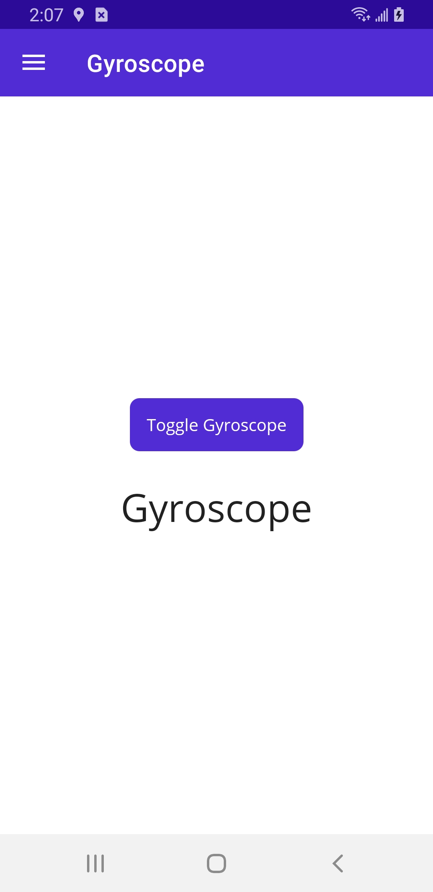

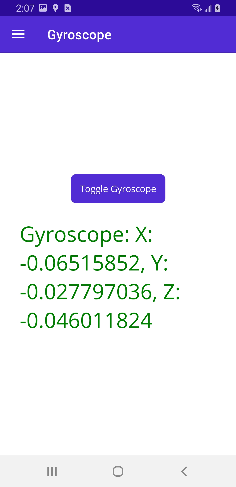

## Orientation

The orientation sensor monitors the orientation of a device in 3D space.

The [IOrientationSensor](https://learn.microsoft.com/en-us/dotnet/api/microsoft.maui.devices.sensors.iorientationsensor) interface provides access to the sensor, and is available through the [OrientationSensor.Default](https://learn.microsoft.com/en-us/dotnet/api/microsoft.maui.devices.sensors.orientationsensor.default#microsoft-maui-devices-sensors-orientationsensor-default) property. Both the `IOrientationSensor` interface and `OrientationSensor` class are contained in the `Microsoft.Maui.Devices.Sensors` namespace.

To start monitoring the orientation sensor, call the [IOrientationSensor.Start](https://learn.microsoft.com/en-us/dotnet/api/microsoft.maui.devices.sensors.iorientationsensor.start) method. .NET MAUI sends orientation data changes to your app by raising the [IOrientationSensor.ReadingChanged](https://learn.microsoft.com/en-us/dotnet/api/microsoft.maui.devices.sensors.iorientationsensor.readingchanged) event. Use the [IOrientationSensor.Stop](https://learn.microsoft.com/en-us/dotnet/api/microsoft.maui.devices.sensors.iorientationsensor.stop) method to stop monitoring the sensor. You can detect the monitoring state of the orientation with the [IOrientationSensor.IsMonitoring](https://learn.microsoft.com/en-us/dotnet/api/microsoft.maui.devices.sensors.iorientationsensor.ismonitoring) property, which will be `true` if the orientation was started and is currently being monitored.

Add a new ContentPage called *OrientationPage.xaml*:

```xaml
<?xml version="1.0" encoding="utf-8" ?>
<ContentPage xmlns="http://schemas.microsoft.com/dotnet/2021/maui"
            xmlns:x="http://schemas.microsoft.com/winfx/2009/xaml"
            x:Class="MyMauiApp.OrientationPage">
    <VerticalStackLayout
            Spacing="25"
            Padding="30,0"
            VerticalOptions="Center">

        <Button Clicked="ToggleOrientation" 
                Text="Toggle Orientation"
                HorizontalOptions="Center" />

        <Label x:Name="OrientationLabel"
                Text="Orientation"
                SemanticProperties.HeadingLevel="Level1"
                FontSize="32"
                HorizontalOptions="Center" />

    </VerticalStackLayout>
</ContentPage>
```

Add a code-behind file:

*OrientationPage.xaml.cs*:

```c#
namespace MyMauiApp;

public partial class OrientationPage : ContentPage
{
    public OrientationPage()
    {
        InitializeComponent();
    }

    private void ToggleOrientation(object sender, EventArgs e)
    {
        if (OrientationSensor.Default.IsSupported)
        {
            if (!OrientationSensor.Default.IsMonitoring)
            {
                // Turn on orientation
                OrientationSensor.Default.ReadingChanged += Orientation_ReadingChanged;
                OrientationSensor.Default.Start(SensorSpeed.UI);
            }
            else
            {
                // Turn off orientation
                OrientationSensor.Default.Stop();
                OrientationSensor.Default.ReadingChanged -= Orientation_ReadingChanged;
                OrientationLabel.TextColor = Colors.Black;
                OrientationLabel.Text = "Orientation";
            }
        }
    }

    private void Orientation_ReadingChanged(object sender, OrientationSensorChangedEventArgs e)
    {
        // Update UI Label with orientation state
        OrientationLabel.TextColor = Colors.Green;
        OrientationLabel.Text = $"Orientation: {e.Reading}";
    }
}
```

Add to *AppShell.xaml*:

```xaml
<ShellContent
    Title="Orientation"
    ContentTemplate="{DataTemplate local:OrientationPage}"
    Route="OrientationPage" />
```

Here's the app running on my Android phone:

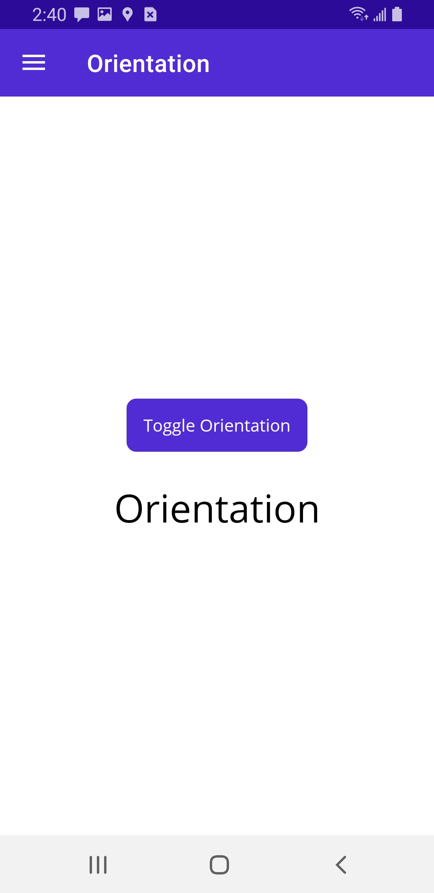


Now, a bunch of numbers such as are shown isn't that helpful, is it?

Replace *OrientationPage.xaml.cs* with this:

```c#
namespace MyMauiApp;

public partial class OrientationPage : ContentPage
{
    public OrientationPage()
    {
        InitializeComponent();
    }

    private void ToggleOrientation(object sender, EventArgs e)
    {
        if (OrientationSensor.Default.IsSupported)
        {
            if (!OrientationSensor.Default.IsMonitoring)
            {
                // Turn on orientation
                OrientationSensor.Default.ReadingChanged += Orientation_ReadingChanged;
                OrientationSensor.Default.Start(SensorSpeed.UI);
            }
            else
            {
                // Turn off orientation
                OrientationSensor.Default.Stop();
                OrientationSensor.Default.ReadingChanged -= Orientation_ReadingChanged;
                OrientationLabel.TextColor = Colors.Black;
                OrientationLabel.Text = "Orientation";
            }
        }
    }

    private void Orientation_ReadingChanged(object sender, OrientationSensorChangedEventArgs e)
    {
        // Update UI Label with orientation state
        OrientationLabel.TextColor = Colors.Green;
        if (!IsPortrait(e.Reading))
            OrientationLabel.Text = "Landscape";
        else
            OrientationLabel.Text = "Portrait";
    }

    private bool IsPortrait(OrientationSensorData orientationSensorData)
    {
        var q = orientationSensorData.Orientation;

        var sinp = +2.0 * (q.W * q.Y - q.Z * q.X);
        double pitch;
        if (Math.Abs(sinp) >= 1)
            pitch = Math.CopySign(Math.PI / 2, sinp); // use 90 degrees if out of range
        else
            pitch = Math.Asin(sinp);

        // Convert pitch to degrees for easier understanding
        pitch = pitch * 180.0 / Math.PI;

        // The device is considered in portrait mode if 
        // it's tilted horizontally, meaning the pitch
        // is closer to 0 or 180.
        if ((pitch <= 45 && pitch >= -45) || pitch >= 135 || pitch <= -135)
            return true;  // Portrait
        else
            return false; // Landscape
    }

}
```

Now you have an approximation of Portrait and Landscape mode:

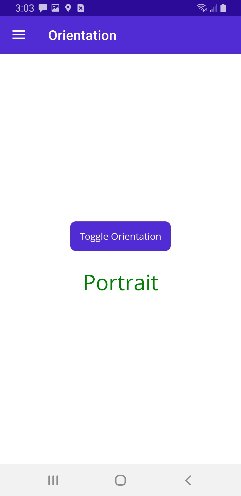

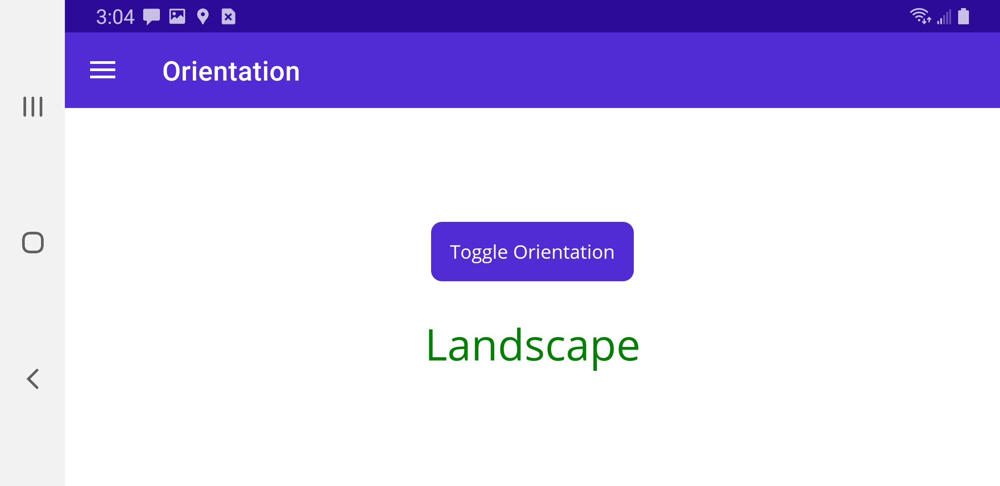

# Geolocation

To access Geolocation information, you can use the .NET Multi-platform App UI (.NET MAUI) [IGeolocation](https://learn.microsoft.com/en-us/dotnet/api/microsoft.maui.devices.sensors.igeolocation) interface. This interface provides APIs to retrieve the device's current geolocation coordinates.

The default implementation of the `IGeolocation` interface is available through the [Geolocation.Default](https://learn.microsoft.com/en-us/dotnet/api/microsoft.maui.devices.sensors.geolocation.default#microsoft-maui-devices-sensors-geolocation-default) property. Both the `IGeolocation` interface and `Geolocation` class are contained in the `Microsoft.Maui.Devices.Sensors` namespace.

To access the **Geolocation** functionality, the following platform-specific setup is required:

#### Android:

Coarse *or* fine location permissions, or both, must be specified and should be configured in the Android project.

Additionally, if your app targets Android 5.0 (API level 21) or higher, you must declare that your app uses the hardware features in the manifest file. This can be added in the following ways:

- Add the assembly-based permission:

  Open the *Platforms/Android/MainApplication.cs* file and add the following assembly attributes after `using` directives:

```c#
[assembly: UsesPermission(Android.Manifest.Permission.AccessCoarseLocation)]
[assembly: UsesPermission(Android.Manifest.Permission.AccessFineLocation)]
[assembly: UsesFeature("android.hardware.location", Required = false)]
[assembly: UsesFeature("android.hardware.location.gps", Required = false)]
[assembly: UsesFeature("android.hardware.location.network", Required = false)]
```

If your application is targeting Android 10 - Q (API Level 29 or higher) and is requesting `LocationAlways`, you must also add this permission request:

```c#
[assembly: UsesPermission(Manifest.Permission.AccessBackgroundLocation)]
```

\- or -

- Update the Android Manifest:

Open the *Platforms/Android/AndroidManifest.xml* file and add the following in the `manifest` node:

```xml
<uses-permission android:name="android.permission.ACCESS_COARSE_LOCATION" />
<uses-permission android:name="android.permission.ACCESS_FINE_LOCATION" />
<uses-feature android:name="android.hardware.location" android:required="false" />
<uses-feature android:name="android.hardware.location.gps" android:required="false" />
<uses-feature android:name="android.hardware.location.network" android:required="false" />
```

If your application is targeting Android 10 - Q (API Level 29 or higher) and is requesting `LocationAlways`, you must also add this permission request:

```xml
<uses-permission android:name="android.permission.ACCESS_BACKGROUND_LOCATION" />
```

> :point_up: Be sure to read the [Android documentation on background location updates](https://developer.android.com/training/location/permissions), as there are many restrictions that need to be considered.

#### iOS/Mac Catalyst:

In the *Platforms/iOS/Info.plist* and *Platforms/MacCatalyst/Info.plist* files, add the following keys and values:

```xml
<key>NSLocationWhenInUseUsageDescription</key>
<string>Fill in a reason why your app needs access to location.</string>
```

The `<string>` element is the reason the app is requesting access to location information. This text is shown to the user.

##### Full accuracy location permission

If you're going to request full accuracy with the [GeolocationRequest.RequestFullAccuracy](https://learn.microsoft.com/en-us/dotnet/api/microsoft.maui.devices.sensors.geolocationrequest.requestfullaccuracy#microsoft-maui-devices-sensors-geolocationrequest-requestfullaccuracy) property, add the following dictionary to the *Platforms/iOS/Info.plist* and *Platforms/MacCatalyst/Info.plist* files:

```xml
<key>NSLocationTemporaryUsageDescriptionDictionary</key>
<array>
  <dict>
    <key>TemporaryFullAccuracyUsageDescription</key>
    <string>Fill in a reason why your app needs full accuracy</string>
  </dict>
</array>
```

The `<string>` element is the reason the app is requesting access to location information with full accuracy. This text is shown to the user.

#### Windows:

No setup is required.

### Get the last known location

The device may have cached the most recent location of the device. Use the [GetLastKnownLocationAsync()](https://learn.microsoft.com/en-us/dotnet/api/microsoft.maui.devices.sensors.igeolocation.getlastknownlocationasync#microsoft-maui-devices-sensors-igeolocation-getlastknownlocationasync) method to access the cached location, if available. This is often faster than doing a full location query, but can be less accurate. If no cached location exists, this method returns `null`.

> :point_up: When necessary, the Geolocation API prompts the user for permissions.

The following code example demonstrates checking for a cached location:

```c#
public async Task<string> GetCachedLocation()
{
    try
    {
        Location location = await Geolocation.Default.GetLastKnownLocationAsync();

        if (location != null)
            return $"Latitude: {location.Latitude}, Longitude: {location.Longitude}, Altitude: {location.Altitude}";
    }
    catch (FeatureNotSupportedException fnsEx)
    {
        // Handle not supported on device exception
    }
    catch (FeatureNotEnabledException fneEx)
    {
        // Handle not enabled on device exception
    }
    catch (PermissionException pEx)
    {
        // Handle permission exception
    }
    catch (Exception ex)
    {
        // Unable to get location
    }

    return "None";
}
```

Depending on the device, not all location values may be available. For example, the [Altitude](https://learn.microsoft.com/en-us/dotnet/api/microsoft.maui.devices.sensors.location.altitude#microsoft-maui-devices-sensors-location-altitude) property might be `null`, have a value of 0, or have a positive value indicating the meters above sea level. Other values that may not be present include the [Speed](https://learn.microsoft.com/en-us/dotnet/api/microsoft.maui.devices.sensors.location.speed#microsoft-maui-devices-sensors-location-speed) and [Course](https://learn.microsoft.com/en-us/dotnet/api/microsoft.maui.devices.sensors.location.course#microsoft-maui-devices-sensors-location-course) properties.

##  Get the current location

While checking for the [last known location](https://learn.microsoft.com/en-us/dotnet/maui/platform-integration/device/geolocation?view=net-maui-7.0&tabs=windows#get-the-last-known-location) of the device may be quicker, it can be inaccurate. Use the [GetLocationAsync](https://learn.microsoft.com/en-us/dotnet/api/microsoft.maui.devices.sensors.igeolocation.getlocationasync) method to query the device for the current location. You can configure the accuracy and timeout of the query. It's best to the method overload that uses the [GeolocationRequest](https://learn.microsoft.com/en-us/dotnet/api/microsoft.maui.devices.sensors.geolocationrequest) and [CancellationToken](https://learn.microsoft.com/en-us/dotnet/api/system.threading.cancellationtoken) parameters, since it may take some time to get the device's location.

> :point_up: When necessary, the Geolocation API prompt's the user for permissions.

The following code example demonstrates how to request the device's location, while supporting cancellation:

```c#
private CancellationTokenSource _cancelTokenSource;
private bool _isCheckingLocation;

public async Task GetCurrentLocation()
{
    try
    {
        _isCheckingLocation = true;

        GeolocationRequest request = new GeolocationRequest(GeolocationAccuracy.Medium, TimeSpan.FromSeconds(10));

        _cancelTokenSource = new CancellationTokenSource();

        Location location = await Geolocation.Default.GetLocationAsync(request, _cancelTokenSource.Token);

        if (location != null)
            Console.WriteLine($"Latitude: {location.Latitude}, Longitude: {location.Longitude}, Altitude: {location.Altitude}");
    }
    // Catch one of the following exceptions:
    //   FeatureNotSupportedException
    //   FeatureNotEnabledException
    //   PermissionException
    catch (Exception ex)
    {
        // Unable to get location
    }
    finally
    {
        _isCheckingLocation = false;
    }
}

public void CancelRequest()
{
    if (_isCheckingLocation && _cancelTokenSource != null && _cancelTokenSource.IsCancellationRequested == false)
        _cancelTokenSource.Cancel();
}
```

Not all location values may be available, depending on the device. For example, the [Altitude](https://learn.microsoft.com/en-us/dotnet/api/microsoft.maui.devices.sensors.location.altitude#microsoft-maui-devices-sensors-location-altitude) property might be `null`, have a value of 0, or have a positive value indicating the meters above sea level. Other values that may not be present include [Speed](https://learn.microsoft.com/en-us/dotnet/api/microsoft.maui.devices.sensors.location.speed#microsoft-maui-devices-sensors-location-speed) and [Course](https://learn.microsoft.com/en-us/dotnet/api/microsoft.maui.devices.sensors.location.course#microsoft-maui-devices-sensors-location-course).

> :warning: [GetLocationAsync](https://learn.microsoft.com/en-us/dotnet/api/microsoft.maui.devices.sensors.igeolocation.getlocationasync) can return `null` in some scenarios. This indicates that the underlying platform is unable to obtain the current location.

Add a new ContentPage to the project called *GeoLocationPage.xaml*:

```xaml
<?xml version="1.0" encoding="utf-8" ?>
<ContentPage xmlns="http://schemas.microsoft.com/dotnet/2021/maui"
            xmlns:x="http://schemas.microsoft.com/winfx/2009/xaml"
            x:Class="MyMauiApp.GeoLocationPage">
    <ScrollView>
        <VerticalStackLayout
            Spacing="25"
            Padding="30,0"
            VerticalOptions="Center">

            <Label x:Name="GeoLocationLabel"
                Text="GeoLocation Data"
                SemanticProperties.HeadingLevel="Level1"
                FontSize="32"
                HorizontalOptions="Center" />

        </VerticalStackLayout>
    </ScrollView>
</ContentPage>
```

Add a code-behind class:

*GeoLocationPage.xaml.cs*:

```c#
namespace MyMauiApp;

public partial class GeoLocationPage : ContentPage
{
    private CancellationTokenSource _cancelTokenSource;
    private bool _isCheckingLocation;
    private Timer GPSTimer;

    public GeoLocationPage()
    {
        InitializeComponent();
        GPSTimer = new Timer(GetCurrentLocation, null, 100, 500);
    }

    public async void GetCurrentLocation(object stateInfo)
    {
        MainThread.BeginInvokeOnMainThread(async () =>
        {
            try
            {
                _isCheckingLocation = true;

                GeolocationRequest request = new GeolocationRequest(GeolocationAccuracy.Medium, TimeSpan.FromSeconds(10));

                _cancelTokenSource = new CancellationTokenSource();

                Location location = await Geolocation.Default.GetLocationAsync(request, _cancelTokenSource.Token);

                if (location != null)
                {
                    GeoLocationLabel.Text = $"Latitude: {location.Latitude}, Longitude: {location.Longitude}, Altitude: {location.Altitude}";


                }
            }
            // Catch one of the following exceptions:
            //   FeatureNotSupportedException
            //   FeatureNotEnabledException
            //   PermissionException
            catch (Exception ex)
            {
                // Unable to get location
            }
            finally
            {
                _isCheckingLocation = false;
            }
        });
    }

    public void CancelRequest()
    {
        if (_isCheckingLocation && _cancelTokenSource != null && _cancelTokenSource.IsCancellationRequested == false)
            _cancelTokenSource.Cancel();
    }
}
```

Add to *AppShell.xaml*:

```xaml
<ShellContent
    Title="GPS"
    ContentTemplate="{DataTemplate local:GeoLocationPage}"
    Route="GeoLocationPage" />
```

Run the app on a mobile device.

Here it is running in my Android Emulator:

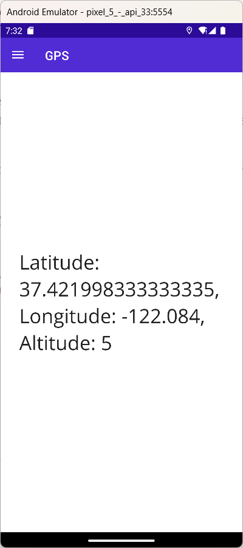

For more information see the [MAUI Geolocation Documentation](https://learn.microsoft.com/en-us/dotnet/maui/platform-integration/device/geolocation?view=net-maui-7.0&tabs=windows)