# Media

## Playing Media

[MediaElement](https://learn.microsoft.com/en-us/dotnet/communitytoolkit/maui/views/mediaelement) is a control for playing video and audio. Media that's supported by the underlying platform can be played from the following sources:

- The web, using a URI (HTTP or HTTPS).
- A resource embedded in the platform application, using the `embed://` URI scheme.
- Files that come from the app's local filesystem, using the `filesystem://` URI scheme.

`MediaElement` can use the platform playback controls, which are referred to as transport controls. However, they are disabled by default and can be replaced with your own transport controls. The following screenshots show `MediaElement` playing a video with the platform transport controls:

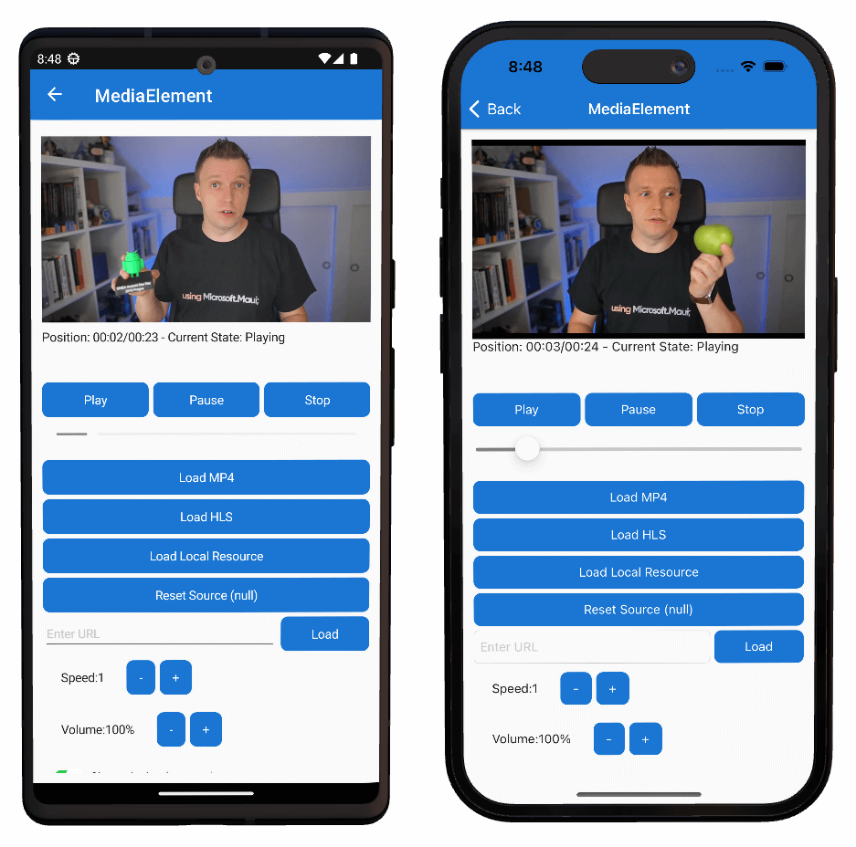

> :information_desk_person: Gerald Versluis (shown above) has made a [good video for this on YouTube](https://www.youtube.com/watch?v=_sp4RG0I0x4&t=206s).

#### Setup

Add the following NuGet package to your app:

```
install-package CommunityToolkit.Maui.MediaElement
```

Add the following to the top of *MauiProgram.cs*:

```c#
global using CommunityToolkit.Maui;
```

Add the following between lines 17 and 18:

```c#
.UseMauiCommunityToolkitMediaElement()
```

Add a new ContentPage called *VideoPage.xaml*:

```xaml
<?xml version="1.0" encoding="utf-8" ?>
<ContentPage xmlns="http://schemas.microsoft.com/dotnet/2021/maui"
             xmlns:x="http://schemas.microsoft.com/winfx/2009/xaml"
             xmlns:toolkit="http://schemas.microsoft.com/dotnet/2022/maui/toolkit"
             x:Class="MyMauiApp.VideoPage">
    
    <VerticalStackLayout
            Spacing="25"
            Padding="30,0"
            VerticalOptions="Center">

        <toolkit:MediaElement 
            Source="https://commondatastorage.googleapis.com/gtv-videos-bucket/sample/BigBuckBunny.mp4"
            ShouldShowPlaybackControls="True"
            />

    </VerticalStackLayout>
</ContentPage>
```

Add a code-behind file

*VideoPage.xaml.cs*:

```c#
namespace MyMauiApp;

public partial class VideoPage : ContentPage
{
    public VideoPage()
    {
        InitializeComponent();
    }
}
```

Add to *AppShell.xaml*:

```xaml
<ShellContent
    Title="Video"
    ContentTemplate="{DataTemplate local:VideoPage}"
    Route="VideoPage" />
```

Here it is in Windows:

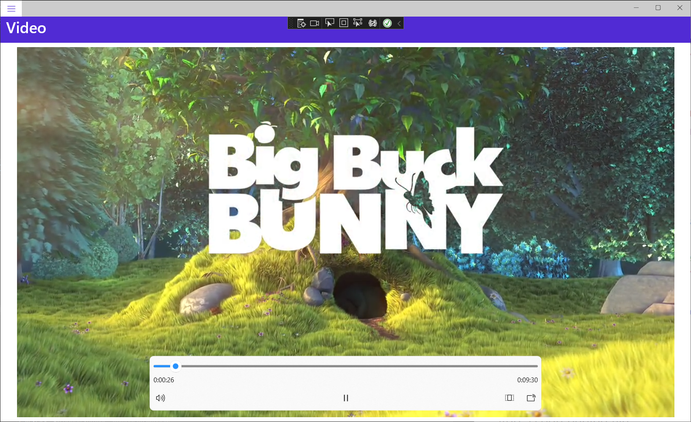

Now let's see what it looks like on my Android phone:

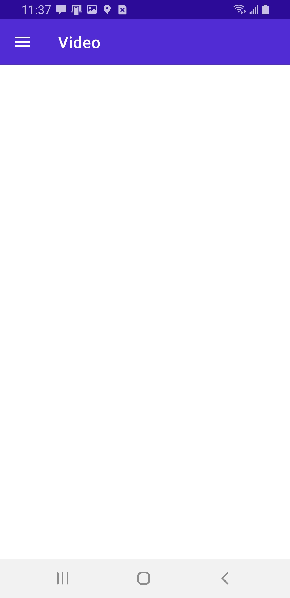

The reason that it doesn't show is that on non-Windows platforms, you have to specify a WidthRequest and HeightRequest. In other words, width and height of the MediaElement.

Change the MediaElement markup to this:

```xaml
<toolkit:MediaElement 
    WidthRequest="400"
    HeightRequest="300"
    Source="https://commondatastorage.googleapis.com/gtv-videos-bucket/sample/BigBuckBunny.mp4"
    ShouldShowPlaybackControls="True"
    />
```

And it shows up just fine:

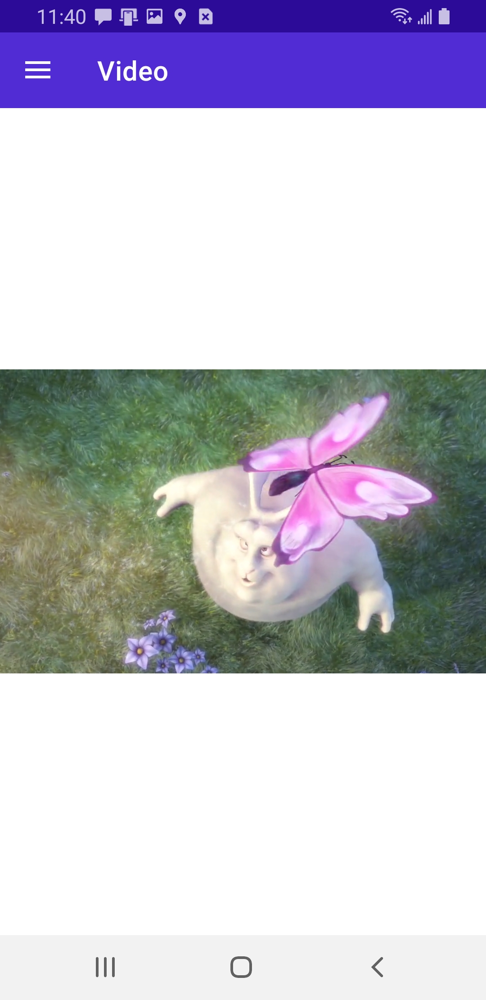

# Determining Screen Width at Runtime

This turns out to be a bit of a trick.

We've already set the window width and height for our Windows app. However, we don't want to hard-code it because the user can resize the window. 

Let's add a line of code to *VideoPage.xaml.cs*:

```c#
namespace MyMauiApp;

public partial class VideoPage : ContentPage
{
    public VideoPage()
    {
        InitializeComponent();
        var width = DeviceDisplay.Current.MainDisplayInfo.Width;
    }
}
```

According to the [documentation](https://learn.microsoft.com/en-us/dotnet/maui/platform-integration/device/display?view=net-maui-7.0&tabs=windows), `DeviceDisplay.Current.MainDisplayInfo.Width` should return the width of the display. That will work for mobile devices, where the window can't be resized, but it won't work in Windows (or Mac Desktop).

Put a breakpoint on line 9, run the app in Windows, and navigate to the Video page. My screen is 5120 pixels wide, so that's what it returns.

What about `this.Width`? That should give us the width of the window, right? Nope. Try it.

The solution is to keep track of the screen width for desktop platforms, and use `DeviceDisplay.Current.MainDisplayInfo.Width` (and height) for mobile platforms. 

Add the following class:

*AppState.cs*:

```c#
namespace MyMauiApp.Services;
public static class AppState
{
    public static double Width { get; set; }
    public static double Height { get; set; }
}
```

Modify *App.Xaml.cs* to save the Width and Height:

*App.Xaml.cs*:

```c#
namespace MyMauiApp;

public partial class App : Application
{
    public App()
    {
        InitializeComponent();

        MainPage = new AppShell();
    }

    protected override Window CreateWindow
        (IActivationState activationState)
    {
        var window = base.CreateWindow(activationState);
#if WINDOWS || MACCATALYST
        window.Created += Window_Created;
        window.SizeChanged += Window_SizeChanged;
#else
        AppState.Width = DeviceDisplay.Current.MainDisplayInfo.Width;
        AppState.Height = DeviceDisplay.Current.MainDisplayInfo.Height;
#endif
        return window;
    }

    private void Window_SizeChanged(object sender, EventArgs e)
    {
#if WINDOWS || MACCATALYST
        var window = (Window)sender;
        AppState.Width = window.Width;
        AppState.Height = window.Height;
#endif
    }

    private async void Window_Created(object sender, EventArgs e)
    {
        await Task.Delay(0);
#if WINDOWS || MACCATALYST
        const int defaultWidth = 1280;
        const int defaultHeight = 720;

        var window = (Window)sender;
        window.Width = defaultWidth;
        window.Height = defaultHeight;
        window.X = -defaultWidth;
        window.Y = -defaultHeight;

        await window.Dispatcher.DispatchAsync(() => { });

        var displayInfo = DeviceDisplay.Current.MainDisplayInfo;
        window.X = (displayInfo.Width / 
            displayInfo.Density - window.Width) / 2;
        window.Y = (displayInfo.Height / 
            displayInfo.Density - window.Height) / 2;
        AppState.Width = window.Width;
        AppState.Height = window.Height;
#endif
    }
}
```

Lines 55 and 56 save the width and height into `AppState` when running on Windows or Mac.

```c#
AppState.Width = window.Width;
AppState.Height = window.Height;
```

Lines 20 and 21 save the display width and height when running on other platforms:

```c#
AppState.Width = DeviceDisplay.Current.MainDisplayInfo.Width;
AppState.Height = DeviceDisplay.Current.MainDisplayInfo.Height;
```

By handling the `SizeChanged` event (Desktop platforms only), we can update `AppState` width and height whenever the user resizes the window.

```c#
private void Window_SizeChanged(object sender, EventArgs e)
{
#if WINDOWS || MACCATALYST
    var window = (Window)sender;
    AppState.Width = window.Width;
    AppState.Height = window.Height;
#endif
}
```

Replace *VideoPage.xaml.cs* with the following:

```c#
namespace MyMauiApp;

public partial class VideoPage : ContentPage
{
    public VideoPage()
    {
        InitializeComponent();
        var width = AppState.Width;
        var height = AppState.Height;
    }
}
```

Put a breakpoint on line 10 and run the app on Windows. Navigate to the Video page.

It should be 1280x720. Close and re-run the app, resize the window, and navigate to the Video page. Notice that Width and Height have changed!

Now the trick is to use the width and height to size the `MediaElement` so it shows up properly on all platforms.

Replace *VideoPage.xaml.cs* with the following:

```c#
namespace MyMauiApp;

public partial class VideoPage : ContentPage
{
    public VideoPage()
    {
        InitializeComponent();
        BindingContext = this;
    }

    public double VideoWidth => AppState.Width - 40;
    public double VideoHeight
    {
        get
        {
#if WINDOWS || MACCATALYST
            return AppState.Height - 100;
#else
            return 300;
#endif
        }
    }
}
```

We've added two read-only properties: `VideoWidth` and `VideoHeight`.

`VideoWidth` returns the screen width minus 40 - a small margin.

`VideoHeight` returns the height minus 100 if running on a desktop OS, otherwise it returns 300 (a safe bet for mobile devices).

Now let's modify *VideoPage.xaml* to bind to these properties:

```xaml
<?xml version="1.0" encoding="utf-8" ?>
<ContentPage xmlns="http://schemas.microsoft.com/dotnet/2021/maui"
             xmlns:x="http://schemas.microsoft.com/winfx/2009/xaml"
             xmlns:toolkit="http://schemas.microsoft.com/dotnet/2022/maui/toolkit"
             x:Class="MyMauiApp.VideoPage">
    
    <VerticalStackLayout
            Spacing="25"
            Padding="30,0"
            VerticalOptions="Center">

        <toolkit:MediaElement 
            WidthRequest="{Binding VideoWidth}"
            HeightRequest="{Binding VideoHeight}"
            Source="https://commondatastorage.googleapis.com/gtv-videos-bucket/sample/BigBuckBunny.mp4"
            ShouldShowPlaybackControls="True"
            />

    </VerticalStackLayout>
</ContentPage>
```

Run the app on Windows. Looks pretty good.

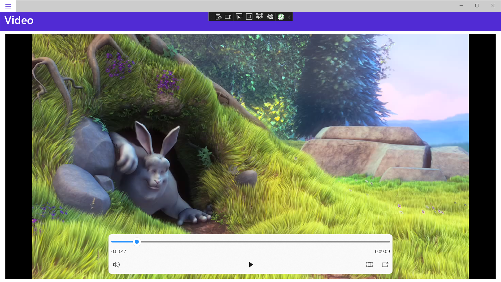

This is the app running on my Android phone:

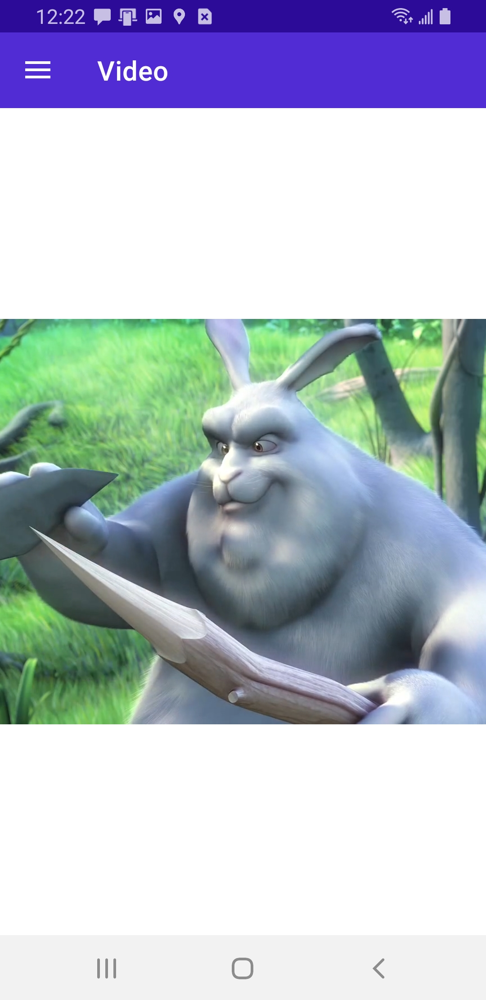

But on the iPhone and MacCatalyst the MediaElement doesn't even show up.

This is what it looks like in an iPad simulator:

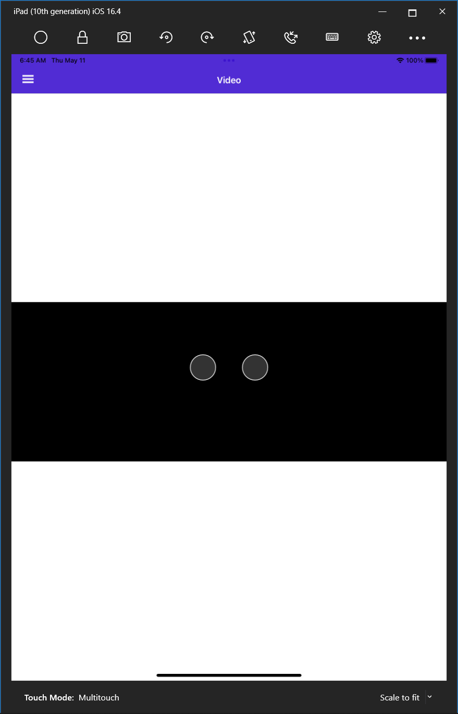

Just a window, no video. I consider this a bug.

## Playing a local media file

In the finished project's */Resources/Raw* folder, you'll find a video called *dnsintro.mp4*. It's a short video file. We're going to embed this in our app. It will be included in the app install and be ready for you to show.

Copy the file into your */Resources/Raw* folder.

Now, replace *VideoPage.xaml* with the following:

```xaml
<?xml version="1.0" encoding="utf-8" ?>
<ContentPage xmlns="http://schemas.microsoft.com/dotnet/2021/maui"
             xmlns:x="http://schemas.microsoft.com/winfx/2009/xaml"
             xmlns:toolkit="http://schemas.microsoft.com/dotnet/2022/maui/toolkit"
             x:Class="MyMauiApp.VideoPage">
    
    <VerticalStackLayout
            Spacing="25"
            Padding="30,0"
            VerticalOptions="Center">

        <toolkit:MediaElement 
            WidthRequest="{Binding VideoWidth}"
            HeightRequest="{Binding VideoHeight}"
            Source="embed://dnsintro.mp4"
            ShouldShowPlaybackControls="True"
            />
        
        <!--<toolkit:MediaElement 
            WidthRequest="{Binding VideoWidth}"
            HeightRequest="{Binding VideoHeight}"
            Source="https://commondatastorage.googleapis.com/gtv-videos-bucket/sample/BigBuckBunny.mp4"
            ShouldShowPlaybackControls="True"
            />-->

    </VerticalStackLayout>
</ContentPage>
```

I've commented out the media element that plays the BigBuckBunny video. 

The syntax to play the embedded video is on line 15:

```c#
Source="embed://dnsintro.mp4"
```

## Images

You've already seen a demo of showing an image in the template's *MainPage.xaml*.  [Click here for Image documentation](https://learn.microsoft.com/en-us/dotnet/maui/user-interface/controls/image?view=net-maui-7.0).

Let's do some more interesting things with images.

Copy *blogicon.png* from the completed project's */Resources/Images* folder into your */Resources/Images* folder.

Replace *BlogPage.xaml* with the following:

```xaml
<?xml version="1.0" encoding="utf-8" ?>
<ContentPage xmlns="http://schemas.microsoft.com/dotnet/2021/maui"
             xmlns:x="http://schemas.microsoft.com/winfx/2009/xaml"
             x:Class="MyMauiApp.BlogPage"
             xmlns:local="clr-namespace:MyMauiApp"
             Title="Blog Posts">

    <ScrollView>
        <CollectionView Margin="20" 
                        ItemsSource="{Binding BlogPosts}">
            <CollectionView.ItemTemplate>
                <DataTemplate>
                    <VerticalStackLayout Margin="0,0,0,20">
                        <Border BackgroundColor="LightGray">
                            <HorizontalStackLayout>
                                <HorizontalStackLayout Margin="0,0,10,0">
                                    <Image Source="blogicon.png" 
                                           HeightRequest="100"/>
                                </HorizontalStackLayout>
                                <VerticalStackLayout VerticalOptions="CenterAndExpand" >
                                    <HorizontalStackLayout>
                                        <Label TextColor="Black"
                                            Text="{Binding PublishDate, 
                                            StringFormat='{}{0:MMM dd, yyyy}'}" 
                                            FontSize="18"  />
                                        <Label Margin="10,0,0,0"
                                            Text="{Binding Author}" 
                                            TextColor="Black"
                                            FontSize="18" 
                                            FontAttributes="Bold" />
                                    </HorizontalStackLayout>
                                    <Label Text="{Binding Title}" 
                                       TextColor="Black"
                                       LineBreakMode="WordWrap"
                                       FontSize="22" />
                                </VerticalStackLayout>
                            </HorizontalStackLayout>
                        </Border>
                        <Label Margin="20" 
                               Text="{Binding Description}" 
                               LineBreakMode="WordWrap"
                               TextType="Html" 
                               FontSize="22" />
                    </VerticalStackLayout>
                </DataTemplate>
            </CollectionView.ItemTemplate>
        </CollectionView>
    </ScrollView>

</ContentPage>
```

Run it on Windows:

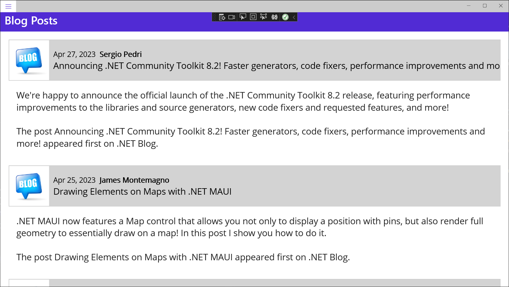

Note that word wrap on the title no longer works, although word wrap in the description works fine.

Line 35 specifies that the title should wrap:

```c#
LineBreakMode="WordWrap"
```

and yet it does not. I have spoken to a member of the MAUI team about this, and they confirmed that this is indeed a bug that will be fixed in the future.

It's very obvious when I run it on my Android phone:


Now consider what it looks like on an iPad Simulator:

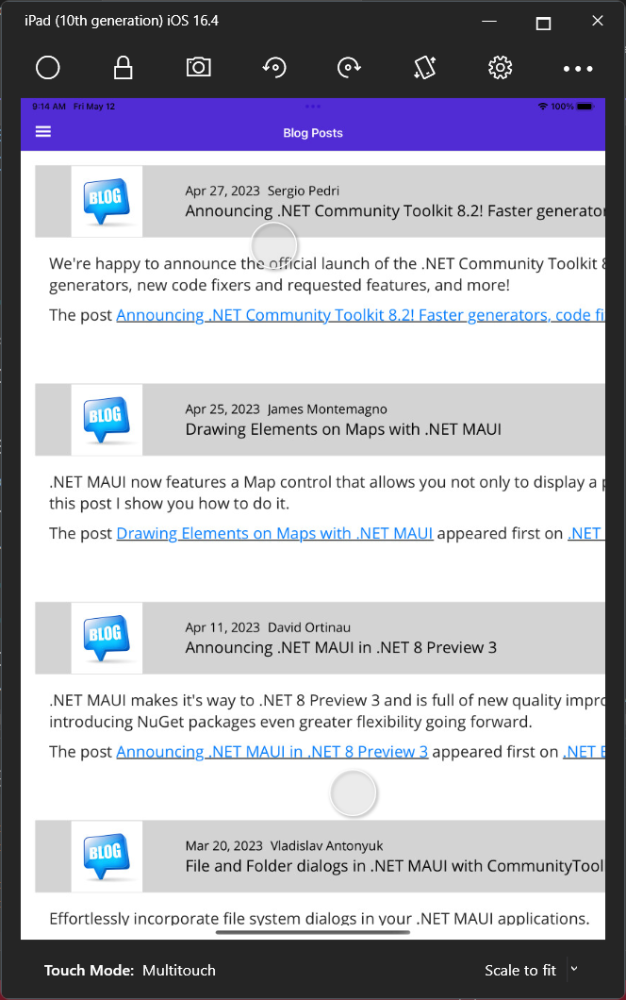

Are you considering using Blazor yet? :smile:

Here's a fix for the bad placement of the image, but I'm afraid word wrapping is still an issue:

Replace the Blog page markup and code:

*BlogPost.xaml*:

```xaml
<?xml version="1.0" encoding="utf-8" ?>
<ContentPage xmlns="http://schemas.microsoft.com/dotnet/2021/maui"
             xmlns:x="http://schemas.microsoft.com/winfx/2009/xaml"
             x:Class="MyMauiApp.BlogPage"
             xmlns:local="clr-namespace:MyMauiApp"
             Title="Blog Posts">

    <ScrollView>
        <CollectionView Margin="20" 
                        ItemsSource="{Binding BlogPosts}">
            <CollectionView.ItemTemplate>
                <DataTemplate>
                    <Grid>
                        <Grid.RowDefinitions>
                            <RowDefinition Height="Auto" />
                            <RowDefinition Height="Auto" />
                        </Grid.RowDefinitions>
                        <Grid.ColumnDefinitions>
                            <ColumnDefinition Width="100" />
                            <ColumnDefinition Width="Auto" />
                        </Grid.ColumnDefinitions>
                        <Image Grid.Row="0" 
                               Grid.Column="0" 
                               HeightRequest="100"
                               Source="blogicon.png" 
                               WidthRequest="100"/>
                        <Border Grid.Row="0" 
                                Grid.Column="1"
                                WidthRequest="{Binding Source={RelativeSource AncestorType={x:Type local:BlogPage}}, Path=Column2Width}"
                                HorizontalOptions="StartAndExpand"
                                BackgroundColor="LightGray">

                            <VerticalStackLayout 
                                WidthRequest="{Binding Source={RelativeSource AncestorType={x:Type local:BlogPage}}, Path=Column2Width}"
                                Margin="20"
                                HorizontalOptions="StartAndExpand"
                                VerticalOptions="CenterAndExpand" >
                                <HorizontalStackLayout WidthRequest="{Binding Source={RelativeSource AncestorType={x:Type local:BlogPage}}, Path=Column2Width}">
                                    <Label TextColor="Black"
                                            Text="{Binding PublishDate, 
                                            StringFormat='{}{0:MMM dd, yyyy}'}" 
                                            FontSize="18"  />
                                    <Label Margin="10,0,0,0"
                                            Text="{Binding Author}" 
                                            TextColor="Black"
                                            FontSize="18" 
                                            FontAttributes="Bold" />
                                </HorizontalStackLayout>
                                <Label Text="{Binding Title}"
                                       WidthRequest="{Binding Source={RelativeSource AncestorType={x:Type local:BlogPage}}, Path=Column2Width}"
                                       TextColor="Black"
                                       LineBreakMode="WordWrap"
                                       FontSize="22" />
                            </VerticalStackLayout>

                        </Border>
                        <Label Grid.Row="2"
                               Grid.Column="0"
                               Grid.ColumnSpan="2"
                               WidthRequest="{Binding Source={RelativeSource AncestorType={x:Type local:BlogPage}}, Path=ContentWidth}"
                               Margin="20" 
                               Text="{Binding Description}" 
                               LineBreakMode="WordWrap"
                               TextType="Html" 
                               FontSize="22" />
                    </Grid>

                </DataTemplate>
            </CollectionView.ItemTemplate>
        </CollectionView>
    </ScrollView>

</ContentPage>
```

*BlogPage.xaml.cs*:

```c#
namespace MyMauiApp;

public partial class BlogPage : ContentPage
{
    public BlogPage()
    {
        InitializeComponent();
        BindingContext = this;
        BlogDataManager.GetBlogPosts();
    }

    public List<BlogPost> BlogPosts => BlogDataManager.BlogPosts;

    public int Column2Width => Convert.ToInt32(AppState.Width) - 180;
    public int ContentWidth => Convert.ToInt32(AppState.Width) - 100;
}
```

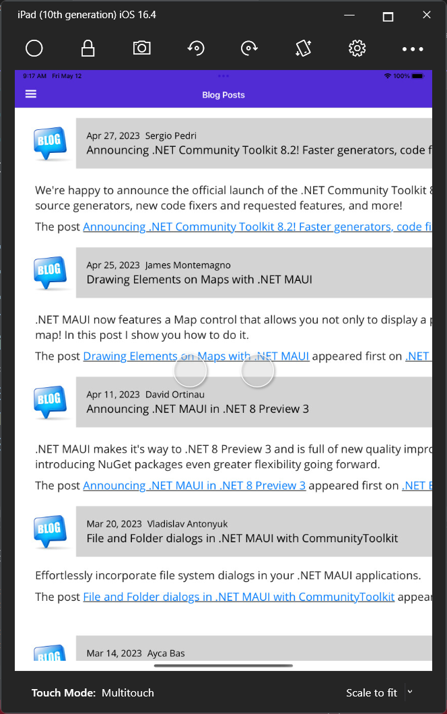


### Load a Remote Image

Change the `Source` property of our `Image` object on line 25 to the following:

```
https://blazorroadshow.azurewebsites.net/blazortrainfiles/blogicon.png
```

Here it is running in Windows:

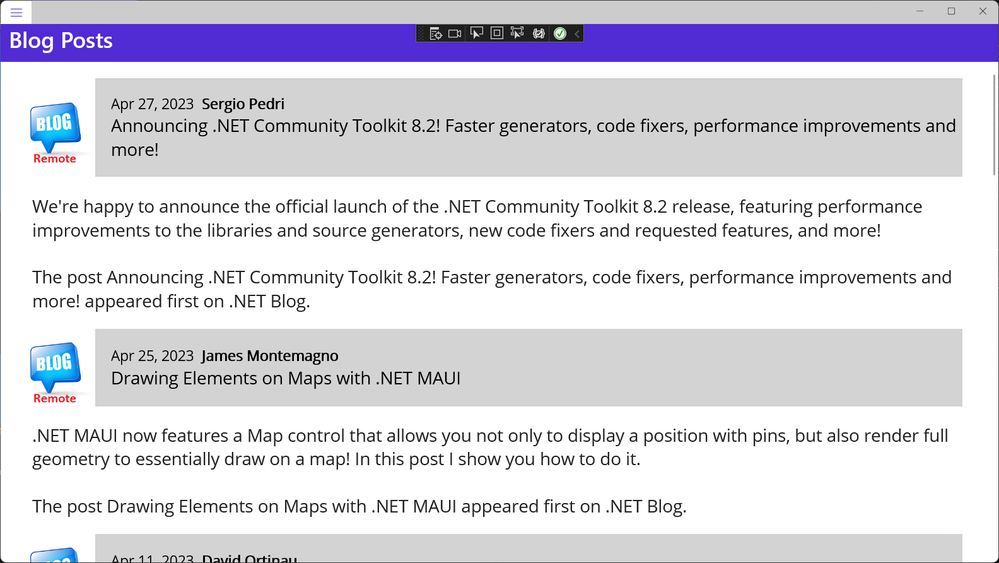

Note the icon says "Remote." That text exists in the image itself, so we can tell it apart from the local image.

### MAUI Blazor 

Check out MauiBlazorBlogApp in the completed projects. This is the main page:

```html
@page "/"

<table>

    @foreach (var post in BlogDataManager.BlogPosts)
    {
        <tr>
            <td style="width:100px;">
                
            </td>
            <td>
                <div style="background-color:lightgray;padding:20px;">
                    @post.PublishDate.ToShortDateString()
                    <span style="font-weight:bold;">&nbsp;@post.Author</span>
                    <br/>
                    <span style="font-size:larger;">
                        @post.Title
                    </span>
                </div>
            </td>
        </tr>
        <tr>
            <td colspan="2">
                <div style="padding:20px;">
                    @((MarkupString)post.Description)
                </div>
            </td>
        </tr>
    }
</table>

@code
{
    protected override void OnInitialized()
    {
        BlogDataManager.GetBlogPosts();
    }
}
```

Here it is in Windows:

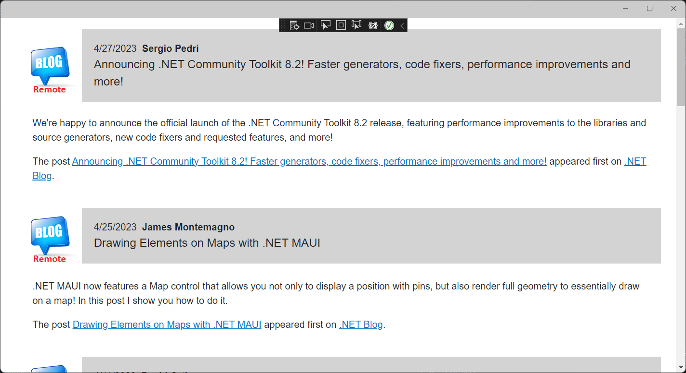

Here it is in an Android Emulator:


Here it is in an iPad simulator:

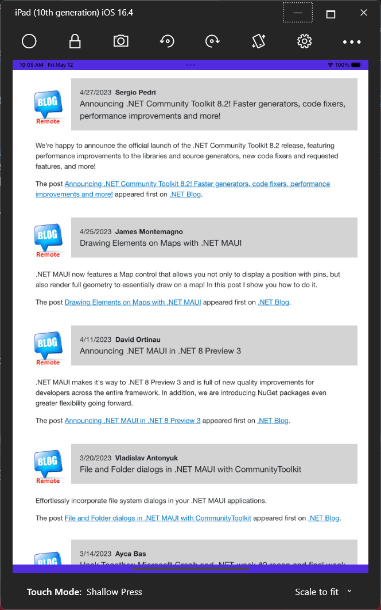

### Image caching

Caching of downloaded images is enabled by default, with cached images being stored for 1 day. This behavior can be changed by setting properties of the `UriImageSource` class.

The `UriImageSource` class defines the following properties:

- `Uri`, of type `Uri`, represents the URI of the image to be downloaded for display.
- `CacheValidity`, of type `TimeSpan`, specifies how long the image will be stored locally for. The default value of this property is 1 day.
- `CachingEnabled`, of type `bool`, defines whether image caching is enabled. The default value of this property is `true`.

These properties are backed by [BindableProperty](https://learn.microsoft.com/en-us/dotnet/api/microsoft.maui.controls.bindableproperty) objects, which means that they can be styled, and be the target of data bindings.

To set a specific cache period, set the `Source` property to an `UriImageSource` object that sets its `CacheValidity` property. Change our image to the following:

```xaml
<Image Grid.Row="0" 
       Grid.Column="0" 
       HeightRequest="100"
       WidthRequest="100">
    <Image.Source>
        <UriImageSource
            Uri="https://blazorroadshow.azurewebsites.net/blazortrainfiles/blogicon.png"
            CacheValidity="10:00:00:00" />
    </Image.Source>
</Image>
```

In this example, the caching period is set to 10 days.

## Load an image from a stream

Images can be loaded from streams with the `ImageSource.FromStream` method:

```c#
Image image = new Image
{
    Source = ImageSource.FromStream(() => stream)
};
```

## Load a font icon

The [`FontImage`](https://learn.microsoft.com/en-us/dotnet/api/microsoft.maui.controls.xaml.fontimageextension) markup extension enables you to display a font icon in any view that can display an [ImageSource](https://learn.microsoft.com/en-us/dotnet/api/microsoft.maui.controls.imagesource). It provides the same functionality as the [FontImageSource](https://learn.microsoft.com/en-us/dotnet/api/microsoft.maui.controls.fontimagesource) class, but with a more concise representation.

The [`FontImage`](https://learn.microsoft.com/en-us/dotnet/api/microsoft.maui.controls.xaml.fontimageextension) markup extension is supported by the [FontImageExtension](https://learn.microsoft.com/en-us/dotnet/api/microsoft.maui.controls.xaml.fontimageextension) class, which defines the following properties:

- `FontFamily` of type `string`, the font family to which the font icon belongs.
- `Glyph` of type `string`, the unicode character value of the font icon.
- `Color` of type [Color](https://learn.microsoft.com/en-us/dotnet/api/microsoft.maui.graphics.color), the color to be used when displaying the font icon.
- `Size` of type `double`, the size, in device-independent units, of the rendered font icon. The default value is 30. In addition, this property can be set to a named font size.

> :point_up: The XAML parser allows the [FontImageExtension](https://learn.microsoft.com/en-us/dotnet/api/microsoft.maui.controls.xaml.fontimageextension) class to be abbreviated as `FontImage`.

The `Glyph` property is the content property of [FontImageExtension](https://learn.microsoft.com/en-us/dotnet/api/microsoft.maui.controls.xaml.fontimageextension). Therefore, for XAML markup expressions expressed with curly braces, you can eliminate the `Glyph=` part of the expression provided that it's the first argument.

The following XAML example shows how to use the [`FontImage`](https://learn.microsoft.com/en-us/dotnet/api/microsoft.maui.controls.xaml.fontimageextension) markup extension:

```xaml
<Image BackgroundColor="#D1D1D1"
       Source="{FontImage &#xf30c;, FontFamily=Ionicons, Size=44}" />
```

In this example, the abbreviated version of the [FontImageExtension](https://learn.microsoft.com/en-us/dotnet/api/microsoft.maui.controls.xaml.fontimageextension) class name is used to display an XBox icon, from the Ionicons font family, in an [Image](https://learn.microsoft.com/en-us/dotnet/api/microsoft.maui.controls.image):


While the unicode character for the icon is `\uf30c`, it has to be escaped in XAML and so becomes ``.

For information about displaying font icons by specifying the font icon data in a [FontImageSource](https://learn.microsoft.com/en-us/dotnet/api/microsoft.maui.controls.fontimagesource) object, see [Display font icons](https://learn.microsoft.com/en-us/dotnet/maui/user-interface/fonts#display-font-icons).

## Load animated GIFs

.NET MAUI includes support for displaying small, animated GIFs. This is accomplished by setting the `Source` property to an animated GIF file:

```xml
<Image Source="demo.gif" />
```

> :information_source: While the animated GIF support in .NET MAUI includes the ability to download files, it does not support caching or streaming animated GIFs.

By default, when an animated GIF is loaded it will not be played. This is because the `IsAnimationPlaying` property, that controls whether an animated GIF is playing or stopped, has a default value of `false`. Therefore, when an animated GIF is loaded it will not be played until the `IsAnimationPlaying` property is set to `true`. Playback can be stopped by reseting the `IsAnimationPlaying` property to `false`. Note that this property has no effect when displaying a non-GIF image source.

## Control image scaling

The `Aspect` property determines how the image will be scaled to fit the display area, and should be set to one of the members of the `Aspect` enumeration:

- `AspectFit` - letterboxes the image (if required) so that the entire image fits into the display area, with blank space added to the top/bottom or sides depending on whether the image is wide or tall.
- `AspectFill` - clips the image so that it fills the display area while preserving the aspect ratio.
- `Fill` - stretches the image to completely and exactly fill the display area. This may result in the image being distorted.
- `Center` - centers the image in the display area while preserving the aspect ratio.

## Image Shadows

The .NET Multi-platform App UI (.NET MAUI) `Shadow` class paints a shadow around a layout or view. The [VisualElement](https://learn.microsoft.com/en-us/dotnet/api/microsoft.maui.controls.visualelement) class has a `Shadow` bindable property, of type `Shadow`, that enables a shadow to be added to any layout or view.

The `Shadow` class defines the following properties:

- `Radius`, of type `float`, defines the radius of the blur used to generate the shadow. The default value of this property is 10.
- `Opacity`, of type `float`, indicates the opacity of the shadow. The default value of this property is 1.
- `Brush`, of type [Brush](https://learn.microsoft.com/en-us/dotnet/api/microsoft.maui.controls.brush), represents the brush used to colorize the shadow.
- `OffSet`, of type `Point`, specifies the offset for the shadow, which represents the position of the light source that creates the shadow.

These properties are backed by [BindableProperty](https://learn.microsoft.com/en-us/dotnet/api/microsoft.maui.controls.bindableproperty) objects, which means that they can be targets of data bindings, and styled.

> :information_source: The `Brush` property only currently supports a [SolidColorBrush](https://learn.microsoft.com/en-us/dotnet/api/microsoft.maui.controls.solidcolorbrush).

Replace the bot Image in *MainPage.xaml* with the following:

```xaml
<Image Source="dotnet_bot.png"
       WidthRequest="250"
       HeightRequest="310">
    <Image.Shadow>
        <Shadow Brush="Black"
            Offset="15,15"
            Radius="20"
            Opacity="0.4" />
    </Image.Shadow>
</Image>
```

Run the app on Windows:

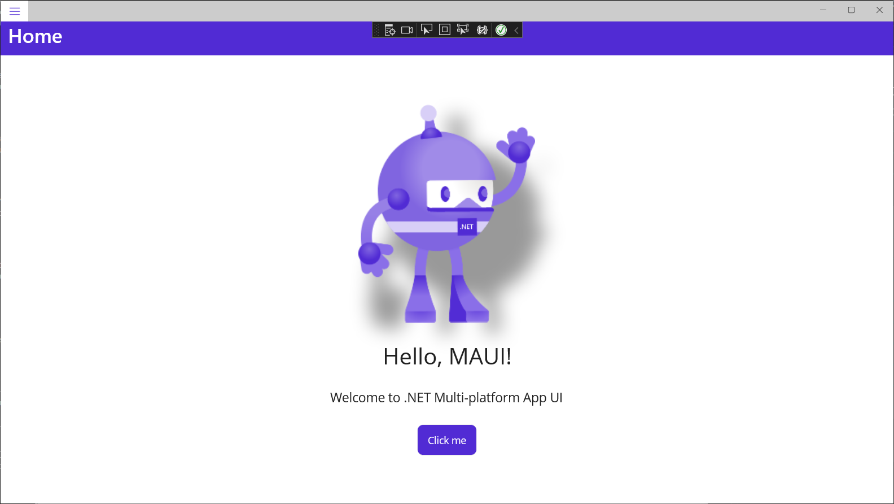

It looks a bit different on my Android phone:

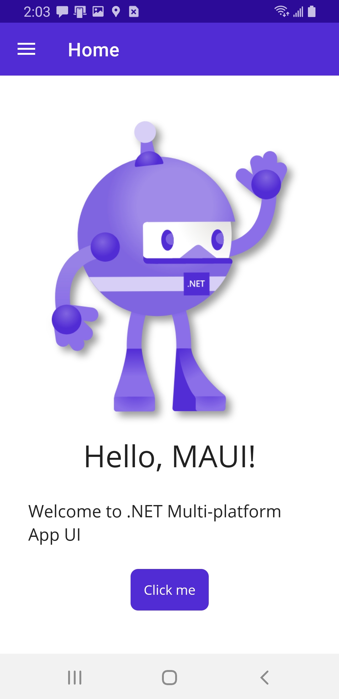

And different still on iOS:

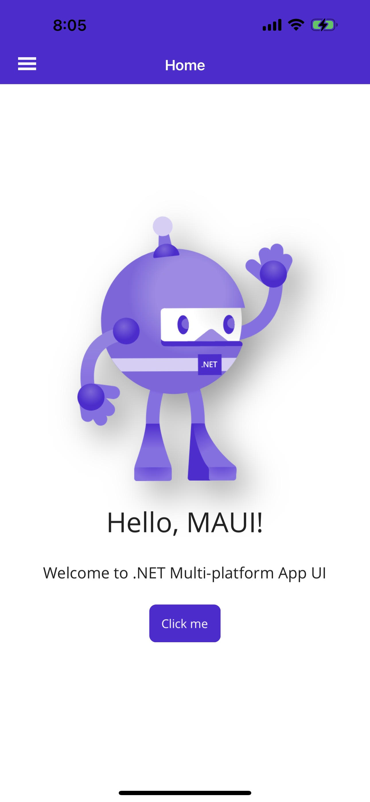

## Clipboard

With the [IClipboard](https://learn.microsoft.com/en-us/dotnet/api/microsoft.maui.applicationmodel.datatransfer.iclipboard) interface, you can copy and paste text to and from the system clipboard.

The default implementation of the `IClipboard` interface is available through the [Clipboard.Default](https://learn.microsoft.com/en-us/dotnet/api/microsoft.maui.applicationmodel.datatransfer.clipboard.default#microsoft-maui-applicationmodel-datatransfer-clipboard-default) property. Both the `IClipboard` interface and `Clipboard` class are contained in the `Microsoft.Maui.ApplicationModel.DataTransfer` namespace.

> :point_up: Access to the clipboard must be done on the main user interface thread. For more information on how to invoke methods on the main user interface thread, see [MainThread](https://learn.microsoft.com/en-us/dotnet/maui/platform-integration/appmodel/main-thread).

Replace *MainPage.xaml.cs* with the following:

```c#
namespace MyMauiApp;

public partial class MainPage : ContentPage
{
    int count = 0;

    public MainPage()
    {
        InitializeComponent();
    }

    private async void OnCounterClicked(object sender, EventArgs e)
    {
        count++;

        if (count == 1)
            CounterBtn.Text = $"Clicked {count} time";
        else
            CounterBtn.Text = $"Clicked {count} times";

        SemanticScreenReader.Announce(CounterBtn.Text);

        // Copy the button text to the clipboard
        await Clipboard.Default.SetTextAsync(CounterBtn.Text);

        // read and examine the text in the clipboard:
        var text = await Clipboard.Default.GetTextAsync();
        if (text == "Clicked 3 times")
        {

        }
    }
}
```

Put a breakpoint on line 31.

Run the app, click the button once, and paste the text from the clipboard into Notepad or some other document.

Click the button two more times. The code breaks after determining the text is "Clicked 3 times".

