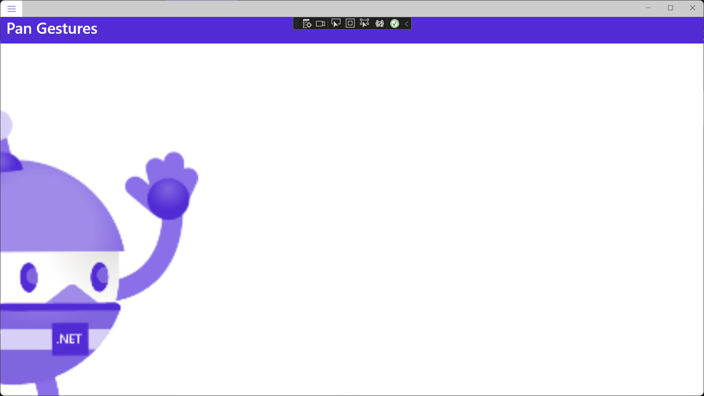
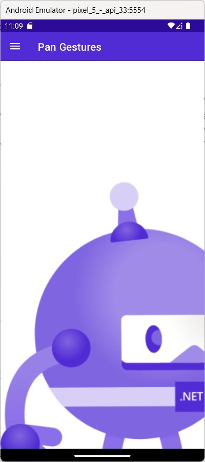
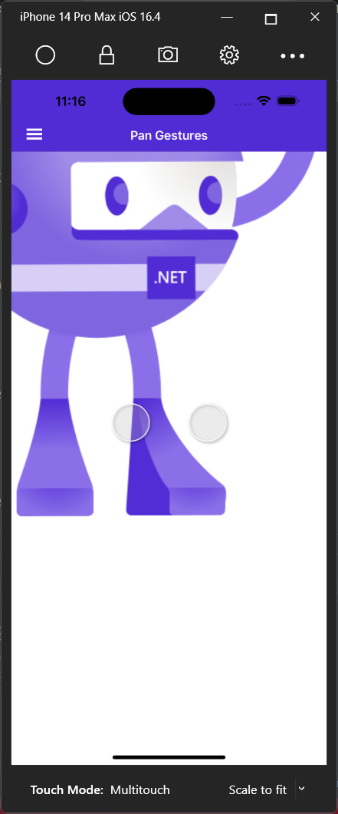
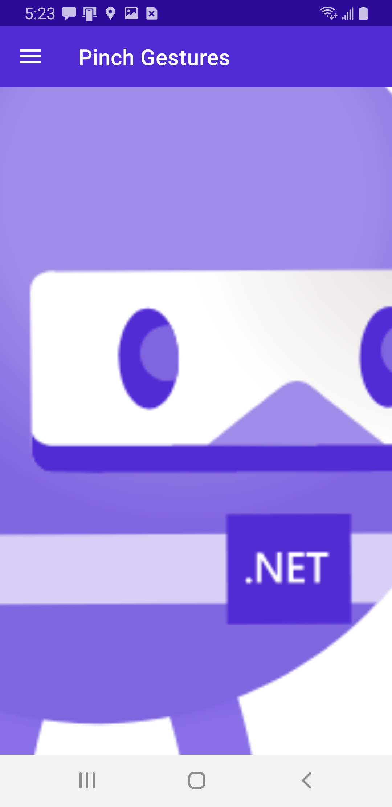
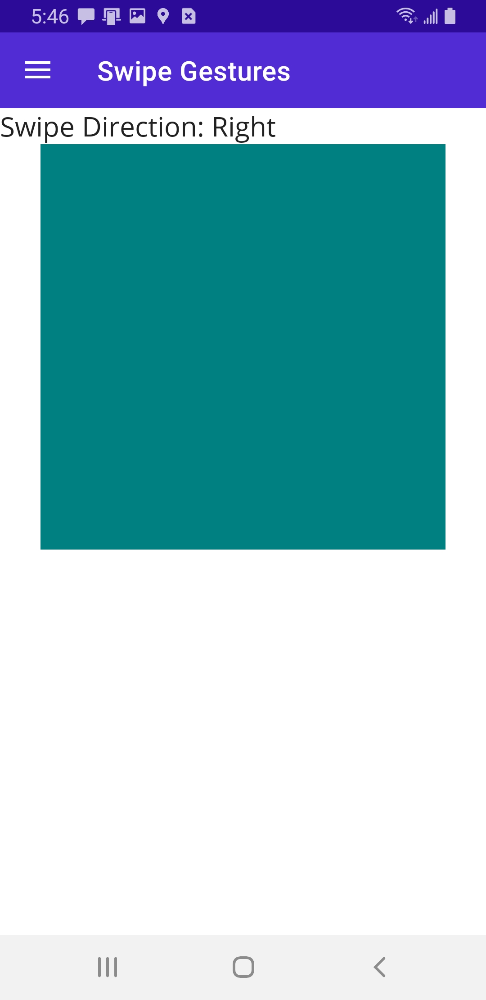

# Gestures

MAUI gives you the ability to recognize gestures. Let's take a look at a few of them.

## Recognize a pan gesture

A .NET Multi-platform App UI (.NET MAUI) pan gesture recognizer detects the movement of fingers around the screen and can be used to apply that movement to content. A typical scenario for the pan gesture is to horizontally and vertically pan an image, so that all of the image content can be viewed when it's being displayed in a viewport smaller than the image dimensions. This is accomplished by moving the image within the viewport.

In .NET MAUI, pan gesture recognition is provided by the [PanGestureRecognizer](https://learn.microsoft.com/en-us/dotnet/api/microsoft.maui.controls.pangesturerecognizer) class. This class defines the [TouchPoints](https://learn.microsoft.com/en-us/dotnet/api/microsoft.maui.controls.pangesturerecognizer.touchpoints#microsoft-maui-controls-pangesturerecognizer-touchpoints) property, of type `int`, which represents the number of touch points in the gesture. The default value of this property is 1. This property is backed by a [BindableProperty](https://learn.microsoft.com/en-us/dotnet/api/microsoft.maui.controls.bindableproperty) object, which means that it can be the target of data bindings, and styled.

The [PanGestureRecognizer](https://learn.microsoft.com/en-us/dotnet/api/microsoft.maui.controls.pangesturerecognizer) class also defines a [PanUpdated](https://learn.microsoft.com/en-us/dotnet/api/microsoft.maui.controls.pangesturerecognizer.panupdated) event that's raised when the detected pan gesture changes. The [PanUpdatedEventArgs](https://learn.microsoft.com/en-us/dotnet/api/microsoft.maui.controls.panupdatedeventargs) object that accompanies this event defines the following properties:

- [GestureId](https://learn.microsoft.com/en-us/dotnet/api/microsoft.maui.controls.panupdatedeventargs.gestureid#microsoft-maui-controls-panupdatedeventargs-gestureid), of type `int`, which represents the id of the gesture that raised the event.
- [StatusType](https://learn.microsoft.com/en-us/dotnet/api/microsoft.maui.controls.panupdatedeventargs.statustype#microsoft-maui-controls-panupdatedeventargs-statustype), of type `GestureStatus`, which indicates if the event has been raised for a newly started gesture, a running gesture, a completed gesture, or a canceled gesture.
- [TotalX](https://learn.microsoft.com/en-us/dotnet/api/microsoft.maui.controls.panupdatedeventargs.totalx#microsoft-maui-controls-panupdatedeventargs-totalx), of type `double`, which indicates the total change in the X direction since the beginning of the gesture.
- [TotalY](https://learn.microsoft.com/en-us/dotnet/api/microsoft.maui.controls.panupdatedeventargs.totaly#microsoft-maui-controls-panupdatedeventargs-totaly), of type `double`, which indicates the total change in the Y direction since the beginning of the gesture.

To make a [View](https://learn.microsoft.com/en-us/dotnet/api/microsoft.maui.controls.view) recognize a pan gesture, create a [PanGestureRecognizer](https://learn.microsoft.com/en-us/dotnet/api/microsoft.maui.controls.pangesturerecognizer) object, handle the [PanUpdated](https://learn.microsoft.com/en-us/dotnet/api/microsoft.maui.controls.pangesturerecognizer.panupdated) event, and add the new gesture recognizer to the `GestureRecognizers` collection on the view. 

Add the following class to the project:

*PanContainer.cs*:

```c#
namespace MyMauiApp;
public class PanContainer : ContentView
{
    double x, y;

    public PanContainer()
    {
        // Set PanGestureRecognizer.TouchPoints to control the
        // number of touch points needed to pan
        PanGestureRecognizer panGesture = new PanGestureRecognizer();
        panGesture.PanUpdated += OnPanUpdated;
        GestureRecognizers.Add(panGesture);
    }

    void OnPanUpdated(object sender, PanUpdatedEventArgs e)
    {
        switch (e.StatusType)
        {
            case GestureStatus.Running:
                // Translate and ensure we don't pan beyond the wrapped user interface element bounds.
                Content.TranslationX = Math.Max(Math.Min(0, x + e.TotalX), -Math.Abs(Content.Width - DeviceDisplay.MainDisplayInfo.Width));
                Content.TranslationY = Math.Max(Math.Min(0, y + e.TotalY), -Math.Abs(Content.Height - DeviceDisplay.MainDisplayInfo.Height));
                break;

            case GestureStatus.Completed:
                // Store the translation applied during the pan
                x = Content.TranslationX;
                y = Content.TranslationY;
                break;
        }
    }
}
```

This class is a View, deriving from `ContentView`. It's a generalized helper class that performs freeform panning.

In this example, the `OnPanUpdated` method updates the viewable content of the wrapped view, based on the user's pan gesture. This is achieved by using the values of the [TotalX](https://learn.microsoft.com/en-us/dotnet/api/microsoft.maui.controls.panupdatedeventargs.totalx#microsoft-maui-controls-panupdatedeventargs-totalx) and [TotalY](https://learn.microsoft.com/en-us/dotnet/api/microsoft.maui.controls.panupdatedeventargs.totaly#microsoft-maui-controls-panupdatedeventargs-totaly) properties of the [PanUpdatedEventArgs](https://learn.microsoft.com/en-us/dotnet/api/microsoft.maui.controls.panupdatedeventargs) instance to calculate the direction and distance of the pan. 

The `DeviceDisplay.MainDisplayInfo.Width` and `DeviceDisplay.MainDisplayInfo.Height` properties provide the screen width and screen height values of the device. The wrapped user element is then panned by setting its `TranslationX` and `TranslationY` properties to the calculated values. When panning content in an element that does not occupy the full screen, the height and width of the viewport can be obtained from the element's `Height` and `Width` properties.

The `PanContainer` class can be wrapped around a [View](https://learn.microsoft.com/en-us/dotnet/api/microsoft.maui.controls.view) so that a recognized pan gesture will pan the wrapped view.

Add a new ContentPage called *PanPage.xaml*:

```xaml
<?xml version="1.0" encoding="utf-8" ?>
<ContentPage xmlns="http://schemas.microsoft.com/dotnet/2021/maui"
             xmlns:x="http://schemas.microsoft.com/winfx/2009/xaml"
             xmlns:local="clr-namespace:MyMauiApp"
             x:Class="MyMauiApp.PanPage">
    <AbsoluteLayout>
        <local:PanContainer>
            <Image Source="dotnet_bot.png" WidthRequest="600" HeightRequest="1200" />
        </local:PanContainer>
    </AbsoluteLayout>
</ContentPage>
```

Add a code-behind file.

*PanPage.xaml.cs*:

```c#
namespace MyMauiApp;

public partial class PanPage : ContentPage
{
    public PanPage()
    {
        InitializeComponent();
    }
}
```

Add to *AppShell.xaml*:

```xaml
<ShellContent
    Title="Pan Gestures"
    ContentTemplate="{DataTemplate local:PanPage}"
    Route="PanPage" />
```


Running on Windows is meh:



It's much more fun on a phone:






# Recognize a pinch gesture

A .NET Multi-platform App UI (.NET MAUI) pinch gesture recognizer is used for performing interactive zoom. A common scenario for the pinch gesture is to perform interactive zoom of an image at the pinch location. This is accomplished by scaling the content of the viewport.

In .NET MAUI, pinch gesture recognition is provided by the [PinchGestureRecognizer](https://learn.microsoft.com/en-us/dotnet/api/microsoft.maui.controls.pinchgesturerecognizer) class, which defines a [PinchUpdated](https://learn.microsoft.com/en-us/dotnet/api/microsoft.maui.controls.pinchgesturerecognizer.pinchupdated) event that's raised when the detected pinch gesture changes. The [PinchGestureUpdatedEventArgs](https://learn.microsoft.com/en-us/dotnet/api/microsoft.maui.controls.pinchgestureupdatedeventargs) object that accompanies the [PinchUpdated](https://learn.microsoft.com/en-us/dotnet/api/microsoft.maui.controls.pinchgesturerecognizer.pinchupdated) event defines the following properties:

- [Scale](https://learn.microsoft.com/en-us/dotnet/api/microsoft.maui.controls.pinchgestureupdatedeventargs.scale#microsoft-maui-controls-pinchgestureupdatedeventargs-scale), of type `double`, which indicates the relative size of the pinch gesture since the last update was received.
- [ScaleOrigin](https://learn.microsoft.com/en-us/dotnet/api/microsoft.maui.controls.pinchgestureupdatedeventargs.scaleorigin#microsoft-maui-controls-pinchgestureupdatedeventargs-scaleorigin), of type `Point`, which indicates the updated origin of the pinch's gesture.
- [Status](https://learn.microsoft.com/en-us/dotnet/api/microsoft.maui.controls.pinchgestureupdatedeventargs.status#microsoft-maui-controls-pinchgestureupdatedeventargs-status), of type [GestureStatus](https://learn.microsoft.com/en-us/dotnet/api/microsoft.maui.gesturestatus), which indicates if the event has been raised for a newly started gesture, a running gesture, a completed gesture, or a canceled gesture.

## Create a pinch container

Add a`PinchToZoomContainer`, a generalized helper class that can be used to interactively zoom a [View](https://learn.microsoft.com/en-us/dotnet/api/microsoft.maui.controls.view).

Add the class to the project:

*PinchToZoomContainer.cs*:

```c#
namespace MyMauiApp;
public class PinchToZoomContainer : ContentView
{
    double currentScale = 1;
    double startScale = 1;
    double xOffset = 0;
    double yOffset = 0;

    public PinchToZoomContainer()
    {
        PinchGestureRecognizer pinchGesture = new PinchGestureRecognizer();
        pinchGesture.PinchUpdated += OnPinchUpdated;
        GestureRecognizers.Add(pinchGesture);
    }

    void OnPinchUpdated(object sender, PinchGestureUpdatedEventArgs e)
    {
        if (e.Status == GestureStatus.Started)
        {
            // Store the current scale factor applied to the wrapped user interface element,
            // and zero the components for the center point of the translate transform.
            startScale = Content.Scale;
            Content.AnchorX = 0;
            Content.AnchorY = 0;
        }
        if (e.Status == GestureStatus.Running)
        {
            // Calculate the scale factor to be applied.
            currentScale += (e.Scale - 1) * startScale;
            currentScale = Math.Max(1, currentScale);

            // The ScaleOrigin is in relative coordinates to the wrapped user interface element,
            // so get the X pixel coordinate.
            double renderedX = Content.X + xOffset;
            double deltaX = renderedX / Width;
            double deltaWidth = Width / (Content.Width * startScale);
            double originX = (e.ScaleOrigin.X - deltaX) * deltaWidth;

            // The ScaleOrigin is in relative coordinates to the wrapped user interface element,
            // so get the Y pixel coordinate.
            double renderedY = Content.Y + yOffset;
            double deltaY = renderedY / Height;
            double deltaHeight = Height / (Content.Height * startScale);
            double originY = (e.ScaleOrigin.Y - deltaY) * deltaHeight;

            // Calculate the transformed element pixel coordinates.
            double targetX = xOffset - (originX * Content.Width) * (currentScale - startScale);
            double targetY = yOffset - (originY * Content.Height) * (currentScale - startScale);

            // Apply translation based on the change in origin.
            Content.TranslationX = Math.Clamp(targetX, -Content.Width * (currentScale - 1), 0);
            Content.TranslationY = Math.Clamp(targetY, -Content.Height * (currentScale - 1), 0);

            // Apply scale factor
            Content.Scale = currentScale;
        }
        if (e.Status == GestureStatus.Completed)
        {
            // Store the translation delta's of the wrapped user interface element.
            xOffset = Content.TranslationX;
            yOffset = Content.TranslationY;
        }
    }
}
```

The `OnPinchUpdated` method updates the zoom level of the wrapped view, based on the user's pinch gesture. This is achieved by using the values of the [Scale](https://learn.microsoft.com/en-us/dotnet/api/microsoft.maui.controls.pinchgestureupdatedeventargs.scale#microsoft-maui-controls-pinchgestureupdatedeventargs-scale), [ScaleOrigin](https://learn.microsoft.com/en-us/dotnet/api/microsoft.maui.controls.pinchgestureupdatedeventargs.scaleorigin#microsoft-maui-controls-pinchgestureupdatedeventargs-scaleorigin) and [Status](https://learn.microsoft.com/en-us/dotnet/api/microsoft.maui.controls.pinchgestureupdatedeventargs.status#microsoft-maui-controls-pinchgestureupdatedeventargs-status) properties of the [PinchGestureUpdatedEventArgs](https://learn.microsoft.com/en-us/dotnet/api/microsoft.maui.controls.pinchgestureupdatedeventargs) object to calculate the scale factor to be applied at the origin of the pinch gesture. The wrapped view is then zoomed at the origin of the pinch gesture by setting its `TranslationX`, `TranslationY`, and `Scale` properties to the calculated values.

The `PinchToZoomContainer` class can be wrapped around a [View](https://learn.microsoft.com/en-us/dotnet/api/microsoft.maui.controls.view) so that a recognized pinch gesture will zoom the wrapped view. 

Add a new ContentPage to the project:

*PinchPage.xaml*

```xaml
<ContentPage xmlns="http://schemas.microsoft.com/dotnet/2021/maui"
             xmlns:x="http://schemas.microsoft.com/winfx/2009/xaml"
             xmlns:local="clr-namespace:MyMauiApp"
             x:Class="MyMauiApp.PinchPage">
    <Grid>
        <local:PinchToZoomContainer>
            <Image Source="dotnet_bot.png" />
        </local:PinchToZoomContainer>
    </Grid>
</ContentPage>
```

Add a code-behind file:

*PinchPage.xaml.cs*

```C#
namespace MyMauiApp;
public partial class PinchPage : ContentPage
{
    public PinchPage()
    {
        InitializeComponent();
    }
}
```

Add to *AppShell.xaml*:

```xaml
<ShellContent
    Title="Pinch Gestures"
    ContentTemplate="{DataTemplate local:PinchPage}"
    Route="PinchPage" />
```

You really need to run this on a phone to get the pinch experience.

Here it is running on my Android phone, zoomed in:




# Recognize a swipe gesture

A .NET Multi-platform App UI (.NET MAUI) swipe gesture recognizer detects when a finger is moved across the screen in a horizontal or vertical direction, and is often used to initiate navigation through content.

In .NET MAUI, drag gesture recognition is provided by the [SwipeGestureRecognizer](https://learn.microsoft.com/en-us/dotnet/api/microsoft.maui.controls.swipegesturerecognizer) class. This class defines the following properties:

- [Command](https://learn.microsoft.com/en-us/dotnet/api/microsoft.maui.controls.swipegesturerecognizer.command#microsoft-maui-controls-swipegesturerecognizer-command), of type `ICommand`, which is executed when a swipe gesture is recognized.
- [CommandParameter](https://learn.microsoft.com/en-us/dotnet/api/microsoft.maui.controls.swipegesturerecognizer.commandparameter#microsoft-maui-controls-swipegesturerecognizer-commandparameter), of type `object`, which is the parameter that's passed to the `Command`.
- [Direction](https://learn.microsoft.com/en-us/dotnet/api/microsoft.maui.controls.swipegesturerecognizer.direction#microsoft-maui-controls-swipegesturerecognizer-direction), of type [SwipeDirection](https://learn.microsoft.com/en-us/dotnet/api/microsoft.maui.swipedirection), which defines the direction
- [Threshold](https://learn.microsoft.com/en-us/dotnet/api/microsoft.maui.controls.swipegesturerecognizer.threshold#microsoft-maui-controls-swipegesturerecognizer-threshold), of type `uint`, which represents the minimum swipe distance that must be achieved for a swipe to be recognized, in device-independent units. The default value of this property is 100, which means that any swipes that are less than 100 device-independent units will be ignored.

These properties are backed by [BindableProperty](https://learn.microsoft.com/en-us/dotnet/api/microsoft.maui.controls.bindableproperty) objects, which means that they can be targets of data bindings, and styled.

The [SwipeGestureRecognizer](https://learn.microsoft.com/en-us/dotnet/api/microsoft.maui.controls.swipegesturerecognizer) also defines a [Swiped](https://learn.microsoft.com/en-us/dotnet/api/microsoft.maui.controls.swipegesturerecognizer.swiped) event that's raised when a swipe is recognized. The [SwipedEventArgs](https://learn.microsoft.com/en-us/dotnet/api/microsoft.maui.controls.swipedeventargs) object that accompanies the [Swiped](https://learn.microsoft.com/en-us/dotnet/api/microsoft.maui.controls.swipegesturerecognizer.swiped) event defines the following properties:

- [Direction](https://learn.microsoft.com/en-us/dotnet/api/microsoft.maui.controls.swipedeventargs.direction#microsoft-maui-controls-swipedeventargs-direction), of type [SwipeDirection](https://learn.microsoft.com/en-us/dotnet/api/microsoft.maui.swipedirection), indicates the direction of the swipe gesture.
- [Parameter](https://learn.microsoft.com/en-us/dotnet/api/microsoft.maui.controls.swipedeventargs.parameter#microsoft-maui-controls-swipedeventargs-parameter), of type `object`, indicates the value passed by the `CommandParameter` property, if defined.

##  Create a swipe container

`SwipeContainer` is a generalized swipe recognition class that be wrapped around a [View](https://learn.microsoft.com/en-us/dotnet/api/microsoft.maui.controls.view) to perform swipe gesture recognition.

Add the following class:

*SwipeContainer.cs*:

```c#
namespace MyMauiApp;
public class SwipeContainer : ContentView
{
    public event EventHandler<SwipedEventArgs> Swipe;

    public SwipeContainer()
    {
        GestureRecognizers.Add(GetSwipeGestureRecognizer(SwipeDirection.Left));
        GestureRecognizers.Add(GetSwipeGestureRecognizer(SwipeDirection.Right));
        GestureRecognizers.Add(GetSwipeGestureRecognizer(SwipeDirection.Up));
        GestureRecognizers.Add(GetSwipeGestureRecognizer(SwipeDirection.Down));
    }

    SwipeGestureRecognizer GetSwipeGestureRecognizer(SwipeDirection direction)
    {
        SwipeGestureRecognizer swipe = new SwipeGestureRecognizer { Direction = direction };
        swipe.Swiped += (sender, e) => Swipe?.Invoke(this, e);
        return swipe;
    }
}
```

The `SwipeContainer` class creates [SwipeGestureRecognizer](https://learn.microsoft.com/en-us/dotnet/api/microsoft.maui.controls.swipegesturerecognizer) objects for all four swipe directions, and attaches `Swipe` event handlers. These event handlers invoke the `Swipe` event defined by the `SwipeContainer`.

Add a new ContentPage to the project:

*SwipePage.xaml*:

```xaml
<?xml version="1.0" encoding="utf-8" ?>
<ContentPage xmlns="http://schemas.microsoft.com/dotnet/2021/maui"
             xmlns:x="http://schemas.microsoft.com/winfx/2009/xaml"
             xmlns:local="clr-namespace:MyMauiApp"
             x:Class="MyMauiApp.SwipePage">
    <StackLayout>
        <Label x:Name="SwipeLabel"
               FontSize="20"
               Text="Swipe Direction" />
        <local:SwipeContainer Swipe="OnSwiped">
            <BoxView Color="Teal" 
                     HorizontalOptions="CenterAndExpand"
                     WidthRequest="300" 
                     HeightRequest="300" />
        </local:SwipeContainer>
    </StackLayout>
</ContentPage>
```

Add a code-behind file:

*SwipePage.xaml.cs*::

```c#
namespace MyMauiApp;

public partial class SwipePage : ContentPage
{
    public SwipePage()
    {
        InitializeComponent();
    }

    void OnSwiped(object sender, SwipedEventArgs e)
    {
        switch (e.Direction)
        {
            case SwipeDirection.Left:
                SwipeLabel.Text = "Swipe Direction: Left";
                break;
            case SwipeDirection.Right:
                SwipeLabel.Text = "Swipe Direction: Right";
                break;
            case SwipeDirection.Up:
                SwipeLabel.Text = "Swipe Direction: Up";
                break;
            case SwipeDirection.Down:
                SwipeLabel.Text = "Swipe Direction: Down";
                break;
        }
    }
}
```

Add to *AppShell.xaml*:

```xAML
<ShellContent
    Title="Swipe Gestures"
    ContentTemplate="{DataTemplate local:SwipePage}"
    Route="SwipePage" />
```

Run the app on a mobile device. Swipe across the teal square in all directions:

