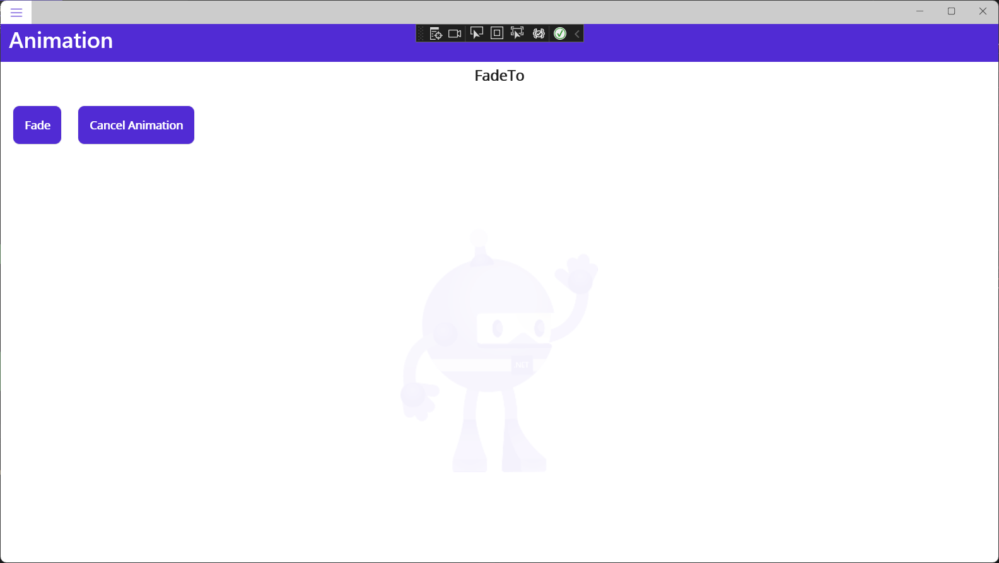
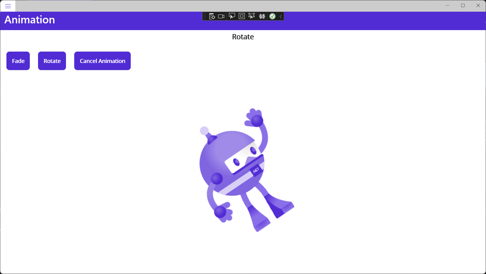
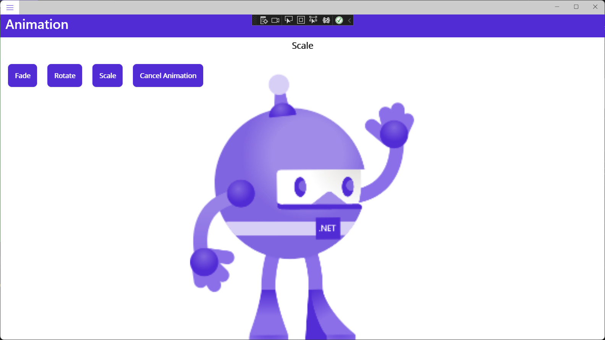
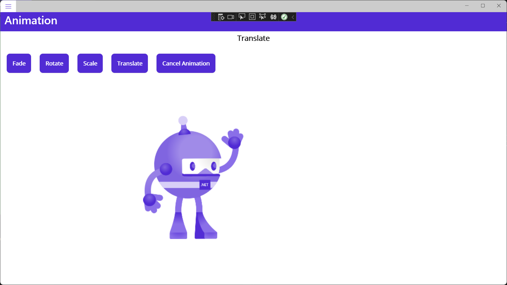
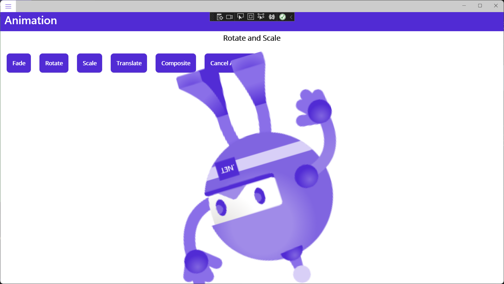

# Animation

.NET MAUI supports many [basic animations](https://learn.microsoft.com/en-us/dotnet/maui/user-interface/animation/basic). We'll check out a few of those here.

## Fading

Let's start with an animation to fade the bot image out, and then fade it in again.

Add a new ContentPage to the project:

*AnimationPage.xaml*:

```XAML
<?xml version="1.0" encoding="utf-8" ?>
<ContentPage xmlns="http://schemas.microsoft.com/dotnet/2021/maui"
             xmlns:x="http://schemas.microsoft.com/winfx/2009/xaml"
             x:Class="MyMauiApp.AnimationPage">

    <ScrollView>
        <VerticalStackLayout Spacing="5" >

            <Label Margin="5"
                Text=""
                FontSize="18"
                FontAttributes="Bold"
                x:Name="AnimationLabel"
                HorizontalOptions="Center" />

            <FlexLayout Margin="5" Wrap="Wrap" >
                
                <Button Margin="5"
                    Text="Fade"
                    FontAttributes="Bold"
                    SemanticProperties.Hint="Play Fade Animation"
                    Clicked="OnFadeAnimationClicked"
                    HorizontalOptions="Center" />

                <Button Margin="5"
                    Text="Cancel Animation"
                    FontAttributes="Bold"
                    SemanticProperties.Hint="Cancel the dot net bot animation"
                    Clicked="OnCancelAnimationClicked"
                    HorizontalOptions="Center" />

            </FlexLayout>

            <Image
                x:Name="dotNetBotImage"
                Source="dotnet_bot.png"
                SemanticProperties.Description="Cute dot net bot waving hi to you!"
                WidthRequest="250"
                HeightRequest="500"
                HorizontalOptions="Center" />

        </VerticalStackLayout>
    </ScrollView>

</ContentPage>
```

This page is using a [FlexLayout](https://learn.microsoft.com/en-us/dotnet/maui/user-interface/layouts/flexlayout), a layout control that lets content flow (wrap) as necessary.

Add a code-behind file.

*AnimationPage.xaml.cs*:

```c#
namespace MyMauiApp;

public partial class AnimationPage : ContentPage
{
    public AnimationPage()
    {
        InitializeComponent();
    }

    private void OnCancelAnimationClicked(object sender, EventArgs e)
    {
        SemanticScreenReader.Announce("Cancel animation");
        dotNetBotImage.CancelAnimations();
    }

    private async void ResetProperties()
    {
        await Task.Delay(1000);
        dotNetBotImage.Rotation = 0;
        dotNetBotImage.Scale = 1;
        dotNetBotImage.TranslationX = 0;
        dotNetBotImage.TranslationY = 0;
        dotNetBotImage.Opacity = 1;
    }

    private async void OnFadeAnimationClicked(object sender, EventArgs e)
    {
        SemanticScreenReader.Announce(AnimationLabel.Text);
        AnimationLabel.Text = "FadeTo";
        await dotNetBotImage.FadeTo(0, 500);
        await dotNetBotImage.FadeTo(1, 500);
        ResetProperties();
    }

}
```

Add to *AppShell.xaml*:

```xaml
<ShellContent
    Title="Animation"
    ContentTemplate="{DataTemplate local:AnimationPage}"
    Route="AnimationPage" />
```

Run the app, navigate to the Animation page and click the **Fade** button. 



Line 30 says to fade the Opacity to 0 in 500 ms:

```c#
await dotNetBotImage.FadeTo(0, 500);
```

The next line (31) says to fade Opacity to 1 in 500 ms:

```c#
await dotNetBotImage.FadeTo(1, 500);
```

The next line (32) calls the `ResetProperties()` method, which cleans everything up after pausing for one second. 

```c#
private async void ResetProperties()
{
    await Task.Delay(1000);
    dotNetBotImage.Rotation = 0;
    dotNetBotImage.Scale = 1;
    dotNetBotImage.TranslationX = 0;
    dotNetBotImage.TranslationY = 0;
    dotNetBotImage.Opacity = 1;
}
```

If you click the **Cancel Animation** button while it's fading, the fading will stop. In fact, whatever animations are playing, they will stop. Check out line 13:

```c#
dotNetBotImage.CancelAnimations();
```

Every image control has this method built-in. 

## Rotation

Add the following to *AnimationPage.xaml* at line 24:

```xaml

<Button Margin="5"
    Text="Rotate"
    FontAttributes="Bold"
    SemanticProperties.Hint="Play Rotate Animation"
    Clicked="OnRotateAnimationClicked"
    HorizontalOptions="Center" />

```

Add the following method to *AnimationPage.xaml.cs*:

```c#

private async void OnRotateAnimationClicked(object sender, EventArgs e)
{
    SemanticScreenReader.Announce(AnimationLabel.Text);
    AnimationLabel.Text = "Rotate";
    await dotNetBotImage.RotateTo(360, 500);
    ResetProperties();
}

```

Run the app, navigate to the Animation page, and click the **Rotate** button. Notice that the bot rotates.

That's because of this line...

```c#
await dotNetBotImage.RotateTo(360, 500);
```

... which says "rotate to 360 degrees (a full sweep) over 500 ms."



## Scaling

Add the following to *AnimationPage.xaml* at line 31:

```xaml

<Button Margin="5"
    Text="Scale"
    FontAttributes="Bold"
    SemanticProperties.Hint="Play Scale Animation"
    Clicked="OnScaleAnimationClicked"
    HorizontalOptions="Center" />

```

Add the following method to *AnimationPage.xaml.cs*:

```c#

private async void OnScaleAnimationClicked(object sender, EventArgs e)
{
    SemanticScreenReader.Announce(AnimationLabel.Text);
    AnimationLabel.Text = "Scale";
    await dotNetBotImage.ScaleTo(2, 500);
    await dotNetBotImage.ScaleTo(1, 500);
    ResetProperties();
}

```

Run the app, navigate to the Animation page, and click the **Scale** button. Notice that the bot zooms in and out.

That's because of these lines...

```c#
await dotNetBotImage.ScaleTo(2, 500);
await dotNetBotImage.ScaleTo(1, 500);
```

... which says "scale to double size in 500 ms, and then back to normal size in 500 ms."



## Translate

Translating is animation-speak for moving from one place to another. The `TranslateTo` method takes relative target x and y values, and a number of milliseconds. This demo moves the robot to the left 200 pixels and back.

Add to the markup at Line 38:

```xaml

<Button Margin="5"
    Text="Translate"
    FontAttributes="Bold"
    SemanticProperties.Hint="Play Translate Animation"
    Clicked="OnTranslateAnimationClicked"
    HorizontalOptions="Center" />

```

Add to the code-behind:

```c#

private async void OnTranslateAnimationClicked(object sender, EventArgs e)
{
    SemanticScreenReader.Announce(AnimationLabel.Text);
    AnimationLabel.Text = "Translate";
    await dotNetBotImage.TranslateTo(-200, 0, 500);
    await dotNetBotImage.TranslateTo(0, 0, 500);
    ResetProperties();
}

```

When you run this demo this line moves the robot to the left 200 pixels:

```c#
await dotNetBotImage.TranslateTo(-200, 0, 500);
```

and the next line moves it back to where it was:

```c#
await dotNetBotImage.TranslateTo(0, 0, 500);
```



## Composite Animations

A composite animation is a combination of animations where two or more animations run simultaneously. Composite animations can be created by combining awaited and non-awaited animations.

In this case we will rotate and scale at the same time.

Add to markup at line 45:

```c#

<Button Margin="5"
    Text="Composite"
    FontAttributes="Bold"
    SemanticProperties.Hint="Play Composite Animation"
    Clicked="OnCompositeAnimationClicked"
    HorizontalOptions="Center" />

```

Add to code-behind:

```c#
private async void OnCompositeAnimationClicked(object sender, EventArgs e)
{
    SemanticScreenReader.Announce(AnimationLabel.Text);
    AnimationLabel.Text = "Rotate and Scale";
    // Composite animation
    // A composite animation is a combination of animations where two or more
    // animations run simultaneously.
    // Composite animations can be created by combining awaited and non-awaited animations:
    // Set Rotation to 0, otherwise the second time this animation runs, it won't rotate.
    dotNetBotImage.Rotation = 0;
    dotNetBotImage.RotateTo(360, 1000);
    await dotNetBotImage.ScaleTo(2, 500);
    await dotNetBotImage.ScaleTo(1, 500);
    ResetProperties();
}
```

Notice the rotate command is not awaited, but the scale commands are:

```c#
dotNetBotImage.RotateTo(360, 1000);
await dotNetBotImage.ScaleTo(2, 500);
await dotNetBotImage.ScaleTo(1, 500);
```



## Easing

.NET Multi-platform App UI (.NET MAUI) includes an [Easing](https://learn.microsoft.com/en-us/dotnet/api/microsoft.maui.easing) class that enables you to specify a transfer function that controls how animations speed up or slow down as they're running.

The [Easing](https://learn.microsoft.com/en-us/dotnet/api/microsoft.maui.easing) class defines a number of easing functions that can be consumed by animations:

- The [BounceIn](https://learn.microsoft.com/en-us/dotnet/api/microsoft.maui.easing.bouncein) easing function bounces the animation at the beginning.
- The [BounceOut](https://learn.microsoft.com/en-us/dotnet/api/microsoft.maui.easing.bounceout) easing function bounces the animation at the end.
- The [CubicIn](https://learn.microsoft.com/en-us/dotnet/api/microsoft.maui.easing.cubicin) easing function slowly accelerates the animation.
- The [CubicInOut](https://learn.microsoft.com/en-us/dotnet/api/microsoft.maui.easing.cubicinout) easing function accelerates the animation at the beginning, and decelerates the animation at the end.
- The [CubicOut](https://learn.microsoft.com/en-us/dotnet/api/microsoft.maui.easing.cubicout) easing function quickly decelerates the animation.
- The [Linear](https://learn.microsoft.com/en-us/dotnet/api/microsoft.maui.easing.linear) easing function uses a constant velocity, and is the default easing function.
- The [SinIn](https://learn.microsoft.com/en-us/dotnet/api/microsoft.maui.easing.sinin) easing function smoothly accelerates the animation.
- The [SinInOut](https://learn.microsoft.com/en-us/dotnet/api/microsoft.maui.easing.sininout) easing function smoothly accelerates the animation at the beginning, and smoothly decelerates the animation at the end.
- The [SinOut](https://learn.microsoft.com/en-us/dotnet/api/microsoft.maui.easing.sinout) easing function smoothly decelerates the animation.
- The [SpringIn](https://learn.microsoft.com/en-us/dotnet/api/microsoft.maui.easing.springin) easing function causes the animation to very quickly accelerate towards the end.
- The [SpringOut](https://learn.microsoft.com/en-us/dotnet/api/microsoft.maui.easing.springout) easing function causes the animation to quickly decelerate towards the end.

The `In` and `Out` suffixes indicate if the effect provided by the easing function is noticeable at the beginning of the animation, at the end, or both.

In addition, custom easing functions can be created. For more information, see [Custom easing functions](https://learn.microsoft.com/en-us/dotnet/maui/user-interface/animation/easing#custom-easing-functions).

In this demo we will use the BounceOut easing option that bounces the image as it slows down toward its target.

Markup:

```xaml
<Button Margin="5"
    Text="Easing Bounce Out"
    FontAttributes="Bold"
    SemanticProperties.Hint="Play Easing Bounce Out Animation"
    Clicked="OnEasingBounceOutAnimationClicked"
    HorizontalOptions="Center" />
```

Code-behind:

```c#
private async void OnEasingBounceOutAnimationClicked(object sender, EventArgs e)
{
    SemanticScreenReader.Announce(AnimationLabel.Text);
    AnimationLabel.Text = "Easing BounceOut";
    await dotNetBotImage.TranslateTo(0, -200, 
        2000, Easing.BounceOut);
    ResetProperties();
}
```

You just have to run this to see the effect.

