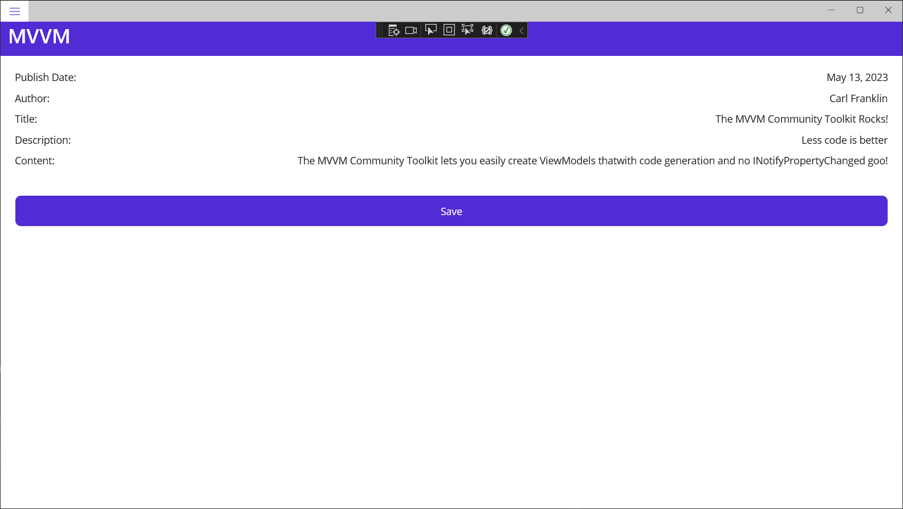
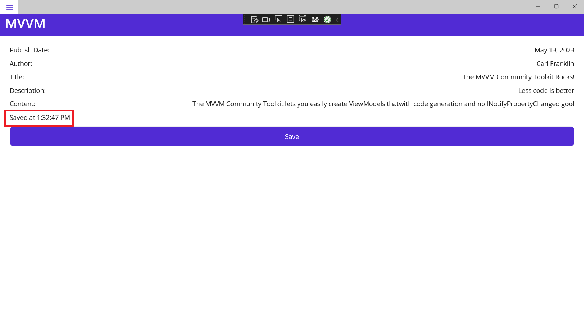
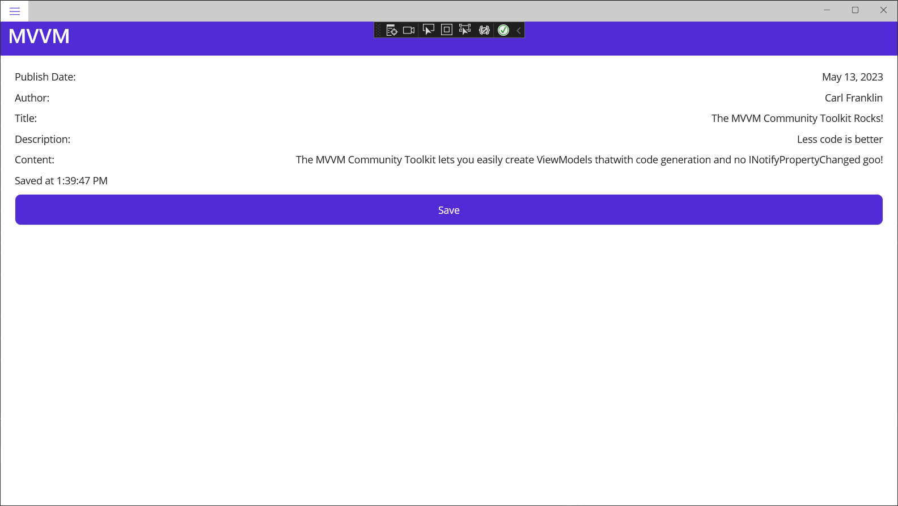

# MVVM

The Model-View-ViewModel (MVVM) pattern is useful in MAUI application. It's a way to separate the View (XAML pages) from the models (such as `BlogPost`) with an intermediate class, called a ViewModel. A well-designed ViewModel will not have any references to Views. Rather, the View is updated by data binding, and the ViewModel exposes commands that are implemented by methods, but command references are also established by data binding. 

There is typically a one-to-one relationship between View and ViewModel. That is, if we were to rewrite our *BlogPage.xaml* to use MVVM, the ViewModel would be called `BlogPageViewModel` by convention.

This module could easily be a day-long class in using MVVM with MAUI. Instead, I'm going to get you started with what I think is the best way to implement MVVM in MAUI.

## INotifyPropertyChanged

`INotifyPropertyChanged` is an interface that a ViewModel should implement. It provides the following event:

```c#
public event PropertyChangedEventHandler PropertyChanged;
```

When you bind to a class that implements `INotifyPropertyChanged`, and that class raises the `PropertyChanged` event, it includes the name of the property that has changed. Like so:

```c#
PropertyChanged?.Invoke(this, new PropertyChangedEventArgs("FirstName"));
```

That code raises the `PropertyChanged` event notifying the received that the `FirstName` property has changed.

Under the hood, MAUI Views are able to refresh the data they are bound to whenever this event is raised. You do not need to do anything on the View side in order for the UI to update, but it is typically a bit of code to implement on the ViewModel side.

We're going to create a ViewModel for a ContentPage, which we will then create, and code-behind to use the ViewModel.

Add a *ViewModels* folder to the project, and to it add the following:

*BlogPostOldViewModel.cs*:

```c#
using System.ComponentModel;
using System.Runtime.CompilerServices;
using System.Windows.Input;

namespace MyMauiApp.ViewModels;

public class BlogPostOldViewModel : INotifyPropertyChanged
{
    public event PropertyChangedEventHandler PropertyChanged;

    private BlogPost _blogPost;

    public void Initialize(BlogPost blogPost)
    {
        PublishDate = blogPost.PublishDate;
        Author = blogPost.Author;
        Title = blogPost.Title;
        Description = blogPost.Description;
        Content = blogPost.Content;
        _blogPost = blogPost;
    }
    
    private DateTime publishDate;
    public DateTime PublishDate
    {
        get => publishDate;
        set => Set(ref publishDate, value);
    }

    private string author;
    public string Author
    {
        get => author;
        set => Set(ref author, value);
    }

    private string title;
    public string Title
    {
        get => title;
        set => Set(ref title, value);
    }

    private string description;
    public string Description
    {
        get => description;
        set => Set(ref description, value);
    }

    private string content;
    public string Content
    {
        get => content;
        set => Set(ref content, value);
    }

    private string message;
    public string Message
    {
        get => message;
        set => Set(ref message, value);
    }

    private ICommand saveCommand;
    public ICommand SaveCommand => saveCommand ??= new Command(() =>
    {
        _blogPost.PublishDate = PublishDate;
        _blogPost.Author = Author;
        _blogPost.Title = Title;
        _blogPost.Description = Description;
        _blogPost.Content = Content;
        
        // Save stuff here

        Message = $"Saved at {DateTime.Now.ToLongTimeString()}";
    });

    private bool Set<T>(ref T field, T newValue, 
            [CallerMemberName] string propertyName = null)
    {
        if (!EqualityComparer<T>.Default.Equals(field, newValue))
        {
            field = newValue;
            PropertyChanged?.Invoke(this, 
				new PropertyChangedEventArgs(propertyName));
            return true;
        }
        return false;
    }
}
```

Add the following to the top of *MauiProgram.cs*:

```c#
global using MyMauiApp.ViewModels;
```

Add a new ContentPage:

*MVVMPage.xaml*:

```c#
<?xml version="1.0" encoding="utf-8" ?>
<ContentPage xmlns="http://schemas.microsoft.com/dotnet/2021/maui"
            xmlns:x="http://schemas.microsoft.com/winfx/2009/xaml"
            x:Class="MyMauiApp.MVVMPage">
    <ScrollView>
        <VerticalStackLayout Padding="20" Spacing="10">
            <Grid>
                <Label Text="Publish Date:" />
                <Label HorizontalOptions="End" Text="{Binding PublishDate, 
                    StringFormat='{}{0:MMM dd, yyyy}'}"  />
            </Grid>
            <Grid>
                <Label Text="Author:" />
                <Label HorizontalOptions="End" Text="{Binding Author}"  />
            </Grid>
            <Grid>
                <Label Text="Title:" />
                <Label HorizontalOptions="End" Text="{Binding Title}"  />
            </Grid>
            <Grid>
                <Label Text="Description:" />
                <Label HorizontalOptions="End" Text="{Binding Description}"  />
            </Grid>
            <Grid>
                <Label Text="Content:" />
                <Label HorizontalOptions="End" Text="{Binding Content}" />
            </Grid>
            <Label Text="{Binding Message}" />
            <Button Text="Save" Command="{Binding SaveCommand}" />
        </VerticalStackLayout>
    </ScrollView>
</ContentPage>
```

Add a code-behind file:

*MVVMPage.xaml.cs*:

```c#
namespace MyMauiApp;

public partial class MVVMPage : ContentPage
{
    public BlogPostOldViewModel ViewModel { get; private set; }

    public MVVMPage()
    {
        InitializeComponent();

        // instantiate and initialize the ViewModel

        ViewModel = new BlogPostOldViewModel();

        var blogPost = new BlogPost()
        {
            PublishDate = DateTime.Now,
            Author = "Carl Franklin",
            Title = "The MVVM Community Toolkit Rocks!",
            Description = "Less code is better",
            Content = "The MVVM Community Toolkit lets " +
                "you easily create ViewModels that" +
                "with code generation and no " +
                "INotifyPropertyChanged goo!"
        };
        ViewModel.Initialize(blogPost);

        // Set the page's Binding Context
        BindingContext = ViewModel;
    }
}
```

Add to *AppShell.xaml*:

```c#
<ShellContent
    Title="MVVM"
    ContentTemplate="{DataTemplate local:MVVMPage}"
    Route="MVVMPage" />
```

Look at *BlogPostOldViewModel.cs*.

It implements the `INotifyPropertyChanged` interface, which gives us the `PropertyChanged` event.

Check out the `Set` method:

```c#
private bool Set<T>(ref T field, T newValue, 
    [CallerMemberName] string propertyName = null)
{
    if (!EqualityComparer<T>.Default.Equals(field, newValue))
    {
        field = newValue;
        PropertyChanged?.Invoke(this, 
            new PropertyChangedEventArgs(propertyName));
        return true;
    }
    return false;
}
```

This is a nice wrapper around invoking the event that you can call from the Setters of your properties without the ceremony of data types and property names.

Check out the `Author` property code:

```c#
private string author;
public string Author
{
    get => author;
    set => Set(ref author, value);
}
```

If we didn't have the `Set` method, it would look like this:

```c#
private string author;
public string Author
{
    get => author;
    set
    {
        author = value;
        PropertyChanged?.Invoke(this, new PropertyChangedEventArgs("Author"));
    }
}
```

You can see how the `Set` method relieves us of having to write the plumbing code for each property setter.

Check out the `SaveCommand` method:

```c#
private ICommand saveCommand;
public ICommand SaveCommand => saveCommand ??= new Command(() =>
{
    _blogPost.PublishDate = PublishDate;
    _blogPost.Author = Author;
    _blogPost.Title = Title;
    _blogPost.Description = Description;
    _blogPost.Content = Content;

    // Save stuff here

    Message = $"Saved at {DateTime.Now.ToLongTimeString()}";
});
```

This is the MVVM way to make events that can be called with UI interactions (such as Button clicks) using data binding instead of providing references directly between the View and the code behind.

> :point_up: I realize there is nothing to save in this example. It's just a demo. Use your imagination. 

Now, let's look at *MVVMPage.xaml.cs* 

Check out line 5:

```c#
public BlogPostOldViewModel ViewModel { get; private set; }
```

This allows the View to access the ViewModel, but not to change it.

We create the ViewModel on line 13:

```c#
ViewModel = new BlogPostOldViewModel();
```

Lines 15-25 create a new `BlogPost`, add some dummy data, and initialize the ViewModel with the data. This data would typically originate in a database that's exposed via an API:

```c#
var blogPost = new BlogPost()
{
    PublishDate = DateTime.Now,
    Author = "Carl Franklin",
    Title = "The MVVM Community Toolkit Rocks!",
    Description = "Less code is better",
    Content = "The MVVM Community Toolkit lets " +
        "you easily create ViewModels that" +
        "with code generation and no INotifyPropertyChanged goo!"
};
ViewModel.Initialize(blogPost);
```

Finally, on line 28, we set the DataContext of `MAUIPage` to the ViewModel:

```c#
BindingContext = ViewModel;
```

The Markup in *MVVMPage.xaml* should be self-explanatory by now.

Run the app and navigate to the MVVM page:



Click the **Save** button. Note the message under the **Content** label:



## MVVM Community Toolkit

My go-to method for building ViewModels is with the [MVVM Community Toolkit](https://learn.microsoft.com/en-us/dotnet/communitytoolkit/mvvm/). 

Add a package reference to:

```c#
CommunityToolkit.Mvvm
```

Add the following to the top of *MauiProgram.cs*:

```c#
global using CommunityToolkit.Mvvm.ComponentModel;
global using CommunityToolkit.Mvvm.Input;
```

Now add the following ViewModel class to the project:

*BlogPostNewViewModel.cs*:

```c#
namespace MyMauiApp.ViewModels;

public partial class BlogPostNewViewModel : ObservableObject
{
    private BlogPost _blogPost;

    public void Initialize(BlogPost blogPost)
    {
        PublishDate = blogPost.PublishDate;
        Author = blogPost.Author;
        Title = blogPost.Title;
        Description = blogPost.Description;
        Content = blogPost.Content;
        _blogPost = blogPost;
    }

    [ObservableProperty]
    private DateTime publishDate;

    [ObservableProperty]
    private string author;

    [ObservableProperty]
    private string title;

    [ObservableProperty]
    private string description;

    [ObservableProperty]
    private string content;

    [ObservableProperty]
    private string message;

    [RelayCommand]
    private void Save()
    {
        _blogPost.PublishDate = PublishDate;
        _blogPost.Author = Author;
        _blogPost.Title = Title;
        _blogPost.Description = Description;
        _blogPost.Content = Content;

        // Save stuff here

        Message = $"Saved at {DateTime.Now.ToLongTimeString()}";
    }
}
```

In *MVVMPage.xaml.cs*, replace references to `BlogPostOldViewModel` with `BlogPostNewViewModel`:

```c#
namespace MyMauiApp;

public partial class MVVMPage : ContentPage
{
    //apublic BlogPostOldViewModel ViewModel { get; private set; }
    public BlogPostNewViewModel ViewModel { get; private set; }

    public MVVMPage()
    {
        InitializeComponent();

        // instantiate and initialize the ViewModel

        //ViewModel = new BlogPostOldViewModel();
        ViewModel = new BlogPostNewViewModel();

        var blogPost = new BlogPost()
        {
            PublishDate = DateTime.Now,
            Author = "Carl Franklin",
            Title = "The MVVM Community Toolkit Rocks!",
            Description = "Less code is better",
            Content = "The MVVM Community Toolkit lets " +
                "you easily create ViewModels that" +
                "with code generation and no INotifyPropertyChanged goo!"
        };
        ViewModel.Initialize(blogPost);

        // Set the page's Binding Context
        BindingContext = ViewModel;
    }
}
```

Run the app to ensure it works just as well as it did with the old ViewModel:



Let's unpack this new ViewModel.

The ViewModel inherits `ObservableObject`, which has support for `INotifyPropertyChanged`.

Look at the property definitions.

```c#
[ObservableProperty]
private string author; 
```

You only define the backing fields. The actual properties are generated by the MVVM Toolkit.

As long as you decorate your backing fields with the `ObservableProperty` attribute, the actual properties are generated, and when you change the actual properties (not the backing fields), the `PropertyChanged` event will be called automatically.

Check out what was `SaveCommand` in the old ViewModel:

```c#
[RelayCommand]
private void Save()
{
    _blogPost.PublishDate = PublishDate;
    _blogPost.Author = Author;
    _blogPost.Title = Title;
    _blogPost.Description = Description;
    _blogPost.Content = Content;

    // Save stuff here

    Message = $"Saved at {DateTime.Now.ToLongTimeString()}";
}
```

To create a command handler, just make a private method (void or Task for async), and decorate it with the `RelayCommand` attribute. The command will appear with "Command" appended to the name of your private method, in this case "SaveCommand".

Now isn't that better?