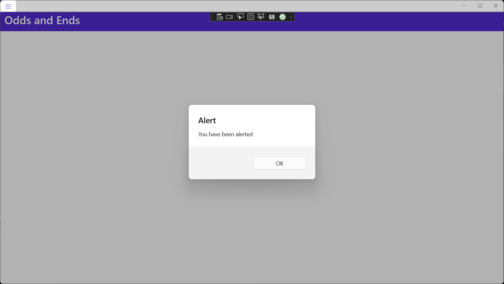
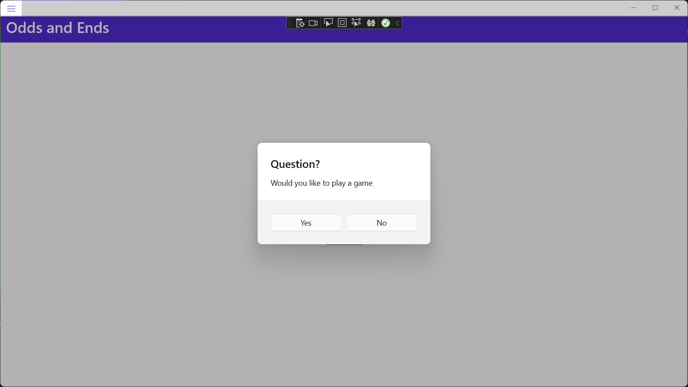
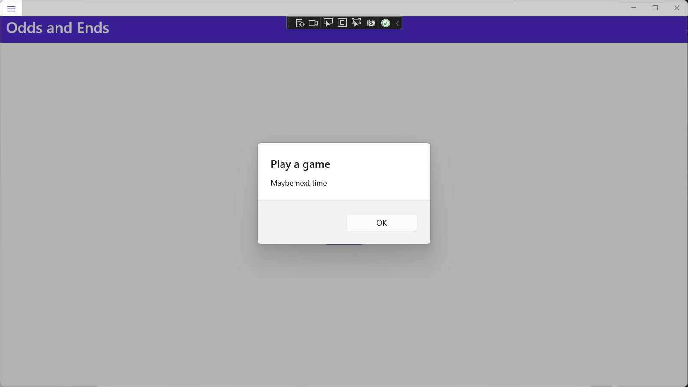
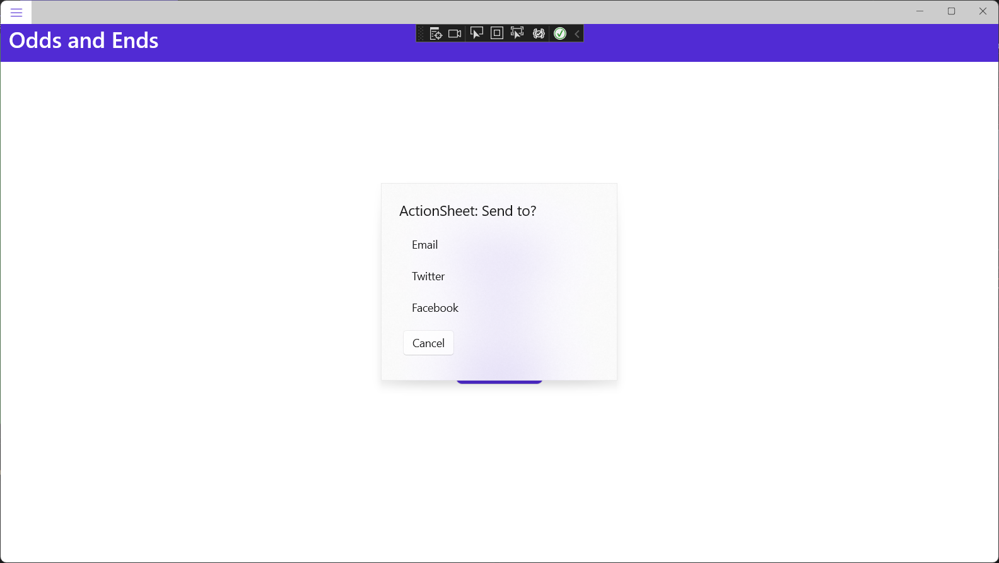
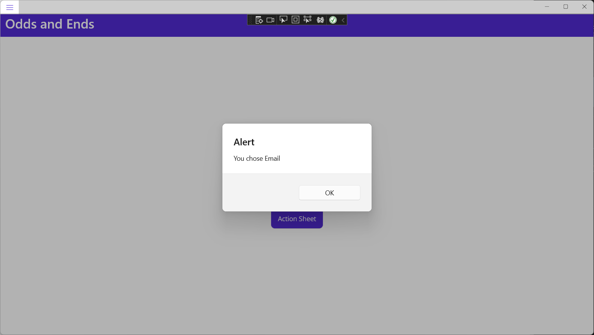
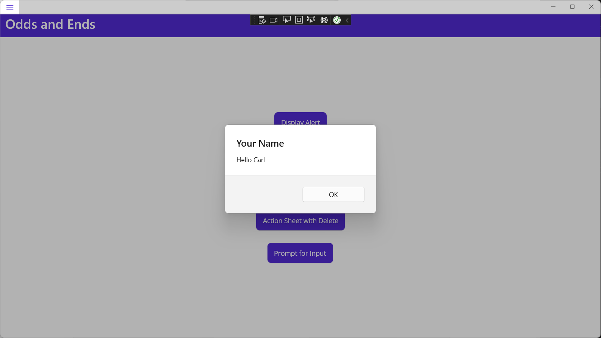
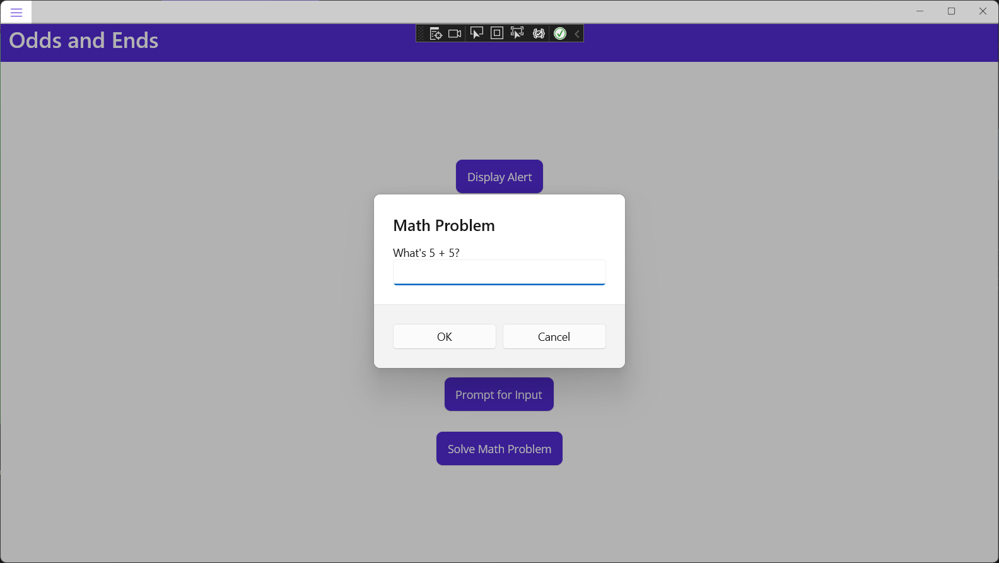
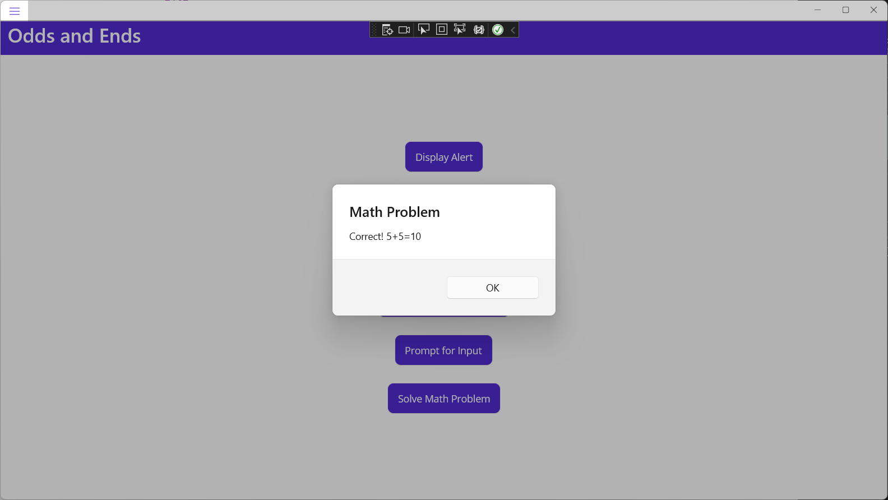
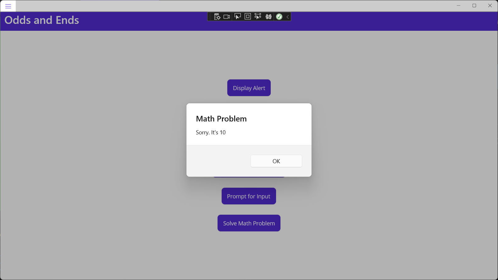

# Odds and Ends

This module contains topics that are too small to fit into any category

## Display pop-ups

From the documentation at [https://learn.microsoft.com/en-us/dotnet/maui/user-interface/pop-ups](https://learn.microsoft.com/en-us/dotnet/maui/user-interface/pop-ups)

Displaying an alert, asking a user to make a choice, or displaying a prompt is a common UI task. .NET Multi-platform App UI (.NET MAUI) has three methods on the [Page](https://learn.microsoft.com/en-us/dotnet/api/microsoft.maui.controls.page) class for interacting with the user via a pop-up: [DisplayAlert](https://learn.microsoft.com/en-us/dotnet/api/microsoft.maui.controls.page.displayalert), [DisplayActionSheet](https://learn.microsoft.com/en-us/dotnet/api/microsoft.maui.controls.page.displayactionsheet), and [DisplayPromptAsync](https://learn.microsoft.com/en-us/dotnet/api/microsoft.maui.controls.page.displaypromptasync). Pop-ups are rendered with native controls on each platform.

### Display an alert

All .NET MAUI-supported platforms have a modal pop-up to alert the user or ask simple questions of them. To display alerts, use the [DisplayAlert](https://learn.microsoft.com/en-us/dotnet/api/microsoft.maui.controls.page.displayalert) method on any [Page](https://learn.microsoft.com/en-us/dotnet/api/microsoft.maui.controls.page). 

Add a new ContentPage to the project:

*OddsAndEndsPage.xaml*:

```xaml
<?xml version="1.0" encoding="utf-8" ?>
<ContentPage xmlns="http://schemas.microsoft.com/dotnet/2021/maui"
            xmlns:x="http://schemas.microsoft.com/winfx/2009/xaml"
            x:Class="MyMauiApp.OddsAndEndsPage">
    <ScrollView>
        <VerticalStackLayout
            Spacing="25"
            Padding="30,0"
            VerticalOptions="Center">

            <Button
                Text="Display Alert"
                SemanticProperties.Hint="Displays a pop-up alert"
                Clicked="Alert"
                HorizontalOptions="Center" />

        </VerticalStackLayout>
    </ScrollView>
</ContentPage>
```

Add a code-behind file:

*OddsAndEndsPage.xaml.cs*:

```c#
namespace MyMauiApp;

public partial class OddsAndEndsPage : ContentPage
{
    public OddsAndEndsPage()
    {
        InitializeComponent();
    }

    async void Alert(object sender, EventArgs e)
    {
        await DisplayAlert("Alert", "You have been alerted", "OK");
    }
}
```

Add to *AppShell.xaml*:

```xaml
<ShellContent
    Title="Odds and Ends"
    ContentTemplate="{DataTemplate local:OddsAndEndsPage}"
    Route="OddsAndEndsPage" />
```

Run the app, navigate to the Odds and Ends page, and click the **Display Alert** button:



The [DisplayAlert](https://learn.microsoft.com/en-us/dotnet/api/microsoft.maui.controls.page.displayalert) method can also be used to capture a user's response by presenting two buttons and returning a `bool`. To get a response from an alert, supply text for both buttons and `await` the method:

Add the following to *OddsAndEnds.xaml* at line 

```xaml

<Button
    Text="Prompt"
    SemanticProperties.Hint="Prompt the user for a decision"
    Clicked="Prompt"
    HorizontalOptions="Center" />

```

Add to the code-behind:

```c#
async void Prompt(object sender, EventArgs e)
{
    string alert;
    bool answer = await DisplayAlert("Question?", 
                 "Would you like to play a game", "Yes", "No");
    if (answer)
        alert = "Great! I love games";
    else alert = "Maybe next time";
    await DisplayAlert("Play a game", alert, "OK");
}
```

Run the app, navigate to the Odds and Ends page, and click the **Prompt** button:



Select **Yes**


Try again, this time selecting **No**



### Guide users through tasks

An action sheet presents the user with a set of alternatives for how to proceed with a task. To display an action sheet, use the [DisplayActionSheet](https://learn.microsoft.com/en-us/dotnet/api/microsoft.maui.controls.page.displayactionsheet) method on any [Page](https://learn.microsoft.com/en-us/dotnet/api/microsoft.maui.controls.page), passing the message and button labels as strings.

Add to markup:

```xaml
<Button
    Text="Action Sheet"
    SemanticProperties.Hint="Allow the user to select from options"
    Clicked="ActionSheet"
    HorizontalOptions="Center" />
```

Add to code-behind:

```c#
async void ActionSheet(object sender, EventArgs e)
{
    string action = await DisplayActionSheet(
        "ActionSheet: Send to?", "Cancel", null, "Email", 
        "Twitter", "Facebook");

    await DisplayAlert("Alert", $"You chose {action}", "OK");
}
```

Run the app, navigate to the Odds and Ends page, and click the **Action Sheet** button:



Choose **Email**



Try again, selecting different options.

Action sheets also support a destroy button, which is a button that represents destructive behavior. The destroy button can be specified as the third string argument to the DisplayActionSheet method, or can be left null. Let's do that.

Add to markup:

```xaml
<Button
    Text="Action Sheet with Delete"
    SemanticProperties.Hint="Allow the user to select from options, 
		adding a destroy button"
    Clicked="ActionSheetWithDelete"
    HorizontalOptions="Center" />
```

Add to code-behind:

```c#
async void ActionSheetWithDelete(object sender, EventArgs e)
{
    string action = await DisplayActionSheet(
        "ActionSheet: SavePhoto?", "Cancel", "Delete", 
        "Photo Roll", "Email");

    await DisplayAlert("Alert", $"You chose {action}", "OK");
}
```

On iOS, the destroy button is rendered differently to the other buttons in the action sheet.

This is a screen cap of this code running on my iPhone:


### Prompt for Input

To display a prompt, call the [DisplayPromptAsync](https://learn.microsoft.com/en-us/dotnet/api/microsoft.maui.controls.page.displaypromptasync) on any [Page](https://learn.microsoft.com/en-us/dotnet/api/microsoft.maui.controls.page), passing a title and message as `string` arguments.

Add to markup:

```xaml
<Button
    Text="Prompt for Input"
    SemanticProperties.Hint="Allow the user to enter a string"
    Clicked="PromptForInput"
    HorizontalOptions="Center" />
```

Add to code-behind:

```c#
async void PromptForInput(object sender, EventArgs e)
{
    string name = await DisplayPromptAsync("Your Name", "What's your name?");
    if (name != null & name != "")
        await DisplayAlert("Your Name", $"Hello {name}", "OK");
}
```

Run the app, navigate to the Odds and Ends page, and click the **Prompt for Input** button, then enter your name and select **OK**.




The full argument list for the [DisplayPromptAsync](https://learn.microsoft.com/en-us/dotnet/api/microsoft.maui.controls.page.displaypromptasync) method is:

- `title`, of type `string`, is the title to display in the prompt.
- `message`, of type `string`, is the message to display in the prompt.
- `accept`, of type `string`, is the text for the accept button. This is an optional argument, whose default value is OK.
- `cancel`, of type `string`, is the text for the cancel button. This is an optional argument, whose default value is Cancel.
- `placeholder`, of type `string`, is the placeholder text to display in the prompt. This is an optional argument, whose default value is `null`.
- `maxLength`, of type `int`, is the maximum length of the user response. This is an optional argument, whose default value is -1.
- `keyboard`, of type `Keyboard`, is the keyboard type to use for the user response. This is an optional argument, whose default value is `Keyboard.Default`.
- `initialValue`, of type `string`, is a pre-defined response that will be displayed, and which can be edited. This is an optional argument, whose default value is an empty `string`.

Here's a little demo to exercise some of these options:

Add to markup:

```xaml
<Button
    Text="Solve Math Problem"
    SemanticProperties.Hint="Allow the user to solve a math problem"
    Clicked="SolveMathProblem"
    HorizontalOptions="Center" />
```

Add to code-behind:

```c#
async void SolveMathProblem(object sender, EventArgs e)
{
    string result = await DisplayPromptAsync("Math Problem", "What's 5 + 5?",
        initialValue: "", maxLength: 2, keyboard: Keyboard.Numeric);

    if (result != null && result != "")
    {
        if (result == "10")
            await DisplayAlert("Math Problem", "Correct! 5+5=10", "OK");
        else
            await DisplayAlert("Math Problem", "Sorry. It's 10", "OK");
    }
}
```

Run the app, navigate to the Odds and Ends page, and click the **Solve Math Problem** button.



Enter the correct answer, 10



Enter an incorrect answer:

